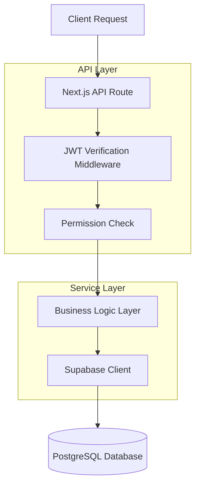
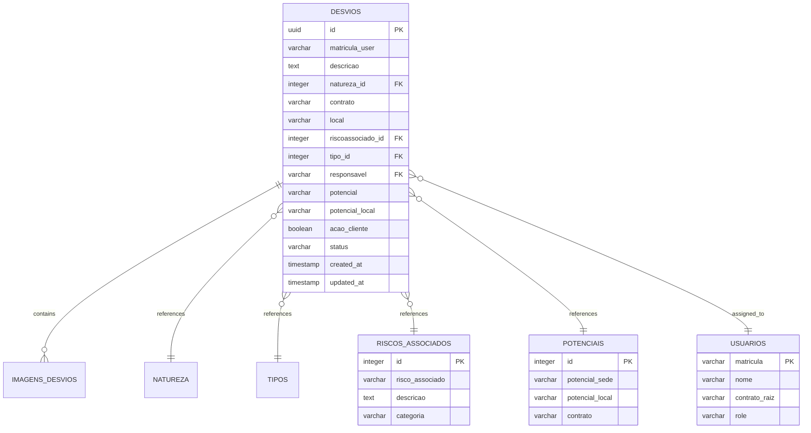

# Arquitetura Técnica: Componente de Avaliação Conversacional de Desvios

## 1. Architecture design

```mermaid
graph TD
  A[User Browser] --> B[React Frontend - Página /desvios/avaliar]
  B --> C[AvaliacaoConversacional Component]
  C --> D[API Routes]
  D --> E[Supabase Database]

  subgraph "Frontend Layer"
    B
    C
  end

  subgraph "API Layer"
    D
    F[/api/desvios/[id]/avaliar]
    G[/api/security-params/potentials]
    H[/api/security-params/associated-risks]
    I[/api/users]
  end

  subgraph "Data Layer"
    E
    J[(desvios table)]
    K[(potenciais table)]
    L[(riscos_associados table)]
    M[(usuarios table)]
  end

  C --> F
  C --> G
  C --> H
  C --> I
  F --> J
  G --> K
  H --> L
  I --> M
```

## 2. Technology Description

* Frontend: React\@18 + TypeScript + TailwindCSS\@3 + Lucide React Icons

* Backend: Next.js API Routes + Supabase Client SDK

* Database: Supabase (PostgreSQL)

* Authentication: JWT Token via localStorage

* State Management: React useState + useEffect

## 3. Route definitions

| Route            | Purpose                                                                   |
| ---------------- | ------------------------------------------------------------------------- |
| /desvios/avaliar | Página principal de avaliação de desvios com lista e modal conversacional |

## 4. API definitions

### 4.1 Core API

**Obter detalhes do desvio para avaliação**

```
GET /api/desvios/[id]/avaliar
```

Request Headers:

| Header Name   | Type   | Required | Description      |
| ------------- | ------ | -------- | ---------------- |
| Authorization | string | true     | Bearer token JWT |

Response:

| Param Name | Param Type | Description               |
| ---------- | ---------- | ------------------------- |
| success    | boolean    | Status da operação        |
| data       | object     | Dados completos do desvio |

**Atualizar avaliação do desvio**

```
PUT /api/desvios/[id]/avaliar
```

Request:

| Param Name             | Param Type | Required | Description                      |
| ---------------------- | ---------- | -------- | -------------------------------- |
| potencial              | string     | false    | Novo potencial se alterado       |
| potencial\_local       | string     | false    | Descrição local do potencial     |
| riscoassociado\_id     | integer    | false    | Novo ID do risco associado       |
| acao\_cliente          | boolean    | true     | Se é responsabilidade do cliente |
| responsavel            | string     | true     | Matrícula do responsável         |
| observacoes\_avaliacao | string     | false    | Observações da avaliação         |

**Carregar potenciais disponíveis**

```
GET /api/security-params/potentials
```

**Carregar riscos associados**

```
GET /api/security-params/associated-risks
```

**Carregar usuários do contrato**

```
GET /api/users?contrato_raiz=[contrato]
```

## 5. Server architecture diagram



## 6. Data model

### 6.1 Data model definition



### 6.2 Data Definition Language

**Estrutura da tabela desvios (já existente)**

```sql
-- Colunas relevantes para avaliação
ALTER TABLE desvios 
  ADD COLUMN IF NOT EXISTS potencial VARCHAR(50) CHECK (potencial IN ('Intolerável', 'Substancial', 'Moderado', 'Trivial')),
  ADD COLUMN IF NOT EXISTS potencial_local VARCHAR(255),
  ADD COLUMN IF NOT EXISTS riscoassociado_id INTEGER REFERENCES riscos_associados(id),
  ADD COLUMN IF NOT EXISTS acao_cliente BOOLEAN DEFAULT false,
  ADD COLUMN IF NOT EXISTS responsavel VARCHAR(20),
  ADD COLUMN IF NOT EXISTS observacoes_avaliacao TEXT,
  ADD COLUMN IF NOT EXISTS status VARCHAR(50) DEFAULT 'Aguardando Avaliação' 
    CHECK (status IN ('Aguardando Avaliação', 'Em Andamento', 'Concluído', 'Vencido'));

-- Índices para otimização
CREATE INDEX IF NOT EXISTS idx_desvios_status ON desvios(status);
CREATE INDEX IF NOT EXISTS idx_desvios_responsavel ON desvios(responsavel);
CREATE INDEX IF NOT EXISTS idx_desvios_riscoassociado ON desvios(riscoassociado_id);

-- Políticas RLS (já existentes)
CREATE POLICY "Usuários autenticados podem gerenciar desvios" ON desvios 
  FOR ALL TO authenticated USING (true);
```

**Dados de exemplo para potenciais**

```sql
-- Inserir potenciais padrão se não existirem
INSERT INTO potenciais (potencial_sede, potencial_local, contrato) VALUES
('Risco Intolerável', 'Intolerável', 'DEFAULT'),
('Risco Substancial', 'Substancial', 'DEFAULT'),
('Risco Moderado', 'Moderado', 'DEFAULT'),
('Risco Trivial', 'Trivial', 'DEFAULT')
ON CONFLICT DO NOTHING;
```

