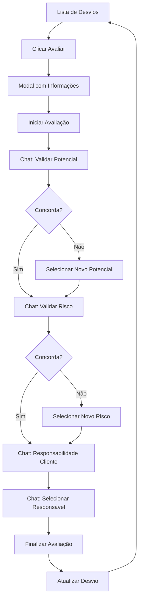

# Produto: Componente de Avaliação Conversacional de Desvios

## 1. Product Overview

Sistema de avaliação interativa de desvios de segurança através de interface conversacional, integrado à página `/desvios/avaliar` para substituir o processo atual de avaliação por um fluxo mais intuitivo e guiado.

O componente permite que avaliadores (Admin/Editor) conduzam avaliações de desvios através de um chat conversacional, validando e ajustando informações como potencial de risco, risco associado, responsabilidade do cliente e definição do responsável pela resolução.

## 2. Core Features

### 2.1 User Roles

| Role | Registration Method | Core Permissions |
|------|---------------------|------------------|
| Admin | Sistema interno | Pode avaliar todos os desvios, acesso completo às funcionalidades |
| Editor | Sistema interno | Pode avaliar desvios do seu contrato, acesso às funcionalidades de avaliação |

### 2.2 Feature Module

O componente de Avaliação Conversacional consiste dos seguintes módulos principais:

1. **Modal de Informações do Desvio**: exibição completa dos dados do desvio, botão para iniciar avaliação
2. **Chat Conversacional**: interface de conversa com perguntas pré-definidas e respostas interativas
3. **Sistema de Validação**: validação de potencial e risco associado com opções de alteração
4. **Seleção de Responsável**: dropdown com usuários do mesmo contrato para definir responsável
5. **Finalização da Avaliação**: atualização dos dados do desvio e mudança de status

### 2.3 Page Details

| Page Name | Module Name | Feature description |
|-----------|-------------|---------------------|
| Modal de Desvio | Exibição de Informações | Mostrar título, descrição, local, potencial atual, natureza, tipo, data de ocorrência, indicador Ver & Agir |
| Modal de Desvio | Botão de Iniciar | Iniciar processo de avaliação conversacional |
| Chat Conversacional | Sistema de Mensagens | Exibir mensagens do bot e do usuário com efeito de digitação |
| Chat Conversacional | Validação de Potencial | Confirmar ou alterar potencial atual do desvio |
| Chat Conversacional | Validação de Risco | Confirmar ou alterar risco associado atual |
| Chat Conversacional | Responsabilidade Cliente | Perguntar se desvio é responsabilidade do cliente (sim/não) |
| Chat Conversacional | Seleção de Responsável | Dropdown com usuários do mesmo contrato_raiz do avaliador |
| Sistema de Finalização | Atualização de Dados | Salvar alterações no desvio e mudar status para "Em Andamento" |

## 3. Core Process

**Fluxo Principal de Avaliação:**

1. Usuário acessa página `/desvios/avaliar` e visualiza lista de desvios pendentes
2. Clica no botão "Avaliar" de um desvio específico
3. Modal abre exibindo informações completas do desvio
4. Usuário clica em "Iniciar Avaliação" para começar o chat
5. Sistema inicia conversa perguntando sobre o potencial atual
6. Se usuário concorda com potencial, prossegue; se não, exibe opções para alteração
7. Sistema pergunta sobre risco associado atual
8. Se usuário concorda, prossegue; se não, exibe lista de riscos para seleção
9. Sistema pergunta se desvio é responsabilidade do cliente
10. Sistema solicita seleção do responsável pela resolução
11. Após todas as respostas, sistema atualiza desvio e fecha modal
12. Lista de desvios é atualizada automaticamente

## 4. User Interface Design

### 4.1 Design Style

- **Cores Primárias**: Orange-600 (#EA580C) para botões de ação, Blue-600 (#2563EB) para links
- **Cores Secundárias**: Gray-100/Gray-800 para backgrounds, Gray-500 para textos secundários
- **Estilo de Botões**: Rounded (rounded-md), com estados hover e disabled
- **Fonte**: Sistema padrão (font-medium, text-sm, text-lg)
- **Layout**: Modal centralizada, chat com scroll automático, cards para informações
- **Ícones**: Lucide React (Bot, MessageCircle, CheckCircle, AlertTriangle, User)

### 4.2 Page Design Overview

| Page Name | Module Name | UI Elements |
|-----------|-------------|-------------|
| Modal Principal | Container | Modal overlay escuro, container branco/gray-800, largura máxima 4xl, altura máxima 90vh |
| Informações do Desvio | Card de Dados | Grid 2 colunas, labels em gray-500, valores em gray-900/white, badges para status |
| Chat Conversacional | Área de Mensagens | Container com scroll, mensagens do bot à esquerda (gray-100), usuário à direita (orange-600) |
| Chat Conversacional | Input de Resposta | Input text/textarea, botões radio/checkbox, dropdowns com search, botão enviar com ícone |
| Seleção de Responsável | Dropdown | Select com search, loading spinner, opções com nome e matrícula |
| Botões de Ação | Controles | Botão "Iniciar Avaliação" orange-600, "Cancelar" gray-300, "Finalizar" green-600 |

### 4.3 Responsiveness

O componente é desktop-first com adaptações para mobile:
- Modal ocupa 95% da largura em telas pequenas
- Chat com altura fixa e scroll em dispositivos móveis
- Botões empilhados verticalmente em telas menores que 640px
- Texto responsivo (text-sm em mobile, text-base em desktop)