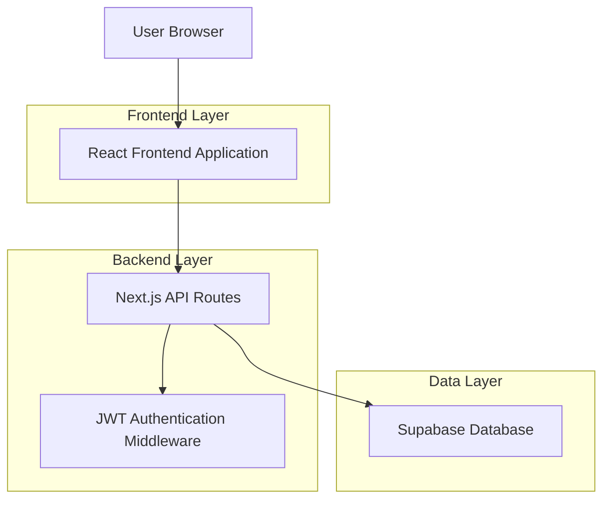
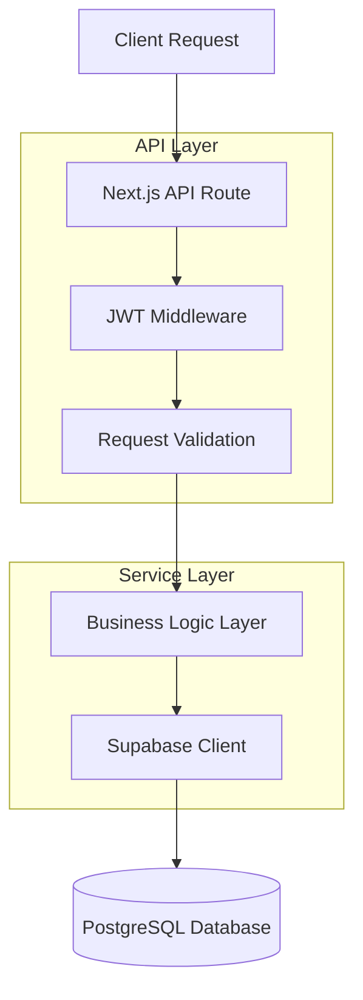
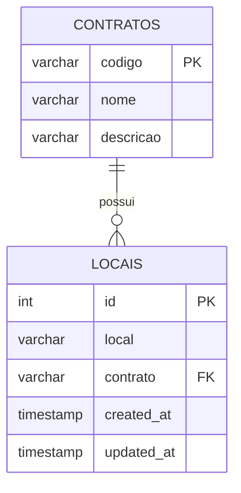

# Cadastro de Locais - Arquitetura Técnica

## 1. Architecture design



## 2. Technology Description

* Frontend: React\@18 + Next.js\@13 + tailwindcss\@3 + TypeScript

* Backend: Next.js API Routes + JWT Authentication

* Database: Supabase (PostgreSQL)

* Authentication: JWT + Supabase RLS

## 3. Route definitions

| Route                          | Purpose                                                  |
| ------------------------------ | -------------------------------------------------------- |
| /security-params               | Dashboard principal de parametrização com card de locais |
| /security-params/locations     | Página de gerenciamento de locais (listagem, CRUD)       |
| /api/security-params/locations | API para operações CRUD de locais                        |

## 4. API definitions

### 4.1 Core API

**Listar locais**

```
GET /api/security-params/locations
```

Query Parameters:

| Param Name | Param Type | isRequired | Description                    |
| ---------- | ---------- | ---------- | ------------------------------ |
| page       | number     | false      | Número da página (padrão: 1)   |
| limit      | number     | false      | Itens por página (padrão: 10)  |
| search     | string     | false      | Busca por nome do local        |
| contrato   | string     | false      | Filtrar por código do contrato |

Response:

| Param Name | Param Type  | Description        |
| ---------- | ----------- | ------------------ |
| success    | boolean     | Status da operação |
| data       | Location\[] | Array de locais    |
| total      | number      | Total de registros |
| page       | number      | Página atual       |
| totalPages | number      | Total de páginas   |

**Criar local**

```
POST /api/security-params/locations
```

Request:

| Param Name | Param Type | isRequired | Description                        |
| ---------- | ---------- | ---------- | ---------------------------------- |
| local      | string     | true       | Nome do local (máx 100 caracteres) |
| contrato   | string     | true       | Código do contrato                 |

Response:

| Param Name | Param Type | Description              |
| ---------- | ---------- | ------------------------ |
| success    | boolean    | Status da operação       |
| data       | Location   | Local criado             |
| message    | string     | Mensagem de sucesso/erro |

**Atualizar local**

```
PUT /api/security-params/locations/[id]
```

Request:

| Param Name | Param Type | isRequired | Description                        |
| ---------- | ---------- | ---------- | ---------------------------------- |
| local      | string     | true       | Nome do local (máx 100 caracteres) |
| contrato   | string     | true       | Código do contrato                 |

Response:

| Param Name | Param Type | Description              |
| ---------- | ---------- | ------------------------ |
| success    | boolean    | Status da operação       |
| data       | Location   | Local atualizado         |
| message    | string     | Mensagem de sucesso/erro |

**Excluir local**

```
DELETE /api/security-params/locations/[id]
```

Response:

| Param Name | Param Type | Description              |
| ---------- | ---------- | ------------------------ |
| success    | boolean    | Status da operação       |
| message    | string     | Mensagem de sucesso/erro |

### 4.2 Type Definitions

```typescript
interface Location {
  id: number
  local: string
  contrato: string
  created_at: string
  updated_at: string
}

interface LocationFormData {
  local: string
  contrato: string
}

interface LocationResponse {
  success: boolean
  data?: Location | Location[]
  total?: number
  page?: number
  totalPages?: number
  message?: string
}
```

## 5. Server architecture diagram



## 6. Data model

### 6.1 Data model definition



### 6.2 Data Definition Language

**Tabela de Locais (locais)**

```sql
-- Criar tabela locais
CREATE TABLE locais (
    id SERIAL PRIMARY KEY,
    local VARCHAR(100) NOT NULL,
    contrato VARCHAR(20) NOT NULL REFERENCES contratos(codigo),
    created_at TIMESTAMP WITH TIME ZONE DEFAULT NOW(),
    updated_at TIMESTAMP WITH TIME ZONE DEFAULT NOW(),
    UNIQUE(local, contrato)
);

-- Criar índices
CREATE INDEX idx_locais_contrato ON locais(contrato);
CREATE INDEX idx_locais_nome ON locais(local);

-- Habilitar RLS
ALTER TABLE locais ENABLE ROW LEVEL SECURITY;

-- Políticas RLS
CREATE POLICY "Usuários autenticados podem ver locais" ON locais FOR SELECT TO authenticated USING (true);
CREATE POLICY "Usuários autenticados podem inserir locais" ON locais FOR INSERT TO authenticated WITH CHECK (true);
CREATE POLICY "Usuários autenticados podem atualizar locais" ON locais FOR UPDATE TO authenticated USING (true);
CREATE POLICY "Usuários autenticados podem deletar locais" ON locais FOR DELETE TO authenticated USING (true);

-- Conceder permissões
GRANT SELECT ON locais TO anon;
GRANT ALL PRIVILEGES ON locais TO authenticated;

-- Comentário na tabela
COMMENT ON TABLE locais IS 'Tabela para parametrização de locais por contrato';

-- Dados iniciais (exemplos)
INSERT INTO locais (local, contrato) VALUES
('Escritório Principal', 'CONT001'),
('Almoxarifado', 'CONT001'),
('Área de Produção', 'CONT001'),
('Refeitório', 'CONT002'),
('Laboratório', 'CONT002');
```

**Trigger para atualizar updated\_at**

```sql
-- Função para atualizar timestamp
CREATE OR REPLACE FUNCTION update_updated_at_column()
RETURNS TRIGGER AS $$
BEGIN
    NEW.updated_at = NOW();
    RETURN NEW;
END;
$$ language 'plpgsql';

-- Trigger para tabela locais
CREATE TRIGGER update_locais_updated_at 
    BEFORE UPDATE ON locais 
    FOR EACH ROW 
    EXECUTE FUNCTION update_updated_at_column();
```

