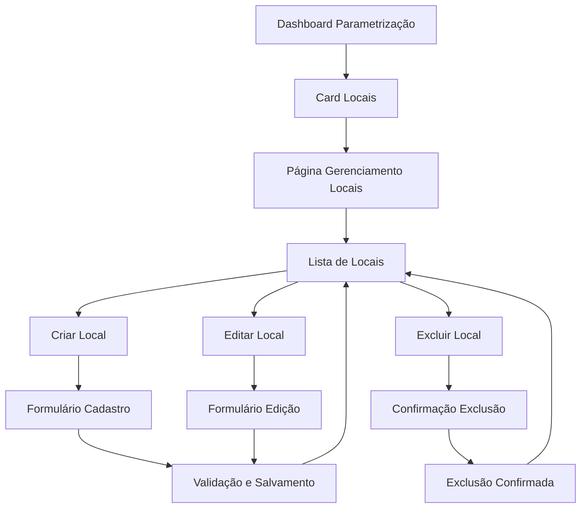

# Cadastro de Locais - Módulo de Parametrização de Segurança

## 1. Product Overview
Sistema para cadastro e gerenciamento de locais dentro do módulo de parametrização de segurança, permitindo que administradores e editores configurem locais específicos por contrato para uso em relatórios e desvios de segurança.
- O sistema resolve a necessidade de parametrizar locais específicos onde ocorrem eventos de segurança, facilitando a categorização e análise de dados por localização.
- Destinado a administradores e editores que precisam configurar os parâmetros de segurança do sistema de forma organizada por contrato.

## 2. Core Features

### 2.1 User Roles
| Role | Registration Method | Core Permissions |
|------|---------------------|------------------|
| Admin | Acesso total ao sistema | Pode criar, editar, visualizar e excluir locais de todos os contratos |
| Editor | Acesso limitado por contrato | Pode criar, editar, visualizar e excluir locais apenas do seu contrato |
| Usuario | Acesso somente leitura | Pode apenas visualizar locais (sem acesso ao módulo de parametrização) |

### 2.2 Feature Module
O módulo de cadastro de locais consiste nas seguintes páginas principais:
1. **Dashboard de Parametrização**: visualização geral dos parâmetros incluindo estatísticas de locais cadastrados.
2. **Página de Gerenciamento de Locais**: listagem, criação, edição e exclusão de locais por contrato.

### 2.3 Page Details
| Page Name | Module Name | Feature description |
|-----------|-------------|---------------------|
| Dashboard de Parametrização | Card de Locais | Exibir estatísticas de locais cadastrados, permitir navegação para gerenciamento |
| Gerenciamento de Locais | Lista de Locais | Listar locais filtrados por contrato do usuário, paginação, busca por nome |
| Gerenciamento de Locais | Formulário de Cadastro | Criar novo local com validação de nome único por contrato |
| Gerenciamento de Locais | Formulário de Edição | Editar local existente com validação de nome único por contrato |
| Gerenciamento de Locais | Ação de Exclusão | Excluir local com confirmação, verificar se não está sendo usado |

## 3. Core Process
**Fluxo do Administrador/Editor:**
1. Usuário acessa o dashboard de parametrização de segurança
2. Visualiza o card de "Locais" com estatísticas atuais
3. Clica no card para acessar o gerenciamento de locais
4. Visualiza lista de locais filtrada por seu contrato (ou todos se Admin)
5. Pode criar novo local informando nome e selecionando contrato
6. Pode editar local existente alterando nome ou contrato
7. Pode excluir local (se não estiver sendo usado em outros módulos)
8. Sistema valida unicidade do nome do local por contrato

## 4. User Interface Design
### 4.1 Design Style
- **Cores primárias**: Azul (#1e40af) para elementos principais, Verde (#10b981) para ações positivas
- **Cores secundárias**: Cinza (#6b7280) para textos secundários, Vermelho (#ef4444) para ações de exclusão
- **Estilo de botões**: Arredondados (rounded-lg) com transições suaves
- **Fonte**: Inter, tamanhos 14px para textos, 16px para labels, 24px para títulos
- **Layout**: Card-based com navegação superior, design responsivo
- **Ícones**: Lucide React, estilo outline, tamanho 20px para botões, 24px para cards

### 4.2 Page Design Overview
| Page Name | Module Name | UI Elements |
|-----------|-------------|-------------|
| Dashboard Parametrização | Card Locais | Card branco com ícone MapPin laranja (#f97316), título "Locais", contador de registros, descrição "Gerenciar locais por contrato" |
| Gerenciamento Locais | Header | Título "Gerenciamento de Locais", breadcrumb, botão "Novo Local" azul no canto direito |
| Gerenciamento Locais | Lista | Tabela responsiva com colunas: Local, Contrato, Data Criação, Ações (Editar/Excluir) |
| Gerenciamento Locais | Formulário | Modal com campos: Nome do Local (input text), Contrato (select), botões Cancelar/Salvar |
| Gerenciamento Locais | Confirmação Exclusão | Modal de confirmação com ícone de alerta, texto explicativo, botões Cancelar/Confirmar |

### 4.3 Responsiveness
O sistema é desktop-first com adaptação mobile, incluindo:
- Tabela responsiva que se transforma em cards em telas menores
- Formulários adaptáveis com campos empilhados em mobile
- Navegação otimizada para touch em dispositivos móveis
- Breakpoints: sm (640px), md (768px), lg (1024px), xl (1280px)