# Desvios Gerais - Documento de Arquitetura Técnica

## 1. Arquitetura do Sistema


## 2. Descrição das Tecnologias

* **Frontend**: React\@18 + TypeScript + TailwindCSS\@3 + Vite

* **Database**: Supabase (PostgreSQL)

* **Exportação**: SheetJS (xlsx) para geração de arquivos Excel

* **Ícones**: Lucide React

* **Autenticação**: Supabase Auth

## 3. Definições de Rotas

| Rota            | Propósito                                                             |
| --------------- | --------------------------------------------------------------------- |
| /desvios/gerais | Página principal de desvios gerais com listagem, filtros e exportação |
| /desvios        | Página principal com atalho adicionado para desvios gerais            |

## 4. Definições de API

### 4.1 Endpoints Principais

**Buscar Desvios do Contrato**

```
GET /api/desvios/contrato
```

Parâmetros de Query:

| Nome do Parâmetro | Tipo   | Obrigatório | Descrição                            |
| ----------------- | ------ | ----------- | ------------------------------------ |
| contrato\_raiz    | string | true        | ID do contrato raiz do usuário       |
| status            | string | false       | Filtro por status do desvio          |
| gravidade         | string | false       | Filtro por gravidade                 |
| data\_inicio      | string | false       | Data inicial do período (YYYY-MM-DD) |
| data\_fim         | string | false       | Data final do período (YYYY-MM-DD)   |
| local             | string | false       | Filtro por local                     |
| responsavel\_id   | string | false       | ID do responsável                    |
| natureza\_id      | string | false       | ID da natureza                       |
| tipo\_id          | string | false       | ID do tipo                           |
| page              | number | false       | Número da página (padrão: 1)         |
| limit             | number | false       | Itens por página (padrão: 20)        |

Resposta:

| Nome do Parâmetro | Tipo   | Descrição                |
| ----------------- | ------ | ------------------------ |
| desvios           | array  | Lista de desvios         |
| pagination        | object | Informações de paginação |
| statistics        | object | Estatísticas por status  |

Exemplo de Resposta:

```json
{
  "desvios": [
    {
      "id": "uuid",
      "titulo": "Trabalhador sem EPI",
      "descricao": "Descrição detalhada",
      "local": "Setor A",
      "data_ocorrencia": "2024-01-15",
      "status": "Em Andamento",
      "gravidade": "Alta",
      "potencial": "Acidente",
      "responsavel": {
        "id": "uuid",
        "nome": "João Silva"
      },
      "natureza": {
        "id": "uuid", 
        "natureza": "Comportamental"
      },
      "tipo": {
        "id": "uuid",
        "tipo": "EPI"
      },
      "created_at": "2024-01-15T10:30:00Z"
    }
  ],
  "pagination": {
    "page": 1,
    "limit": 20,
    "total": 150,
    "totalPages": 8
  },
  "statistics": {
    "total": 150,
    "aguardando_avaliacao": 45,
    "em_andamento": 60,
    "concluido": 40,
    "vencido": 5
  }
}
```

## 5. Arquitetura do Servidor


## 6. Modelo de Dados

### 6.1 Definição do Modelo de Dados

```mermaid
erDiagram
    DESVIOS ||--o{ IMAGENS_DESVIOS : possui
    DESVIOS }o--|| USUARIOS : "criado_por"
    DESVIOS }o--|| USUARIOS : "responsavel"
    DESVIOS }o--|| NATUREZAS : "natureza"
    DESVIOS }o--|| TIPOS : "tipo"
    DESVIOS }o--|| CONTRATOS : "contrato"
    
    DESVIOS {
        uuid id PK
        string titulo
        text descricao
        string local
        date data_ocorrencia
        string status
        string gravidade
        string potencial
        string potencial_local
        boolean ver_agir
        date data_limite
        text observacoes_avaliacao
        uuid criado_por FK
        uuid responsavel FK
        uuid natureza_id FK
        uuid tipo_id FK
        uuid contrato_id FK
        timestamp created_at
        timestamp updated_at
    }
    
    USUARIOS {
        uuid id PK
        string nome
        string email
        uuid contrato_raiz FK
    }
    
    CONTRATOS {
        uuid id PK
        string nome
        string codigo
    }
    
    NATUREZAS {
        uuid id PK
        string natureza
        text descricao
    }
    
    TIPOS {
        uuid id PK
        string tipo
        text descricao
        uuid natureza_id FK
    }
```



### 6.2 Linguagem de Definição de Dados (DDL)

**Índices para Performance**

```sql
-- Índices existentes que serão utilizados
CREATE INDEX IF NOT EXISTS idx_desvios_contrato_id ON desvios(contrato_id);
CREATE INDEX IF NOT EXISTS idx_desvios_status ON desvios(status);
CREATE INDEX IF NOT EXISTS idx_desvios_created_at ON desvios(created_at DESC);

-- Novos índices para otimizar filtros da página Desvios Gerais
CREATE INDEX IF NOT EXISTS idx_desvios_contrato_status ON desvios(contrato_id, status);
CREATE INDEX IF NOT EXISTS idx_desvios_contrato_gravidade ON desvios(contrato_id, gravidade);
CREATE INDEX IF NOT EXISTS idx_desvios_contrato_data ON desvios(contrato_id, data_ocorrencia DESC);
CREATE INDEX IF NOT EXISTS idx_desvios_responsavel ON desvios(responsavel);
CREATE INDEX IF NOT EXISTS idx_desvios_natureza_tipo ON desvios(natureza_id, tipo_id);

-- Índice composto para consultas complexas com múltiplos filtros
CREATE INDEX IF NOT EXISTS idx_desvios_filtros_gerais ON desvios(
    contrato_id, 
    status, 
    gravidade, 
    data_ocorrencia DESC
) WHERE contrato_id IS NOT NULL;
```

**Consulta Principal Otimizada**

```sql
-- Consulta base para carregar desvios gerais
SELECT 
    d.id,
    d.titulo,
    d.descricao,
    d.local,
    d.data_ocorrencia,
    d.status,
    d.gravidade,
    d.potencial,
    d.potencial_local,
    d.ver_agir,
    d.data_limite,
    d.observacoes_avaliacao,
    d.created_at,
    u_criador.nome as criador_nome,
    u_responsavel.nome as responsavel_nome,
    n.natureza,
    t.tipo,
    c.nome as contrato_nome
FROM desvios d
LEFT JOIN usuarios u_criador ON d.criado_por = u_criador.id
LEFT JOIN usuarios u_responsavel ON d.responsavel = u_responsavel.id
LEFT JOIN naturezas n ON d.natureza_id = n.id
LEFT JOIN tipos t ON d.tipo_id = t.id
LEFT JOIN contratos c ON d.contrato_id = c.id
WHERE d.contrato_id = (
    SELECT contrato_raiz 
    FROM usuarios 
    WHERE id = $1
)
ORDER BY d.created_at DESC
LIMIT $2 OFFSET $3;
```

**Consulta de Estatísticas**

```sql
-- Estatísticas por status para o header
SELECT 
    status,
    COUNT(*) as total,
    COUNT(CASE WHEN ver_agir = true THEN 1 END) as ver_agir_count,
    COUNT(CASE WHEN data_limite < NOW() AND status != 'Concluído' THEN 1 END) as vencidos_count
FROM desvios 
WHERE contrato_id = (
    SELECT contrato_raiz 
    FROM usuarios 
    WHERE id = $1
)
GROUP BY status;
```

**Permissões RLS (Row Level Security)**

```sql
-- Política para visualização de desvios gerais
CREATE POLICY "Usuarios podem ver desvios do seu contrato raiz" ON desvios
    FOR SELECT USING (
        contrato_id = (
            SELECT contrato_raiz 
            FROM usuarios 
            WHERE id = auth.uid()
        )
    );
```

