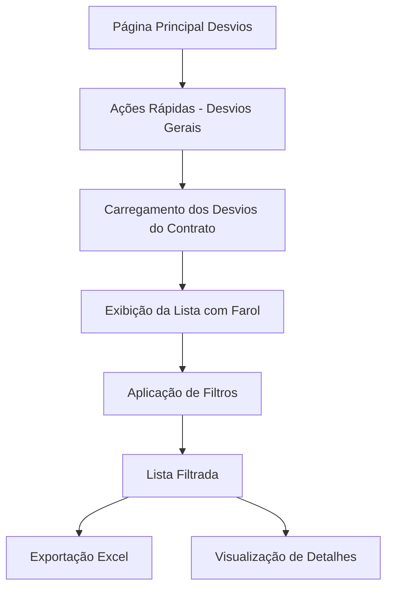

# Desvios Gerais - Documento de Requisitos do Produto

## 1. Visão Geral do Produto

Sistema de visualização e gestão de desvios gerais que permite aos usuários visualizar todos os desvios do seu contrato raiz, com funcionalidades avançadas de filtragem, indicadores visuais de status e exportação para Excel.

- **Objetivo Principal**: Centralizar a visualização de todos os desvios de segurança do contrato, proporcionando uma visão geral completa com filtros eficientes e indicadores visuais claros.
- **Usuários-alvo**: Gestores, supervisores e responsáveis pela segurança que precisam monitorar desvios em nível contratual.
- **Valor de Mercado**: Melhoria na gestão de segurança através de visibilidade centralizada e relatórios exportáveis.

## 2. Funcionalidades Principais

### 2.1 Papéis de Usuário
Não há distinção de papéis específicos para esta funcionalidade. Todos os usuários autenticados podem acessar os desvios do seu contrato raiz.

### 2.2 Módulo de Funcionalidades

Nossa página de Desvios Gerais consiste das seguintes páginas principais:
1. **Página Desvios Gerais**: listagem completa, filtros avançados, farol de status, exportação Excel.
2. **Atalho em Ações Rápidas**: link de acesso rápido na página principal de desvios.

### 2.3 Detalhes das Páginas

| Nome da Página | Nome do Módulo | Descrição da Funcionalidade |
|----------------|----------------|----------------------------|
| Desvios Gerais | Header com Estatísticas | Exibe contadores de desvios por status e métricas gerais do contrato |
| Desvios Gerais | Filtros Avançados | Filtros por status, gravidade, período, local, responsável, natureza e tipo com otimização de performance |
| Desvios Gerais | Lista com Farol de Status | Tabela responsiva com indicador visual colorido (farol) para cada status de desvio |
| Desvios Gerais | Legenda do Farol | Componente explicativo das cores e significados dos status |
| Desvios Gerais | Exportação Excel | Botão para exportar dados filtrados em formato XLSX com todas as colunas relevantes |
| Desvios Gerais | Paginação | Sistema de paginação para otimizar carregamento de grandes volumes de dados |
| Página Principal Desvios | Ações Rápidas | Link "Desvios Gerais" adicionado ao menu de ações rápidas |

## 3. Processo Principal

**Fluxo do Usuário:**

1. **Acesso**: Usuário acessa via atalho "Desvios Gerais" na página principal de desvios
2. **Carregamento**: Sistema carrega todos os desvios do contrato_raiz do usuário logado
3. **Visualização**: Lista exibida com farol de status colorido e informações principais
4. **Filtragem**: Usuário aplica filtros conforme necessário (status, período, etc.)
5. **Exportação**: Usuário pode exportar dados filtrados para Excel
6. **Navegação**: Usuário pode visualizar detalhes específicos de cada desvio

## 4. Design da Interface do Usuário

### 4.1 Estilo de Design

- **Cores Primárias**: Azul (#3B82F6) e Laranja (#EA580C)
- **Cores do Farol**: 
  - Verde (#10B981) - Concluído
  - Amarelo (#F59E0B) - Em Andamento  
  - Vermelho (#EF4444) - Aguardando Avaliação/Vencido
  - Cinza (#6B7280) - Cancelado
- **Estilo dos Botões**: Arredondados com hover effects
- **Fonte**: Sistema padrão com tamanhos hierárquicos (text-xl, text-lg, text-sm)
- **Layout**: Card-based com navegação superior
- **Ícones**: Lucide React para consistência visual

### 4.2 Visão Geral do Design da Página

| Nome da Página | Nome do Módulo | Elementos da UI |
|----------------|----------------|-----------------|
| Desvios Gerais | Header Estatísticas | Cards coloridos com ícones, contadores por status, métricas de performance |
| Desvios Gerais | Filtros | Grid responsivo com inputs, selects e date pickers, botão "Limpar Filtros" |
| Desvios Gerais | Farol de Status | Círculo colorido (12px) ao lado de cada linha, tooltip com descrição do status |
| Desvios Gerais | Legenda | Card fixo com lista de cores e significados, posicionado no canto superior direito |
| Desvios Gerais | Tabela | Colunas: Farol, Título, Local, Data, Status, Gravidade, Responsável, Ações |
| Desvios Gerais | Exportação | Botão verde com ícone de download, contador de registros a serem exportados |

### 4.3 Responsividade

- **Desktop-first** com adaptação para mobile
- **Breakpoints**: sm (640px), md (768px), lg (1024px), xl (1280px)
- **Tabela responsiva** com scroll horizontal em telas menores
- **Filtros colapsáveis** em dispositivos móveis
- **Cards empilhados** em vez de tabela em telas muito pequenas