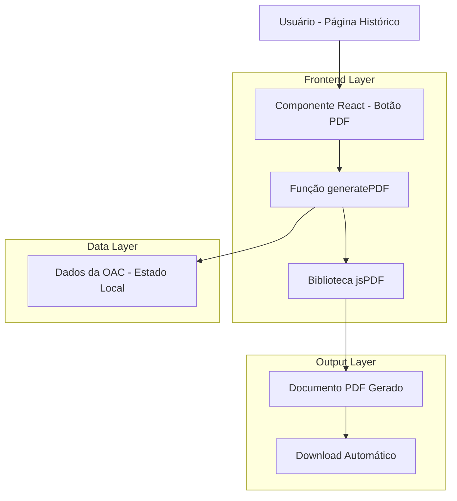
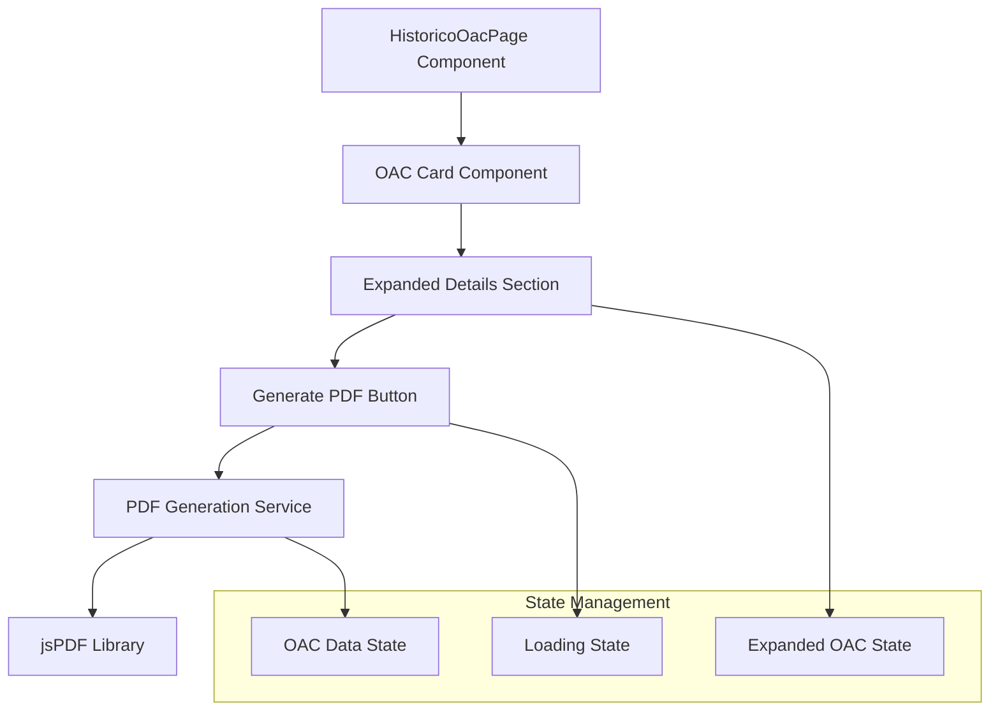
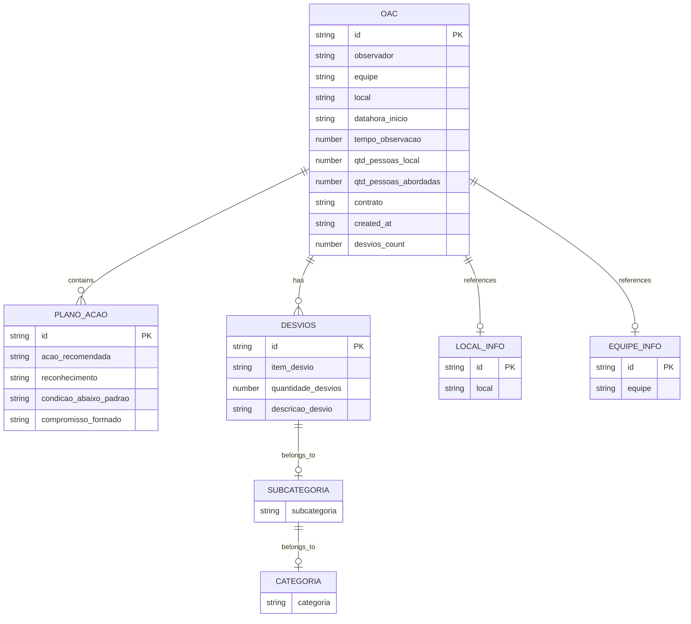

# Geração de PDF para OACs - Documento de Arquitetura Técnica

## 1. Design da Arquitetura



## 2. Descrição da Tecnologia

- **Frontend**: React@18 + TypeScript + jsPDF@2.5.1 + Tailwind CSS@3
- **Backend**: Nenhum (processamento client-side)
- **Bibliotecas Adicionais**: 
  - `jspdf` para geração de PDF
  - `lucide-react` para ícones (já existente)
  - `react-hot-toast` para notificações (já existente)

## 3. Definições de Rotas

| Rota | Propósito |
|------|-----------|
| /oac/historico | Página principal onde a funcionalidade será integrada |

*Nota: Não há novas rotas, a funcionalidade é integrada à página existente*

## 4. Definições de API

### 4.1 APIs Existentes Utilizadas

**Buscar dados da OAC**
```
GET /api/oac?page=1&limit=10
```

*Nota: A funcionalidade utiliza dados já carregados no estado do componente React, não requer novas APIs*

## 5. Arquitetura do Cliente (Frontend)



## 6. Modelo de Dados

### 6.1 Definição do Modelo de Dados



### 6.2 Interface TypeScript

```typescript
// Interface principal já existente no sistema
interface OAC {
  id: string
  observador: string
  equipe: string
  local: string
  datahora_inicio: string
  tempo_observacao: number
  qtd_pessoas_local: number
  qtd_pessoas_abordadas: number
  contrato: string
  created_at: string
  desvios_count?: number
  plano_acao?: Array<{
    id: string
    acao_recomendada?: string
    reconhecimento?: string
    condicao_abaixo_padrao?: string
    compromisso_formado?: string
  }>
  desvios?: Array<{
    id: string
    item_desvio: string
    quantidade_desvios: number
    descricao_desvio: string
    subcategoria?: {
      subcategoria: string
      categoria: {
        categoria: string
      }
    }
  }>
  local_info?: {
    id: string
    local: string
  }
  equipe_info?: {
    id: string
    equipe: string
  }
}

// Nova interface para configuração do PDF
interface PDFConfig {
  includeHeader: boolean
  includeFooter: boolean
  pageFormat: 'A4' | 'Letter'
  orientation: 'portrait' | 'landscape'
}

// Interface para o serviço de geração de PDF
interface PDFGenerationService {
  generateOACPDF(oac: OAC, config?: PDFConfig): Promise<void>
  formatDateTime(dateString: string): string
  formatDuration(minutes: number): string
}
```

## 7. Implementação Técnica

### 7.1 Estrutura de Arquivos

```
src/
├── app/oac/historico/
│   ├── page.tsx (modificado - adicionar botão PDF)
│   └── components/
│       └── PDFGenerator.tsx (novo)
├── lib/
│   └── services/
│       └── pdfService.ts (novo)
└── types/
    └── pdf.ts (novo)
```

### 7.2 Dependências Necessárias

```json
{
  "dependencies": {
    "jspdf": "^2.5.1"
  },
  "devDependencies": {
    "@types/jspdf": "^2.3.0"
  }
}
```

### 7.3 Configuração de Build

*Nota: jsPDF é compatível com Next.js e não requer configurações especiais de build*

## 8. Considerações de Performance

### 8.1 Otimizações

- **Lazy Loading**: Carregar biblioteca jsPDF apenas quando necessário
- **Memoização**: Cache de dados formatados para evitar reprocessamento
- **Processamento Assíncrono**: Geração de PDF em background com feedback visual

### 8.2 Limitações

- **Tamanho do Bundle**: jsPDF adiciona ~200KB ao bundle (carregamento sob demanda recomendado)
- **Processamento Client-side**: Limitado pela capacidade do dispositivo do usuário
- **Memória**: PDFs grandes podem consumir memória significativa no navegador

## 9. Segurança

### 9.1 Considerações de Segurança

- **Dados Sensíveis**: Processamento local evita envio de dados para servidores externos
- **Controle de Acesso**: Utiliza sistema de autenticação existente
- **Sanitização**: Validação de dados antes da geração do PDF para evitar injeção de conteúdo

### 9.2 Compliance

- **LGPD**: Dados processados localmente, sem armazenamento adicional
- **Auditoria**: Log de geração de PDFs pode ser implementado se necessário