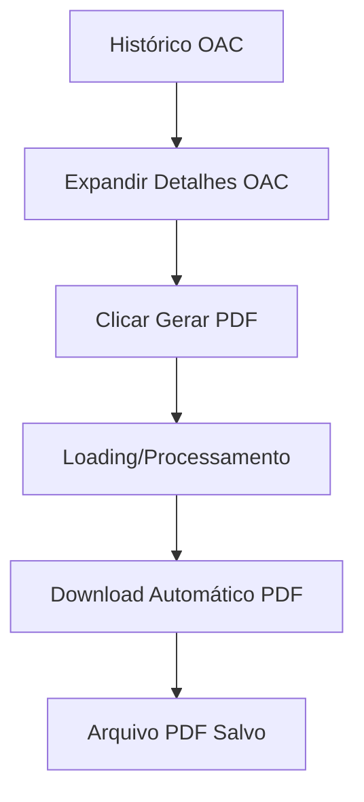

# Geração de PDF para OACs - Documento de Requisitos do Produto

## 1. Visão Geral do Produto

Sistema de geração de relatórios em PDF para Observações de Atos e Condições (OACs) realizadas, permitindo exportar dados completos de observações comportamentais em formato profissional e padronizado.

* **Propósito Principal**: Facilitar a documentação, compartilhamento e arquivo de relatórios de OACs em formato PDF profissional para gestores, equipes de segurança e auditores.

* **Valor de Mercado**: Melhora a rastreabilidade e documentação de práticas de segurança, atendendo requisitos de compliance e facilitando análises posteriores.

## 2. Funcionalidades Principais

### 2.1 Papéis de Usuário

| Papel               | Método de Acesso         | Permissões Principais                                          |
| ------------------- | ------------------------ | -------------------------------------------------------------- |
| Usuário Autenticado | Login no sistema         | Pode gerar PDF das próprias OACs e OACs de sua equipe/contrato |
| Gestor/Supervisor   | Login com perfil elevado | Pode gerar PDF de todas as OACs do seu escopo de gestão        |

### 2.2 Módulo de Funcionalidades

Nossa funcionalidade de geração de PDF consiste das seguintes páginas principais:

1. **Página de Histórico OAC**: botão de geração de PDF nos detalhes expandidos de cada OAC.
2. **Modal de Configuração**: opções de personalização do PDF (opcional para versão inicial).
3. **Preview do PDF**: visualização antes do download (opcional para versão inicial).

### 2.3 Detalhes das Páginas

| Nome da Página | Nome do Módulo    | Descrição da Funcionalidade                                                                                                                            |
| -------------- | ----------------- | ------------------------------------------------------------------------------------------------------------------------------------------------------ |
| Histórico OAC  | Botão Gerar PDF   | Adicionar botão "Gerar PDF" nos detalhes expandidos de cada OAC. Exibir loading durante geração e fazer download automático                            |
| Histórico OAC  | Processamento PDF | Coletar todos os dados da OAC (básicos, pessoas, comportamentos, plano de ação, desvios). Formatar em layout profissional com logo e identidade visual |
| Histórico OAC  | Download PDF      | Gerar arquivo PDF com nome padronizado (OAC\_\[ID]\_\[DATA].pdf). Iniciar download automático no navegador                                             |

## 3. Processo Principal

**Fluxo do Usuário:**

1. Usuário acessa página de Histórico de OACs (/oac/historico)
2. Expande os detalhes de uma OAC específica clicando no card
3. Visualiza botão "Gerar PDF" na seção de detalhes expandidos
4. Clica no botão "Gerar PDF"
5. Sistema exibe loading/spinner durante processamento
6. PDF é gerado automaticamente e download inicia
7. Usuário recebe arquivo PDF formatado com todos os dados da OAC

## 4. Design da Interface do Usuário

### 4.1 Estilo de Design

* **Cores Primárias**: Azul (#2563eb) para botões principais, Cinza (#6b7280) para textos secundários

* **Cores Secundárias**: Verde (#10b981) para status positivos, Vermelho (#ef4444) para alertas

* **Estilo de Botão**: Botão arredondado com ícone de download, hover com transição suave

* **Fonte**: Sistema padrão (Inter/system-ui), tamanhos 14px (texto), 16px (botões)

* **Layout**: Integração harmoniosa com design existente da página de histórico

* **Ícones**: Lucide React (Download, FileText, Loader2 para loading)

### 4.2 Visão Geral do Design da Página

| Nome da Página | Nome do Módulo      | Elementos da UI                                                                                                                                      |
| -------------- | ------------------- | ---------------------------------------------------------------------------------------------------------------------------------------------------- |
| Histórico OAC  | Botão Gerar PDF     | Botão azul com ícone de download, texto "Gerar PDF", posicionado no canto superior direito da seção expandida. Loading spinner durante processamento |
| Histórico OAC  | Feedback Visual     | Toast notification de sucesso/erro. Mudança temporária do botão para estado de loading com spinner                                                   |
| PDF Gerado     | Layout do Documento | Cabeçalho com logo e título, seções organizadas (dados básicos, pessoas, comportamentos, plano de ação), rodapé com data de geração                  |

### 4.3 Responsividade

* **Desktop-first**: Funcionalidade otimizada para desktop onde PDFs são mais utilizados

* **Mobile-adaptive**: Botão responsivo que se adapta ao tamanho da tela

* **Touch-friendly**: Botão com área de toque adequada para dispositivos móveis (mínimo 44px)

## 5. Especificações Técnicas do PDF

### 5.1 Estrutura do Documento PDF

**Cabeçalho:**

* Logo da empresa (se disponível)

* Título: "Relatório de Observação de Atos e Condições (OAC)"

* ID da OAC e data de geração

**Seções do Conteúdo:**

1. **Informações Básicas**: Observador, equipe, local, data/hora, tempo de observação
2. **Dados Quantitativos**: Pessoas no local, pessoas abordadas, contrato
3. **Comportamentos Observados**: Lista de desvios com categorias e descrições
4. **Plano de Ação**: Ações recomendadas, reconhecimentos, condições abaixo do padrão, compromissos
5. **Estatísticas**: Resumo quantitativo da observação

**Rodapé:**

* Data e hora de geração do relatório

* Nome do usuário que gerou o relatório

* Número da página

### 5.2 Formatação e Estilo

* **Formato**: A4 (210 x 297 mm)

* **Margens**: 20mm em todos os lados

* **Fonte**: Arial ou Helvetica, tamanhos variados (12pt texto, 14pt subtítulos, 18pt título)

* **Cores**: Escala de cinza para impressão, azul para destaques digitais

* **Espaçamento**: Seções bem definidas com espaçamento adequado entre elementos

