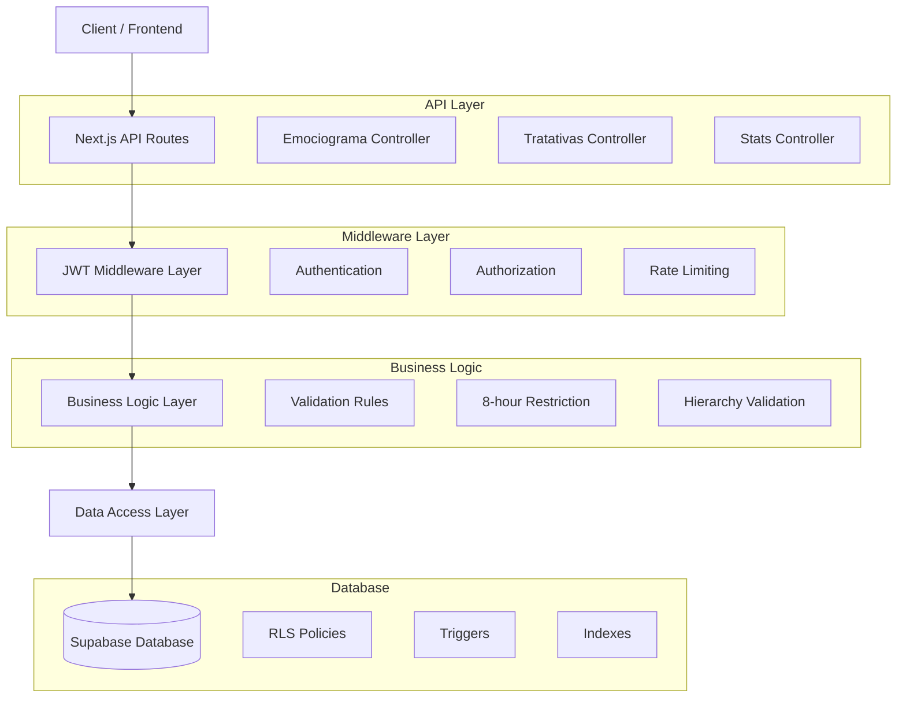
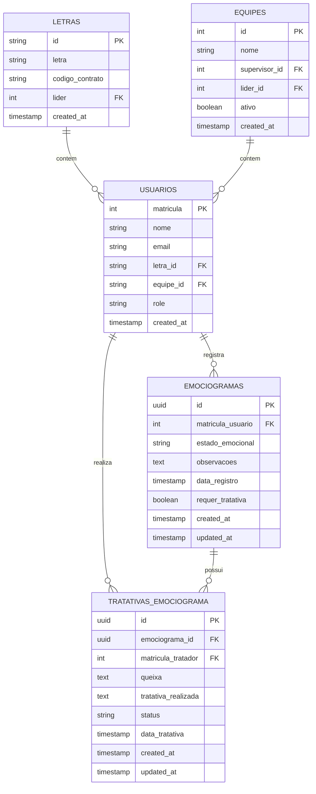

# Gestão de Emociograma - Documento de Arquitetura Técnica

## 1. Architecture design

```mermaid
graph TD
    A[User Browser] --> B[React Frontend Application]
    B --> C[Next.js API Routes]
    C --> D[JWT Middleware]
    D --> E[Supabase Client]
    E --> F[Supabase Database]
    
    subgraph "Frontend Layer"
        B
        G[Emociograma Components]
        H[Modal de Registro]
        I[Dashboard Components]
    end
    
    subgraph "API Layer"
        C
        J[/api/emociograma]
        K[/api/emociograma/tratativas]
        L[/api/emociograma/stats]
    end
    
    subgraph "Database Layer"
        F
        M[emociogramas table]
        N[tratativas_emociograma table]
        O[usuarios table]
    end
    
    subgraph "Security Layer"
        D
        P[RLS Policies]
        Q[Role-based Access]
    end
```

## 2. Technology Description

* Frontend: React\@18 + Next.js\@14 + TypeScript + Tailwind CSS\@3

* Backend: Next.js API Routes + Supabase

* Database: Supabase (PostgreSQL)

* Authentication: JWT + Supabase Auth

* UI Components: Lucide React (icons) + Sonner (toasts)

* Styling: Tailwind CSS com animações customizadas

## 3. Route definitions

| Route                   | Purpose                                                             |
| ----------------------- | ------------------------------------------------------------------- |
| /emociograma            | Dashboard principal do módulo com estatísticas e acesso ao registro |
| /emociograma/historico  | Página de histórico pessoal de registros do usuário                 |
| /emociograma/tratativas | Página para líderes/supervisores gerenciarem tratativas             |
| /emociograma/relatorios | Dashboard gerencial com métricas e indicadores (Admin/Editor)       |

## 4. API definitions

### 4.1 Core API

**Registro de Emociograma**

```
POST /api/emociograma
```

Request:

| Param Name        | Param Type | isRequired | Description                                   |
| ----------------- | ---------- | ---------- | --------------------------------------------- |
| estado\_emocional | string     | true       | Estado emocional: "bem", "regular", "pessimo" |
| observacoes       | string     | false      | Observações opcionais do usuário              |

Response:

| Param Name | Param Type | Description                 |
| ---------- | ---------- | --------------------------- |
| success    | boolean    | Status da operação          |
| message    | string     | Mensagem de retorno         |
| data       | object     | Dados do emociograma criado |

Example:

```json
{
  "estado_emocional": "regular",
  "observacoes": "Dor de cabeça persistente"
}
```

**Listar Emociogramas**

```
GET /api/emociograma
```

Query Parameters:

| Param Name | Param Type | isRequired | Description                                |
| ---------- | ---------- | ---------- | ------------------------------------------ |
| page       | number     | false      | Página para paginação (default: 1)         |
| limit      | number     | false      | Limite de registros (default: 10)          |
| periodo    | string     | false      | Filtro por período: "7d", "30d", "90d"     |
| meus       | boolean    | false      | Filtrar apenas registros do usuário logado |
| equipe     | boolean    | false      | Filtrar registros da equipe (para líderes) |

**Estatísticas de Emociograma**

```
GET /api/emociograma/stats
```

Query Parameters:

| Param Name | Param Type | isRequired | Description                                   |
| ---------- | ---------- | ---------- | --------------------------------------------- |
| periodo    | string     | false      | Período para estatísticas: "7d", "30d", "90d" |
| tipo       | string     | false      | Tipo de visão: "pessoal", "equipe", "geral"   |

**Criar Tratativa**

```
POST /api/emociograma/tratativas
```

Request:

| Param Name           | Param Type | isRequired | Description                      |
| -------------------- | ---------- | ---------- | -------------------------------- |
| emociograma\_id      | string     | true       | ID do emociograma a ser tratado  |
| queixa               | string     | true       | Descrição da queixa identificada |
| tratativa\_realizada | string     | true       | Descrição da tratativa realizada |

**Listar Tratativas**

```
GET /api/emociograma/tratativas
```

Query Parameters:

| Param Name | Param Type | isRequired | Description                                  |
| ---------- | ---------- | ---------- | -------------------------------------------- |
| status     | string     | false      | Status da tratativa: "pendente", "concluida" |
| periodo    | string     | false      | Filtro por período                           |

## 5. Server architecture diagram



## 6. Data model

### 6.1 Data model definition



### 6.2 Data Definition Language

**Tabela Emociogramas**

```sql
-- Criar tabela emociogramas
CREATE TABLE emociogramas (
    id UUID PRIMARY KEY DEFAULT gen_random_uuid(),
    matricula_usuario INTEGER NOT NULL REFERENCES usuarios(matricula),
    estado_emocional VARCHAR(20) NOT NULL CHECK (estado_emocional IN ('bem', 'regular', 'pessimo')),
    observacoes TEXT,
    data_registro TIMESTAMP WITH TIME ZONE DEFAULT NOW(),
    requer_tratativa BOOLEAN DEFAULT FALSE,
    created_at TIMESTAMP WITH TIME ZONE DEFAULT NOW(),
    updated_at TIMESTAMP WITH TIME ZONE DEFAULT NOW()
);

-- Criar índices para performance
CREATE INDEX idx_emociogramas_matricula_usuario ON emociogramas(matricula_usuario);
CREATE INDEX idx_emociogramas_data_registro ON emociogramas(data_registro DESC);
CREATE INDEX idx_emociogramas_estado_emocional ON emociogramas(estado_emocional);
CREATE INDEX idx_emociogramas_requer_tratativa ON emociogramas(requer_tratativa) WHERE requer_tratativa = true;

-- Trigger para definir se requer tratativa
CREATE OR REPLACE FUNCTION set_requer_tratativa()
RETURNS TRIGGER AS $$
BEGIN
    NEW.requer_tratativa = (NEW.estado_emocional IN ('regular', 'pessimo'));
    RETURN NEW;
END;
$$ LANGUAGE plpgsql;

CREATE TRIGGER trigger_set_requer_tratativa
    BEFORE INSERT OR UPDATE ON emociogramas
    FOR EACH ROW
    EXECUTE FUNCTION set_requer_tratativa();

-- Função para verificar último registro (8 horas)
CREATE OR REPLACE FUNCTION check_last_emociograma(user_matricula INTEGER)
RETURNS BOOLEAN AS $$
DECLARE
    last_registro TIMESTAMP WITH TIME ZONE;
BEGIN
    SELECT data_registro INTO last_registro
    FROM emociogramas
    WHERE matricula_usuario = user_matricula
    ORDER BY data_registro DESC
    LIMIT 1;
    
    IF last_registro IS NULL THEN
        RETURN TRUE;
    END IF;
    
    RETURN (NOW() - last_registro) >= INTERVAL '8 hours';
END;
$$ LANGUAGE plpgsql;
```

**Tabela Tratativas Emociograma**

```sql
-- Criar tabela tratativas_emociograma
CREATE TABLE tratativas_emociograma (
    id UUID PRIMARY KEY DEFAULT gen_random_uuid(),
    emociograma_id UUID NOT NULL REFERENCES emociogramas(id) ON DELETE CASCADE,
    matricula_tratador INTEGER NOT NULL REFERENCES usuarios(matricula),
    queixa TEXT NOT NULL,
    tratativa_realizada TEXT NOT NULL,
    status VARCHAR(20) DEFAULT 'concluida' CHECK (status IN ('pendente', 'concluida')),
    data_tratativa TIMESTAMP WITH TIME ZONE DEFAULT NOW(),
    created_at TIMESTAMP WITH TIME ZONE DEFAULT NOW(),
    updated_at TIMESTAMP WITH TIME ZONE DEFAULT NOW()
);

-- Criar índices
CREATE INDEX idx_tratativas_emociograma_id ON tratativas_emociograma(emociograma_id);
CREATE INDEX idx_tratativas_matricula_tratador ON tratativas_emociograma(matricula_tratador);
CREATE INDEX idx_tratativas_status ON tratativas_emociograma(status);
CREATE INDEX idx_tratativas_data_tratativa ON tratativas_emociograma(data_tratativa DESC);

-- Trigger para atualizar updated_at
CREATE OR REPLACE FUNCTION update_updated_at_column()
RETURNS TRIGGER AS $$
BEGIN
    NEW.updated_at = NOW();
    RETURN NEW;
END;
$$ LANGUAGE plpgsql;

CREATE TRIGGER trigger_update_emociogramas_updated_at
    BEFORE UPDATE ON emociogramas
    FOR EACH ROW
    EXECUTE FUNCTION update_updated_at_column();

CREATE TRIGGER trigger_update_tratativas_updated_at
    BEFORE UPDATE ON tratativas_emociograma
    FOR EACH ROW
    EXECUTE FUNCTION update_updated_at_column();
```

**Políticas RLS (Row Level Security)**

```sql
-- Habilitar RLS nas tabelas
ALTER TABLE emociogramas ENABLE ROW LEVEL SECURITY;
ALTER TABLE tratativas_emociograma ENABLE ROW LEVEL SECURITY;

-- Política para emociogramas - usuários podem ver apenas seus próprios registros
CREATE POLICY "Usuários podem ver próprios emociogramas" ON emociogramas
    FOR SELECT USING (auth.uid()::text IS NOT NULL);

-- Política para inserção - usuários autenticados podem inserir
CREATE POLICY "Usuários autenticados podem inserir emociogramas" ON emociogramas
    FOR INSERT WITH CHECK (auth.uid()::text IS NOT NULL);

-- Política para tratativas - apenas usuários autenticados
CREATE POLICY "Usuários autenticados podem ver tratativas" ON tratativas_emociograma
    FOR SELECT USING (auth.uid()::text IS NOT NULL);

CREATE POLICY "Usuários autenticados podem inserir tratativas" ON tratativas_emociograma
    FOR INSERT WITH CHECK (auth.uid()::text IS NOT NULL);

-- Grants para roles
GRANT SELECT, INSERT, UPDATE ON emociogramas TO authenticated;
GRANT SELECT, INSERT, UPDATE ON tratativas_emociograma TO authenticated;
GRANT USAGE ON SEQUENCE emociogramas_id_seq TO authenticated;
GRANT USAGE ON SEQUENCE tratativas_emociograma_id_seq TO authenticated;
```

**Dados Iniciais para Teste**

```sql
-- Inserir alguns registros de exemplo (apenas para desenvolvimento)
INSERT INTO emociogramas (matricula_usuario, estado_emocional, observacoes) VALUES
(1001, 'bem', 'Dia produtivo e motivado'),
(1002, 'regular', 'Cansaço devido à sobrecarga de trabalho'),
(1003, 'pessimo', 'Problemas pessoais afetando o trabalho');

-- Inserir tratativa de exemplo
INSERT INTO tratativas_emociograma (emociograma_id, matricula_tratador, queixa, tratativa_realizada)
SELECT 
    e.id,
    2001, -- Matrícula do líder
    'Funcionário relatou cansaço excessivo',
    'Conversa realizada, ajuste na carga de trabalho e acompanhamento semanal'
FROM emociogramas e 
WHERE e.estado_emocional = 'regular' 
LIMIT 1;
```

## 7. Componentes e Estrutura Frontend

### 7.1 Estrutura de Arquivos

```
src/
├── app/
│   ├── emociograma/
│   │   ├── page.tsx (Dashboard principal)
│   │   ├── historico/
│   │   │   └── page.tsx
│   │   ├── tratativas/
│   │   │   └── page.tsx
│   │   └── relatorios/
│   │       └── page.tsx
│   └── api/
│       └── emociograma/
│           ├── route.ts
│           ├── tratativas/
│           │   └── route.ts
│           └── stats/
│               └── route.ts
├── components/
│   └── emociograma/
│       ├── ModalRegistro.tsx
│       ├── CardEstadoEmocional.tsx
│       ├── AlertaEstadoIrregular.tsx
│       ├── GraficoTendencia.tsx
│       └── FormularioTratativa.tsx
└── lib/
    └── types/
        └── emociograma.ts
```

### 7.2 Interfaces TypeScript

```typescript
export interface Emociograma {
  id: string
  matricula_usuario: number
  estado_emocional: 'bem' | 'regular' | 'pessimo'
  observacoes?: string
  data_registro: string
  requer_tratativa: boolean
  created_at: string
  updated_at: string
  usuario?: {
    nome: string
    email: string
  }
}

export interface TratativaEmociograma {
  id: string
  emociograma_id: string
  matricula_tratador: number
  queixa: string
  tratativa_realizada: string
  status: 'pendente' | 'concluida'
  data_tratativa: string
  created_at: string
  updated_at: string
  tratador?: {
    nome: string
    email: string
  }
  emociograma?: Emociograma
}

export interface EmociogramaStats {
  total_registros: number
  bem: number
  regular: number
  pessimo: number
  pendentes_tratativa: number
  tratativas_realizadas: number
  periodo: string
}
```

