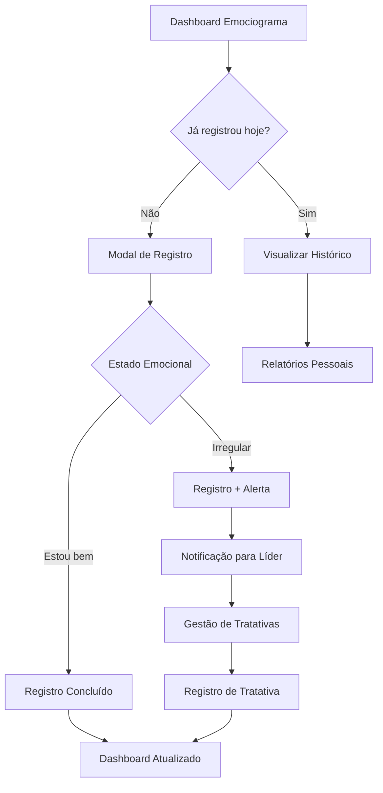

# Gestão de Emociograma - Documento de Requisitos do Produto

## 1. Product Overview

O módulo de Gestão de Emociograma é uma ferramenta inovadora para monitoramento do bem-estar emocional dos colaboradores, permitindo registro diário do estado emocional e implementação de tratativas preventivas para casos que necessitem de atenção especial.

- O sistema visa promover um ambiente de trabalho mais seguro e saudável, identificando precocemente situações que possam comprometer o bem-estar dos funcionários e a segurança operacional.
- Destinado a todos os usuários do sistema, com funcionalidades específicas para líderes e supervisores realizarem acompanhamento e tratativas adequadas.

## 2. Core Features

### 2.1 User Roles

| Role | Registration Method | Core Permissions |
|------|---------------------|------------------|
| Usuário Padrão | Acesso via sistema existente | Pode registrar seu próprio emociograma e visualizar histórico pessoal |
| Líder de Letra | Definido na estrutura organizacional | Pode visualizar emociogramas da sua letra e realizar tratativas |
| Supervisor de Equipe | Definido na estrutura organizacional | Pode visualizar emociogramas da sua equipe e realizar tratativas |
| Admin/Editor | Roles existentes no sistema | Acesso completo a todos os emociogramas e relatórios gerenciais |

### 2.2 Feature Module

O módulo de Gestão de Emociograma consiste nas seguintes páginas principais:

1. **Dashboard de Emociograma**: painel principal com estatísticas, alertas e acesso rápido ao registro
2. **Registro de Emociograma**: modal interativa para registro do estado emocional diário
3. **Histórico Pessoal**: visualização dos registros pessoais do usuário
4. **Gestão de Tratativas**: página para líderes e supervisores gerenciarem casos que necessitam atenção
5. **Relatórios Gerenciais**: dashboard com métricas e indicadores para gestores

### 2.3 Page Details

| Page Name | Module Name | Feature description |
|-----------|-------------|---------------------|
| Dashboard de Emociograma | Painel Principal | Exibe estatísticas pessoais, alertas ativos, botão de registro rápido e indicadores visuais do estado atual |
| Dashboard de Emociograma | Widget de Registro | Botão animado e intuitivo para acesso rápido ao registro diário |
| Dashboard de Emociograma | Alertas de Estado | Exibe alertas para usuários com estado irregular, orientando sobre procedimentos |
| Registro de Emociograma | Modal de Registro | Interface lúdica com 3 opções: "Estou bem" (😊), "Não me sinto muito bem" (😐), "Estou péssimo" (😞) |
| Registro de Emociograma | Validação de Frequência | Verifica se usuário já registrou nas últimas 8 horas e bloqueia novo registro se necessário |
| Registro de Emociograma | Campo de Observações | Permite adicionar comentários opcionais sobre o estado emocional |
| Histórico Pessoal | Lista de Registros | Exibe histórico cronológico dos registros pessoais com filtros por período |
| Histórico Pessoal | Gráfico de Tendência | Visualização gráfica da evolução do estado emocional ao longo do tempo |
| Gestão de Tratativas | Lista de Pendências | Exibe emociogramas irregulares que necessitam tratativa da equipe/letra |
| Gestão de Tratativas | Formulário de Tratativa | Permite registrar queixa identificada e tratativa realizada |
| Gestão de Tratativas | Histórico de Tratativas | Visualiza tratativas realizadas com status e resultados |
| Relatórios Gerenciais | Indicadores Gerais | Dashboard com métricas de bem-estar por equipe, letra e período |
| Relatórios Gerenciais | Exportação de Dados | Funcionalidade para exportar relatórios em Excel/PDF |

## 3. Core Process

### Fluxo do Usuário Padrão:
1. Usuário acessa o dashboard e visualiza seu status atual
2. Clica no botão de registro (disponível apenas se não registrou nas últimas 8 horas)
3. Seleciona seu estado emocional na modal interativa
4. Adiciona observações opcionais
5. Confirma o registro
6. Se estado for irregular, recebe alerta sobre procedimentos de segurança
7. Pode visualizar seu histórico pessoal

### Fluxo do Líder/Supervisor:
1. Acessa dashboard e visualiza alertas de sua equipe/letra
2. Identifica casos que necessitam tratativa
3. Acessa página de gestão de tratativas
4. Seleciona caso específico e registra tratativa
5. Documenta queixa identificada e ação realizada
6. Acompanha evolução através de relatórios

## 4. User Interface Design

### 4.1 Design Style

- **Cores primárias**: Verde (#10B981) para estados positivos, Amarelo (#F59E0B) para atenção, Vermelho (#EF4444) para estados críticos
- **Cores secundárias**: Azul (#3B82F6) para elementos informativos, Cinza (#6B7280) para elementos neutros
- **Estilo de botões**: Arredondados com efeitos de hover e animações suaves
- **Fontes**: Inter (tamanhos: 14px para texto, 16px para labels, 24px para títulos)
- **Layout**: Card-based com espaçamento generoso e hierarquia visual clara
- **Ícones**: Emojis e ícones do Lucide para representar estados emocionais de forma intuitiva
- **Animações**: Transições suaves, efeitos de pulse para botões de ação, micro-interações nos cards

### 4.2 Page Design Overview

| Page Name | Module Name | UI Elements |
|-----------|-------------|-------------|
| Dashboard de Emociograma | Painel Principal | Cards com gradientes, ícones grandes coloridos, métricas em destaque com animações de contagem |
| Dashboard de Emociograma | Widget de Registro | Botão circular grande com ícone de coração pulsante, cores dinâmicas baseadas no último estado |
| Registro de Emociograma | Modal de Registro | Modal centralizada com 3 cards grandes, cada um com emoji animado, cores específicas e efeitos hover |
| Registro de Emociograma | Opções de Estado | Cards interativos: Verde com 😊, Amarelo com 😐, Vermelho com 😞, animações de seleção |
| Histórico Pessoal | Lista de Registros | Timeline vertical com ícones coloridos, cards com sombras suaves, filtros em chips |
| Histórico Pessoal | Gráfico de Tendência | Gráfico de linha com cores gradientes, pontos interativos, tooltips informativos |
| Gestão de Tratativas | Lista de Pendências | Cards com bordas coloridas por prioridade, badges de status, botões de ação destacados |
| Gestão de Tratativas | Formulário de Tratativa | Layout em duas colunas, campos com labels flutuantes, botões de confirmação destacados |
| Relatórios Gerenciais | Indicadores Gerais | Dashboard com cards de métricas, gráficos coloridos, filtros em dropdown estilizados |

### 4.3 Responsiveness

O módulo é desenvolvido com abordagem mobile-first, garantindo experiência otimizada em dispositivos móveis e tablets. Inclui otimizações para interação touch, com botões de tamanho adequado e gestos intuitivos para navegação entre registros.

## 5. Regras de Negócio Específicas

### 5.1 Controle de Frequência
- Usuários podem registrar apenas 1 emociograma a cada 8 horas
- Sistema exibe countdown até próximo registro permitido
- Validação tanto no frontend quanto no backend

### 5.2 Alertas e Notificações
- Estados "Não me sinto muito bem" e "Estou péssimo" geram alertas automáticos
- Usuário recebe orientação para não iniciar atividades sem conversar com liderança
- Líderes recebem notificações de casos pendentes de tratativa

### 5.3 Permissões de Tratativa
- Apenas líderes da letra ou supervisores da equipe podem realizar tratativas
- Sistema valida hierarquia organizacional antes de permitir acesso
- Histórico completo de tratativas para auditoria

### 5.4 Privacidade e Confidencialidade
- Dados pessoais de emociograma são confidenciais
- Acesso restrito conforme hierarquia organizacional
- Relatórios gerenciais apresentam dados agregados sem identificação individual