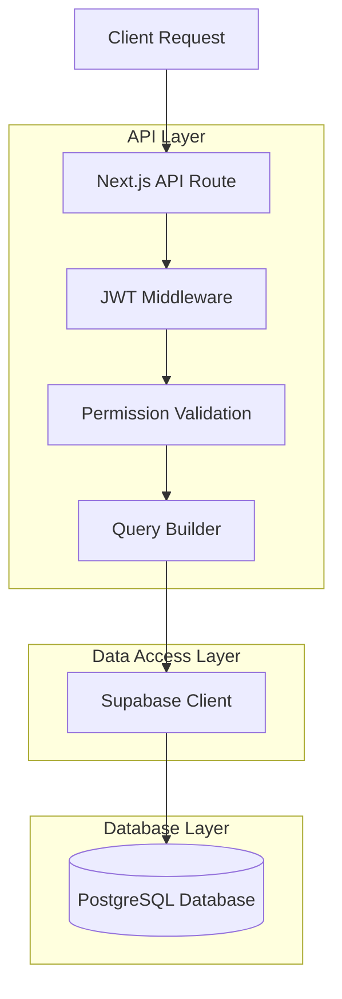
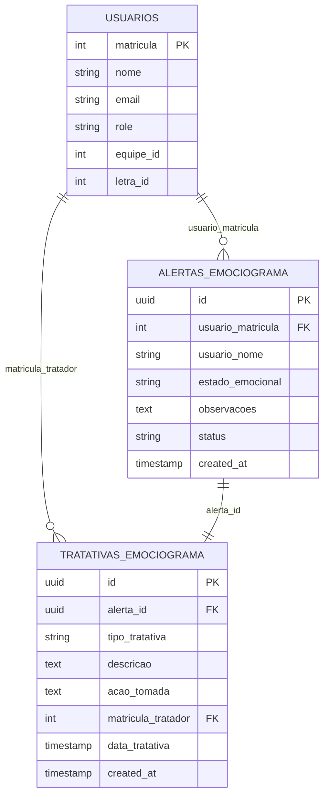

# Histórico de Tratativas - Emociograma - Arquitetura Técnica

## 1. Architecture design

```mermaid
graph TD
  A[User Browser] --> B[React Frontend Application]
  B --> C[Next.js API Routes]
  C --> D[Supabase Database]
  C --> E[JWT Authentication]

  subgraph "Frontend Layer"
    B
    F[Histórico Tratativas Page]
    G[Filtros Component]
    H[Tratativas List Component]
    I[Alertas Pendentes Component]
  end

  subgraph "API Layer"
    C
    J[/api/emociograma/tratativas - GET All]
    K[/api/emociograma/alertas - GET Pending]
  end

  subgraph "Data Layer"
    D
    L[tratativas_emociograma]
    M[alertas_emociograma]
    N[usuarios]
  end

  B --> F
  F --> G
  F --> H
  F --> I
  G --> J
  H --> J
  I --> K
  J --> L
  J --> M
  J --> N
  K --> M
  K --> N
```

## 2. Technology Description
- Frontend: React@18 + Next.js@14 + TypeScript + Tailwind CSS@3
- Backend: Next.js API Routes
- Database: Supabase (PostgreSQL)
- Authentication: JWT + Supabase Auth
- UI Components: Lucide React Icons

## 3. Route definitions
| Route | Purpose |
|-------|---------|
| /emociograma | Página principal do emociograma com botão de acesso ao histórico |
| /emociograma/historico-tratativas | Nova página de histórico completo de tratativas e alertas pendentes |

## 4. API definitions

### 4.1 Core API

**Listar todas as tratativas (modificação da API existente)**
```
GET /api/emociograma/tratativas?all=true&nome=string&data_inicio=date&data_fim=date&page=number&limit=number
```

Request Parameters:
| Param Name | Param Type | isRequired | Description |
|------------|------------|------------|-------------|
| all | boolean | false | Se true, retorna todas as tratativas sem filtro de permissão |
| nome | string | false | Filtro por nome do usuário |
| data_inicio | string | false | Data inicial do filtro (YYYY-MM-DD) |
| data_fim | string | false | Data final do filtro (YYYY-MM-DD) |
| page | number | false | Número da página (default: 1) |
| limit | number | false | Itens por página (default: 20) |

Response:
| Param Name | Param Type | Description |
|------------|------------|-------------|
| success | boolean | Status da operação |
| data | array | Lista de tratativas com dados completos |
| pagination | object | Informações de paginação |

Example Response:
```json
{
  "success": true,
  "data": [
    {
      "id": "uuid",
      "alerta_id": "uuid",
      "tipo_tratativa": "conversa_individual",
      "descricao": "Conversa realizada com o colaborador",
      "acao_tomada": "Orientação sobre bem-estar",
      "matricula_tratador": 12345,
      "data_tratativa": "2024-01-15T10:30:00Z",
      "created_at": "2024-01-15T10:30:00Z",
      "alerta": {
        "id": "uuid",
        "usuario_matricula": 67890,
        "usuario_nome": "João Silva",
        "estado_emocional": "pessimo",
        "observacoes": "Relatou stress no trabalho",
        "status": "resolvido",
        "created_at": "2024-01-15T08:00:00Z"
      },
      "responsavel": {
        "matricula": 12345,
        "nome": "Maria Santos",
        "email": "maria@empresa.com",
        "role": "Lider"
      }
    }
  ],
  "pagination": {
    "page": 1,
    "limit": 20,
    "total": 150,
    "totalPages": 8
  }
}
```

**Listar alertas pendentes**
```
GET /api/emociograma/alertas?status=ativo,em_tratamento&all=true
```

Request Parameters:
| Param Name | Param Type | isRequired | Description |
|------------|------------|------------|-------------|
| status | string | true | Status dos alertas (ativo,em_tratamento) |
| all | boolean | false | Se true, retorna todos os alertas sem filtro de permissão |

Response:
| Param Name | Param Type | Description |
|------------|------------|-------------|
| success | boolean | Status da operação |
| data | array | Lista de alertas pendentes |

## 5. Server architecture diagram



## 6. Data model

### 6.1 Data model definition



### 6.2 Data Definition Language

**Tabelas já existentes - apenas para referência:**

```sql
-- Tabela de usuários (já existe)
-- usuarios: matricula, nome, email, role, equipe_id, letra_id

-- Tabela de alertas do emociograma (já existe)
-- alertas_emociograma: id, usuario_matricula, usuario_nome, estado_emocional, observacoes, status, created_at

-- Tabela de tratativas do emociograma (já existe)  
-- tratativas_emociograma: id, alerta_id, tipo_tratativa, descricao, acao_tomada, matricula_tratador, data_tratativa, created_at

-- Índices para otimização de consultas
CREATE INDEX IF NOT EXISTS idx_tratativas_data_tratativa ON tratativas_emociograma(data_tratativa DESC);
CREATE INDEX IF NOT EXISTS idx_tratativas_matricula_tratador ON tratativas_emociograma(matricula_tratador);
CREATE INDEX IF NOT EXISTS idx_alertas_status ON alertas_emociograma(status);
CREATE INDEX IF NOT EXISTS idx_alertas_usuario_nome ON alertas_emociograma(usuario_nome);

-- Permissões para acesso aos dados
GRANT SELECT ON tratativas_emociograma TO authenticated;
GRANT SELECT ON alertas_emociograma TO authenticated;
GRANT SELECT ON usuarios TO authenticated;
```