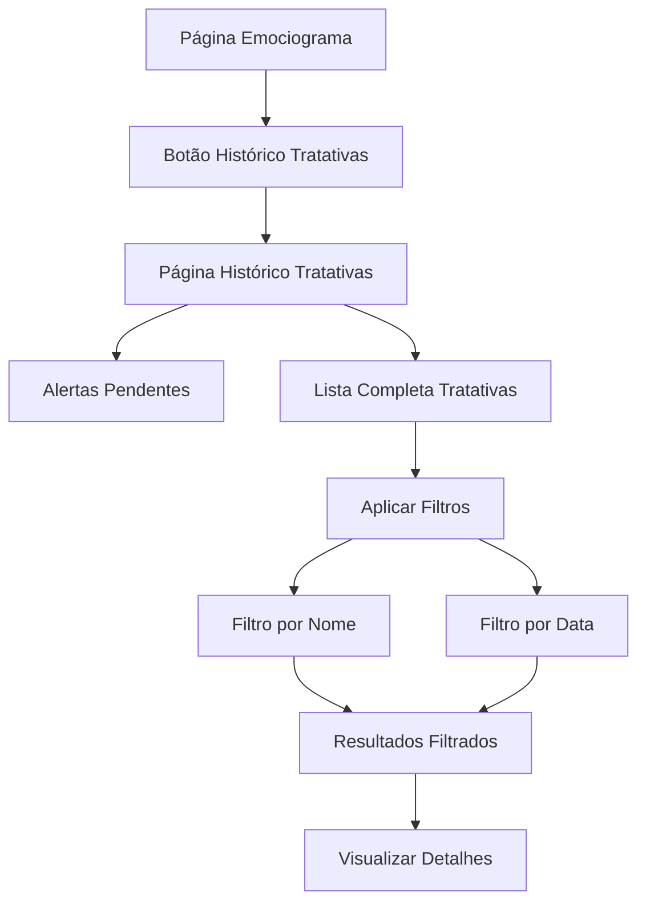

# Histórico de Tratativas - Emociograma

## 1. Product Overview
Sistema de visualização completa do histórico de tratativas e alertas pendentes do módulo de emociograma, permitindo aos gestores uma visão abrangente de todas as ações tomadas e situações em andamento.

O produto oferece uma interface centralizada para consulta de dados históricos com capacidade de filtragem por usuário e período, facilitando o acompanhamento e auditoria das tratativas realizadas no sistema de emociograma.

## 2. Core Features

### 2.1 User Roles
| Role | Registration Method | Core Permissions |
|------|---------------------|------------------|
| Líder | Sistema existente | Visualizar tratativas da sua equipe |
| Supervisor | Sistema existente | Visualizar tratativas da sua letra/setor |
| Admin/Editor | Sistema existente | Visualizar todas as tratativas do sistema |

### 2.2 Feature Module
Nossa página de histórico de tratativas consiste das seguintes seções principais:
1. **Página Principal do Emociograma**: botão de acesso rápido ao histórico de tratativas.
2. **Histórico de Tratativas**: visualização completa de tratativas com filtros e alertas pendentes.

### 2.3 Page Details
| Page Name | Module Name | Feature description |
|-----------|-------------|---------------------|
| Emociograma Principal | Botão de Acesso | Adicionar botão "Histórico de Tratativas" para navegação rápida |
| Histórico de Tratativas | Filtros de Busca | Filtrar por nome de usuário e intervalo de datas com busca em tempo real |
| Histórico de Tratativas | Lista de Tratativas | Exibir todas as tratativas com dados completos: tipo, descrição, ação tomada, responsável e data |
| Histórico de Tratativas | Alertas Pendentes | Mostrar alertas com status "ativo" ou "em_tratamento" em seção destacada |
| Histórico de Tratativas | Detalhes do Alerta | Visualizar informações completas do alerta associado: usuário, estado emocional, observações |
| Histórico de Tratativas | Paginação | Navegação por páginas para otimizar performance com grandes volumes de dados |

## 3. Core Process
**Fluxo Principal do Usuário:**
O usuário acessa a página principal do emociograma e clica no botão "Histórico de Tratativas". Na nova página, visualiza automaticamente todas as tratativas do sistema (conforme suas permissões). Pode aplicar filtros por nome de usuário ou período para refinar a busca. Os alertas pendentes são exibidos em destaque no topo da página. Todas as informações são somente para visualização, sem opções de edição.

**Fluxo de Permissões:**
- Líderes visualizam apenas tratativas de sua equipe
- Supervisores visualizam tratativas de sua letra/setor  
- Admins e Editores visualizam todas as tratativas do sistema

## 4. User Interface Design
### 4.1 Design Style
- **Cores primárias**: Azul (#3B82F6) para elementos principais, Verde (#10B981) para alertas resolvidos
- **Cores secundárias**: Amarelo (#F59E0B) para alertas em tratamento, Vermelho (#EF4444) para alertas ativos
- **Estilo de botões**: Arredondados com hover effects e estados disabled
- **Fonte**: Sistema padrão (Inter/Segoe UI) com tamanhos 14px (corpo), 16px (títulos), 24px (cabeçalhos)
- **Layout**: Card-based com navegação superior, grid responsivo
- **Ícones**: Lucide React para consistência visual

### 4.2 Page Design Overview
| Page Name | Module Name | UI Elements |
|-----------|-------------|-------------|
| Emociograma Principal | Botão de Acesso | Botão destacado com ícone de histórico, posicionado na área de ações principais |
| Histórico Tratativas | Header | Título da página, breadcrumb de navegação e contador total de registros |
| Histórico Tratativas | Filtros | Cards com inputs de busca por nome e seletores de data, botão limpar filtros |
| Histórico Tratativas | Alertas Pendentes | Cards destacados em amarelo/vermelho com informações resumidas e status visual |
| Histórico Tratativas | Lista Tratativas | Tabela responsiva com colunas: Data, Usuário, Tipo, Descrição, Responsável, Status |
| Histórico Tratativas | Paginação | Controles de navegação com números de página e informações de total de registros |

### 4.3 Responsiveness
O produto é desktop-first com adaptação mobile completa. Em dispositivos móveis, a tabela se transforma em cards empilhados e os filtros se reorganizam verticalmente. Touch interactions são otimizadas para facilitar a navegação em tablets e smartphones.