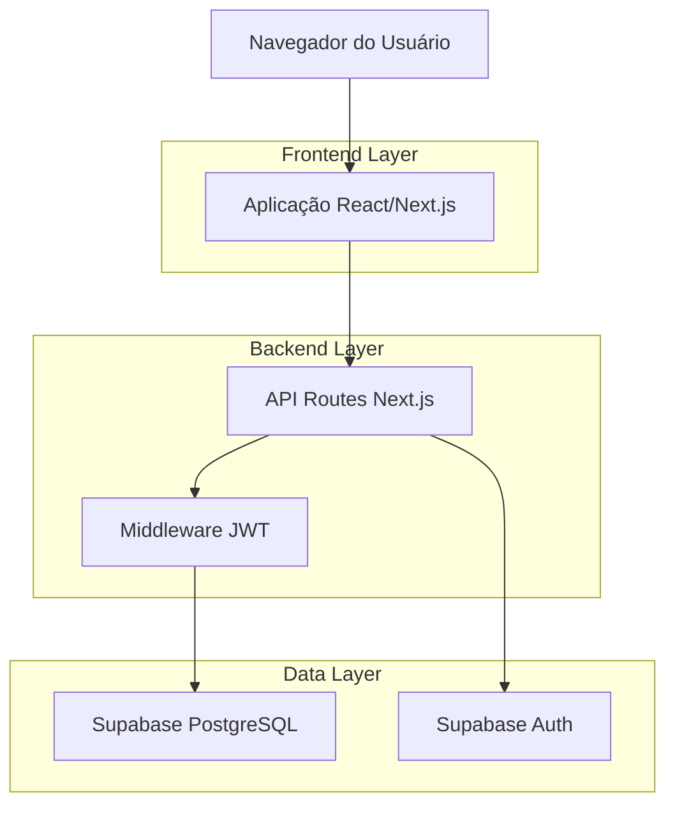
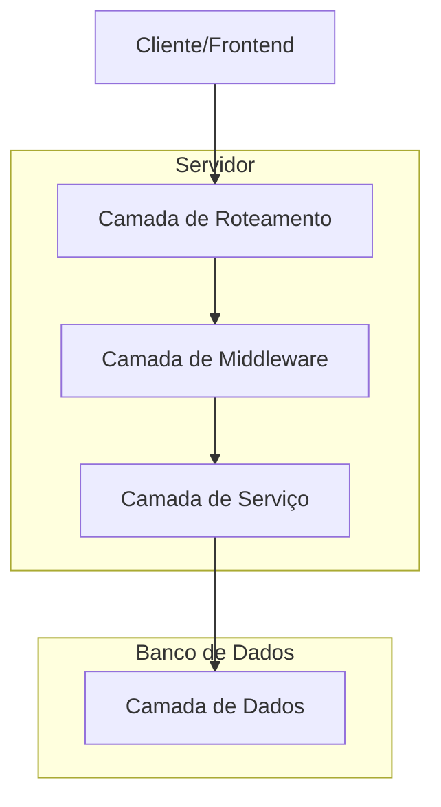
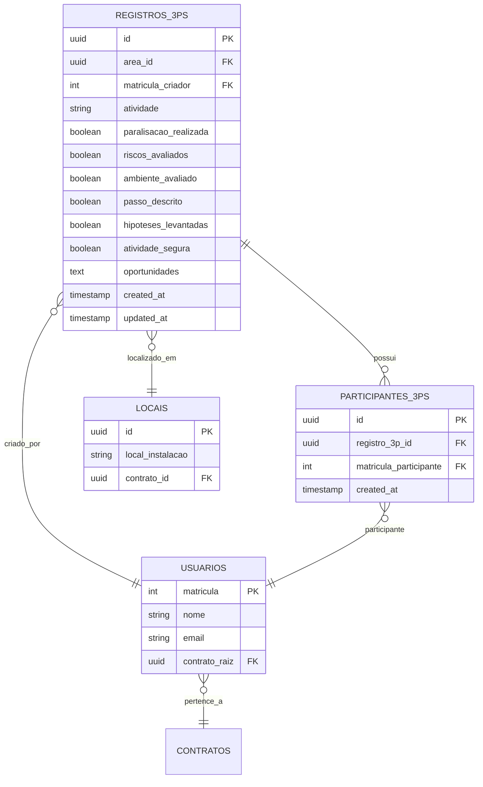

# Módulo 3 P's - Documento de Arquitetura Técnica

## 1. Arquitetura do Sistema



## 2. Descrição das Tecnologias

- **Frontend**: React@18 + Next.js@14 + TypeScript + Tailwind CSS@3
- **Backend**: Next.js API Routes + Middleware JWT personalizado
- **Banco de Dados**: Supabase (PostgreSQL) com Row Level Security
- **Autenticação**: Supabase Auth integrado com JWT customizado
- **UI Components**: Lucide React icons + Recharts para gráficos

## 3. Definições de Rotas

| Rota | Propósito |
|------|-----------|
| /3ps | Dashboard principal com estatísticas dos registros 3P's |
| /3ps/novo | Formulário multi-etapas para criação de novo registro 3P |
| /3ps/meus-registros | Listagem dos registros onde o usuário foi envolvido |
| /3ps/[id] | Página de detalhes de um registro específico |
| /3ps/configuracoes | Configurações do módulo (apenas admin) |

## 4. Definições de API

### 4.1 APIs Principais

**Estatísticas dos 3P's**
```
GET /api/3ps/stats
```

Request:
| Parâmetro | Tipo | Obrigatório | Descrição |
|-----------|------|-------------|-----------|
| periodo | string | false | Período em dias (7, 30, 90) |
| usuario_id | string | false | ID do usuário (para filtro não-admin) |

Response:
| Parâmetro | Tipo | Descrição |
|-----------|------|-----------|
| success | boolean | Status da operação |
| data | object | Dados estatísticos |

Exemplo:
```json
{
  "success": true,
  "data": {
    "resumo": {
      "total3ps": 45,
      "3psHoje": 3,
      "taxaAprovacao": 87,
      "areasAtivas": 12
    },
    "3psPorArea": {...},
    "3psPorDia": [...],
    "participacoesPorUsuario": [...]
  }
}
```

**Listagem de 3P's**
```
GET /api/3ps
```

Request:
| Parâmetro | Tipo | Obrigatório | Descrição |
|-----------|------|-------------|-----------|
| page | number | false | Página atual |
| limit | number | false | Itens por página |
| area_id | string | false | Filtro por área |
| data_inicio | string | false | Data inicial (YYYY-MM-DD) |
| data_fim | string | false | Data final (YYYY-MM-DD) |
| usuario_id | string | false | Filtro por usuário |

Response:
| Parâmetro | Tipo | Descrição |
|-----------|------|-----------|
| success | boolean | Status da operação |
| data | array | Lista de registros 3P |
| pagination | object | Informações de paginação |

**Criação de 3P**
```
POST /api/3ps
```

Request:
| Parâmetro | Tipo | Obrigatório | Descrição |
|-----------|------|-------------|-----------|
| area_id | string | true | ID da área/local |
| atividade | string | true | Descrição da atividade |
| paralisacao_realizada | boolean | true | Etapa 1: Paralisação |
| riscos_avaliados | boolean | true | Etapa 2: Riscos avaliados |
| ambiente_avaliado | boolean | true | Etapa 2: Ambiente avaliado |
| passo_descrito | boolean | true | Etapa 2: Passo a passo |
| hipoteses_levantadas | boolean | true | Etapa 2: Hipóteses |
| atividade_segura | boolean | true | Etapa 2: Atividade segura |
| oportunidades | string | false | Etapa 3: Oportunidades |
| participantes | array | true | IDs dos participantes |

Response:
| Parâmetro | Tipo | Descrição |
|-----------|------|-----------|
| success | boolean | Status da operação |
| data | object | Registro 3P criado |
| message | string | Mensagem de sucesso |

## 5. Arquitetura do Servidor



## 6. Modelo de Dados

### 6.1 Diagrama Entidade-Relacionamento



### 6.2 Definições DDL

**Tabela de Registros 3P's**
```sql
-- Criar tabela principal
CREATE TABLE registros_3ps (
    id UUID PRIMARY KEY DEFAULT gen_random_uuid(),
    area_id UUID NOT NULL REFERENCES locais(id),
    matricula_criador INTEGER NOT NULL REFERENCES usuarios(matricula),
    atividade TEXT NOT NULL,
    paralisacao_realizada BOOLEAN NOT NULL,
    riscos_avaliados BOOLEAN NOT NULL,
    ambiente_avaliado BOOLEAN NOT NULL,
    passo_descrito BOOLEAN NOT NULL,
    hipoteses_levantadas BOOLEAN NOT NULL,
    atividade_segura BOOLEAN NOT NULL,
    oportunidades TEXT,
    created_at TIMESTAMP WITH TIME ZONE DEFAULT NOW(),
    updated_at TIMESTAMP WITH TIME ZONE DEFAULT NOW()
);

-- Criar índices para performance
CREATE INDEX idx_registros_3ps_area_id ON registros_3ps(area_id);
CREATE INDEX idx_registros_3ps_matricula_criador ON registros_3ps(matricula_criador);
CREATE INDEX idx_registros_3ps_created_at ON registros_3ps(created_at DESC);

-- Habilitar RLS
ALTER TABLE registros_3ps ENABLE ROW LEVEL SECURITY;

-- Políticas de segurança
CREATE POLICY "Usuários podem ver registros do seu contrato" ON registros_3ps
    FOR SELECT USING (
        EXISTS (
            SELECT 1 FROM usuarios u1
            JOIN locais l ON registros_3ps.area_id = l.id
            JOIN usuarios u2 ON u2.matricula = registros_3ps.matricula_criador
            WHERE u1.matricula = auth.jwt() ->> 'matricula'::text
            AND u1.contrato_raiz = u2.contrato_raiz
        )
    );

CREATE POLICY "Usuários podem criar registros" ON registros_3ps
    FOR INSERT WITH CHECK (
        matricula_criador = (auth.jwt() ->> 'matricula')::integer
    );
```

**Tabela de Participantes**
```sql
-- Criar tabela de participantes
CREATE TABLE participantes_3ps (
    id UUID PRIMARY KEY DEFAULT gen_random_uuid(),
    registro_3p_id UUID NOT NULL REFERENCES registros_3ps(id) ON DELETE CASCADE,
    matricula_participante INTEGER NOT NULL REFERENCES usuarios(matricula),
    created_at TIMESTAMP WITH TIME ZONE DEFAULT NOW(),
    UNIQUE(registro_3p_id, matricula_participante)
);

-- Criar índices
CREATE INDEX idx_participantes_3ps_registro_id ON participantes_3ps(registro_3p_id);
CREATE INDEX idx_participantes_3ps_matricula ON participantes_3ps(matricula_participante);

-- Habilitar RLS
ALTER TABLE participantes_3ps ENABLE ROW LEVEL SECURITY;

-- Políticas de segurança
CREATE POLICY "Usuários podem ver participações do seu contrato" ON participantes_3ps
    FOR SELECT USING (
        EXISTS (
            SELECT 1 FROM usuarios u1
            JOIN registros_3ps r ON participantes_3ps.registro_3p_id = r.id
            JOIN usuarios u2 ON u2.matricula = r.matricula_criador
            WHERE u1.matricula = auth.jwt() ->> 'matricula'::text
            AND u1.contrato_raiz = u2.contrato_raiz
        )
    );

-- Dados iniciais (se necessário)
-- INSERT INTO registros_3ps (area_id, matricula_criador, atividade, ...)
-- VALUES (...);
```