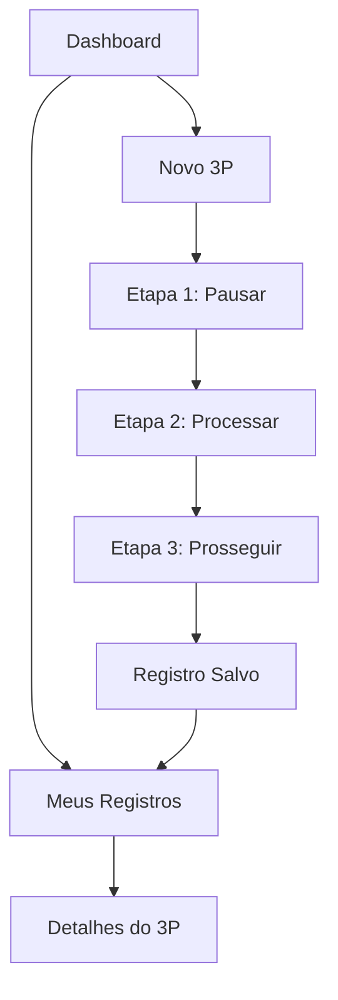

# Módulo 3 P's - Documento de Requisitos do Produto

## 1. Visão Geral do Produto

O módulo "3 P's" (Pausar, Processar, Prosseguir) é um sistema para registro e gestão de paralisações de atividades para avaliação de riscos no ambiente de trabalho. O módulo permite que os usuários documentem o processo de análise de riscos antes da execução de atividades, seguindo uma metodologia estruturada em três etapas fundamentais para garantir a segurança no trabalho.

- **Objetivo**: Facilitar o registro sistemático de avaliações de risco através da metodologia 3 P's, promovendo uma cultura de segurança proativa.
- **Público-alvo**: Colaboradores, supervisores e administradores do sistema de gestão de segurança do trabalho.
- **Valor**: Redução de acidentes através de avaliação estruturada de riscos e documentação de aprendizados.

## 2. Funcionalidades Principais

### 2.1 Perfis de Usuário

| Perfil | Método de Acesso | Permissões Principais |
|--------|------------------|----------------------|
| Administrador | Login com role admin | Visualiza estatísticas globais, acessa todos os registros, gerencia configurações |
| Usuário Comum | Login padrão | Visualiza apenas seus próprios registros e estatísticas, cria novos 3P's |

### 2.2 Módulos do Sistema

O módulo 3 P's consiste nas seguintes páginas principais:

1. **Dashboard**: painel de controle com estatísticas e métricas dos registros 3P's
2. **Novo 3P**: formulário multi-etapas para criação de novos registros
3. **Meus Registros**: listagem dos registros onde o usuário foi envolvido
4. **Detalhes do 3P**: visualização completa de um registro específico

### 2.3 Detalhes das Páginas

| Página | Módulo | Descrição da Funcionalidade |
|--------|--------|----------------------------|
| Dashboard | Estatísticas Gerais | Exibe métricas de registros 3P's (total, por período, por área). Administradores veem dados globais, usuários comuns veem apenas seus dados |
| Dashboard | Gráficos e Indicadores | Apresenta gráficos de registros por área, por etapa concluída, taxa de aprovação de atividades |
| Novo 3P | Informações Básicas | Coleta área (dropdown de locais) e descrição da atividade (textarea obrigatório) |
| Novo 3P | Etapa 1 - Pausar | Pergunta sobre paralisação antes do início da atividade (Sim/Não) |
| Novo 3P | Etapa 2 - Processar | Cinco perguntas sobre avaliação de riscos (todas Sim/Não): riscos avaliados, ambiente ao redor, passo a passo descrito, hipóteses levantadas, atividade segura |
| Novo 3P | Etapa 3 - Prosseguir | Campo para oportunidades/aprendizado e seleção múltipla de participantes |
| Meus Registros | Lista de 3P's | Exibe registros onde o usuário foi criador ou participante, com filtros por data, área e status |
| Detalhes do 3P | Visualização Completa | Mostra todas as informações do registro, participantes e permite edição se necessário |

## 3. Fluxo Principal do Sistema

O usuário acessa o sistema e navega pelas funcionalidades conforme seu perfil de acesso. O fluxo principal envolve a criação de um novo registro 3P através das três etapas metodológicas, seguida pela visualização e acompanhamento dos registros criados.

**Fluxo do Usuário Comum:**
1. Acessa dashboard com suas estatísticas pessoais
2. Cria novo 3P seguindo as três etapas
3. Visualiza seus registros na listagem
4. Consulta detalhes de registros específicos

**Fluxo do Administrador:**
1. Acessa dashboard com estatísticas globais
2. Monitora todos os registros do sistema
3. Pode criar novos 3P's como qualquer usuário
4. Tem acesso a relatórios e configurações avançadas

## 4. Design da Interface do Usuário

### 4.1 Estilo de Design

- **Cores Primárias**: Azul (#3B82F6) para ações principais, Verde (#10B981) para aprovações
- **Cores Secundárias**: Laranja (#F59E0B) para alertas, Vermelho (#EF4444) para negativas
- **Estilo de Botões**: Arredondados com hover effects, seguindo padrão Tailwind CSS
- **Tipografia**: Inter ou system fonts, tamanhos hierárquicos (text-3xl para títulos, text-base para corpo)
- **Layout**: Card-based com sombras suaves, navegação top-bar, sidebar responsiva
- **Ícones**: Lucide React icons para consistência visual

### 4.2 Visão Geral das Páginas

| Página | Módulo | Elementos da Interface |
|--------|--------|------------------------|
| Dashboard | Estatísticas | Cards com métricas, gráficos responsivos, filtros de período, botões de ação primários |
| Novo 3P | Formulário Multi-etapas | Stepper horizontal, campos de formulário validados, botões de navegação, indicadores de progresso |
| Meus Registros | Tabela de Dados | Tabela responsiva, filtros avançados, paginação, ações por linha (visualizar, editar) |
| Detalhes do 3P | Visualização | Layout em cards organizados, informações hierárquicas, lista de participantes, timestamps |

### 4.3 Responsividade

O sistema é desenvolvido com abordagem mobile-first, garantindo usabilidade em dispositivos móveis, tablets e desktops. Utiliza breakpoints do Tailwind CSS para adaptação automática da interface.