# Módulo Almoxarifado - Documento de Arquitetura Técnica

## 1. Architecture design


## 2. Technology Description

- Frontend: React@18 + TypeScript + TailwindCSS@3 + Next.js@14
- Backend: Next.js API Routes + Supabase SDK
- Database: Supabase (PostgreSQL) com RLS
- Storage: Supabase Storage para imagens dos itens
- Authentication: Supabase Auth integrado

## 3. Route definitions

| Route | Purpose |
|-------|---------|
| /almoxarifado | Dashboard principal do almoxarifado |
| /almoxarifado/catalogo | Catálogo de itens disponíveis |
| /almoxarifado/nova-requisicao | Carrinho de compras para nova requisição |
| /almoxarifado/minhas-requisicoes | Histórico de requisições do usuário |
| /almoxarifado/aprovacoes | Lista de requisições para aprovação (líderes/supervisores) |
| /almoxarifado/entregas | Gestão de entregas (equipe almoxarifado) |
| /almoxarifado/itens | Gestão de itens (gestor) |
| /almoxarifado/estoque | Controle de estoque e movimentações |
| /almoxarifado/relatorios | Dashboards e relatórios gerenciais |

## 4. API definitions

### 4.1 Core API

**Gestão de Itens**
```
GET /api/almoxarifado/itens
```
Request:
| Param Name | Param Type | isRequired | Description |
|------------|------------|------------|-------------|
| categoria | string | false | Filtrar por categoria |
| disponivel | boolean | false | Apenas itens com estoque |
| search | string | false | Buscar por nome/descrição |

Response:
| Param Name | Param Type | Description |
|------------|------------|-------------|
| success | boolean | Status da operação |
| data | Item[] | Lista de itens |
| pagination | object | Informações de paginação |

```
POST /api/almoxarifado/itens
```
Request:
| Param Name | Param Type | isRequired | Description |
|------------|------------|------------|-------------|
| nome | string | true | Nome do item |
| descricao | string | true | Descrição detalhada |
| categoria | string | true | Categoria do item |
| preco_unitario | number | true | Preço unitário |
| estoque_atual | number | true | Quantidade em estoque |
| estoque_minimo | number | true | Estoque mínimo |
| imagem_url | string | false | URL da imagem |

**Gestão de Requisições**
```
POST /api/almoxarifado/requisicoes
```
Request:
| Param Name | Param Type | isRequired | Description |
|------------|------------|------------|-------------|
| itens | RequisicaoItem[] | true | Lista de itens e quantidades |
| observacoes | string | false | Observações da requisição |

```
GET /api/almoxarifado/requisicoes
```
Request:
| Param Name | Param Type | isRequired | Description |
|------------|------------|------------|-------------|
| status | string | false | Filtrar por status |
| data_inicio | string | false | Data inicial (ISO) |
| data_fim | string | false | Data final (ISO) |

**Aprovações**
```
PUT /api/almoxarifado/requisicoes/[id]/aprovar
```
Request:
| Param Name | Param Type | isRequired | Description |
|------------|------------|------------|-------------|
| aprovado | boolean | true | Aprovado ou rejeitado |
| justificativa | string | false | Justificativa da decisão |

**Entregas**
```
PUT /api/almoxarifado/requisicoes/[id]/entregar
```
Request:
| Param Name | Param Type | isRequired | Description |
|------------|------------|------------|-------------|
| itens_entregues | ItemEntrega[] | true | Itens e quantidades entregues |
| observacoes | string | false | Observações da entrega |

**Movimentações de Estoque**
```
POST /api/almoxarifado/movimentacoes
```
Request:
| Param Name | Param Type | isRequired | Description |
|------------|------------|------------|-------------|
| item_id | string | true | ID do item |
| tipo | string | true | entrada/saida/ajuste |
| quantidade | number | true | Quantidade movimentada |
| motivo | string | true | Motivo da movimentação |

**Relatórios e Estatísticas**
```
GET /api/almoxarifado/stats
```
Request:
| Param Name | Param Type | isRequired | Description |
|------------|------------|------------|-------------|
| periodo | number | false | Período em dias (padrão: 30) |
| tipo | string | false | Tipo de relatório |

## 5. Server architecture diagram


## 6. Data model

### 6.1 Data model definition

```mermaid
erDiagram
    ITENS_ALMOXARIFADO ||--o{ REQUISICOES_ITENS : contains
    REQUISICOES ||--o{ REQUISICOES_ITENS : has
    USUARIOS ||--o{ REQUISICOES : creates
    USUARIOS ||--o{ REQUISICOES : approves
    USUARIOS ||--o{ REQUISICOES : delivers
    ITENS_ALMOXARIFADO ||--o{ MOVIMENTACOES_ESTOQUE : affects
    USUARIOS ||--o{ MOVIMENTACOES_ESTOQUE : performs

    ITENS_ALMOXARIFADO {
        uuid id PK
        string nome
        text descricao
        string categoria
        decimal preco_unitario
        integer estoque_atual
        integer estoque_minimo
        string imagem_url
        boolean ativo
        timestamp created_at
        timestamp updated_at
    }

    REQUISICOES {
        uuid id PK
        integer matricula_solicitante FK
        string status
        text observacoes
        integer matricula_aprovador FK
        timestamp data_aprovacao
        text justificativa_aprovacao
        integer matricula_entregador FK
        timestamp data_entrega
        text observacoes_entrega
        decimal valor_total
        timestamp created_at
        timestamp updated_at
    }

    REQUISICOES_ITENS {
        uuid id PK
        uuid requisicao_id FK
        uuid item_id FK
        integer quantidade_solicitada
        integer quantidade_entregue
        decimal preco_unitario
        decimal subtotal
    }

    MOVIMENTACOES_ESTOQUE {
        uuid id PK
        uuid item_id FK
        string tipo
        integer quantidade
        integer estoque_anterior
        integer estoque_atual
        string motivo
        integer matricula_responsavel FK
        uuid requisicao_id FK
        timestamp created_at
    }

    USUARIOS {
        integer matricula PK
        string nome
        string email
        string funcao
        string contrato_raiz
        string letra_equipe
        integer equipe_id
    }
```



### 6.2 Data Definition Language

**Tabela de Itens do Almoxarifado**
```sql
-- Criar tabela de itens
CREATE TABLE itens_almoxarifado (
    id UUID PRIMARY KEY DEFAULT gen_random_uuid(),
    nome VARCHAR(255) NOT NULL,
    descricao TEXT,
    categoria VARCHAR(100) NOT NULL,
    preco_unitario DECIMAL(10,2) NOT NULL DEFAULT 0,
    estoque_atual INTEGER NOT NULL DEFAULT 0,
    estoque_minimo INTEGER NOT NULL DEFAULT 0,
    imagem_url TEXT,
    ativo BOOLEAN DEFAULT true,
    created_at TIMESTAMP WITH TIME ZONE DEFAULT NOW(),
    updated_at TIMESTAMP WITH TIME ZONE DEFAULT NOW()
);

-- Índices para performance
CREATE INDEX idx_itens_categoria ON itens_almoxarifado(categoria);
CREATE INDEX idx_itens_ativo ON itens_almoxarifado(ativo);
CREATE INDEX idx_itens_estoque ON itens_almoxarifado(estoque_atual);

-- RLS Policies
ALTER TABLE itens_almoxarifado ENABLE ROW LEVEL SECURITY;

-- Política para leitura (todos os usuários autenticados)
CREATE POLICY "Usuários podem visualizar itens ativos" ON itens_almoxarifado
    FOR SELECT TO authenticated
    USING (ativo = true);

-- Política para gestão (apenas gestores do almoxarifado)
CREATE POLICY "Gestores podem gerenciar itens" ON itens_almoxarifado
    FOR ALL TO authenticated
    USING (
        EXISTS (
            SELECT 1 FROM usuarios 
            WHERE matricula = auth.jwt() ->> 'matricula'::text
            AND funcao IN ('Gestor Almoxarifado', 'Administrador')
        )
    );
```

**Tabela de Requisições**
```sql
-- Criar tabela de requisições
CREATE TABLE requisicoes (
    id UUID PRIMARY KEY DEFAULT gen_random_uuid(),
    matricula_solicitante INTEGER NOT NULL,
    status VARCHAR(50) DEFAULT 'pendente' CHECK (status IN ('pendente', 'aprovada', 'rejeitada', 'entregue', 'cancelada')),
    observacoes TEXT,
    matricula_aprovador INTEGER,
    data_aprovacao TIMESTAMP WITH TIME ZONE,
    justificativa_aprovacao TEXT,
    matricula_entregador INTEGER,
    data_entrega TIMESTAMP WITH TIME ZONE,
    observacoes_entrega TEXT,
    valor_total DECIMAL(10,2) DEFAULT 0,
    created_at TIMESTAMP WITH TIME ZONE DEFAULT NOW(),
    updated_at TIMESTAMP WITH TIME ZONE DEFAULT NOW(),
    
    FOREIGN KEY (matricula_solicitante) REFERENCES usuarios(matricula),
    FOREIGN KEY (matricula_aprovador) REFERENCES usuarios(matricula),
    FOREIGN KEY (matricula_entregador) REFERENCES usuarios(matricula)
);

-- Índices
CREATE INDEX idx_requisicoes_solicitante ON requisicoes(matricula_solicitante);
CREATE INDEX idx_requisicoes_status ON requisicoes(status);
CREATE INDEX idx_requisicoes_data ON requisicoes(created_at DESC);

-- RLS Policies
ALTER TABLE requisicoes ENABLE ROW LEVEL SECURITY;

-- Usuários podem ver suas próprias requisições
CREATE POLICY "Usuários veem suas requisições" ON requisicoes
    FOR SELECT TO authenticated
    USING (matricula_solicitante = (auth.jwt() ->> 'matricula')::integer);

-- Líderes e supervisores podem ver requisições para aprovação
CREATE POLICY "Aprovadores veem requisições da equipe" ON requisicoes
    FOR SELECT TO authenticated
    USING (
        EXISTS (
            SELECT 1 FROM usuarios u1
            JOIN usuarios u2 ON u1.matricula = (auth.jwt() ->> 'matricula')::integer
            WHERE u2.matricula = requisicoes.matricula_solicitante
            AND (
                (u1.funcao = 'Líder' AND u1.letra_equipe = u2.letra_equipe) OR
                (u1.funcao = 'Supervisor' AND u1.equipe_id = u2.equipe_id)
            )
        )
    );
```

**Tabela de Itens da Requisição**
```sql
-- Criar tabela de itens das requisições
CREATE TABLE requisicoes_itens (
    id UUID PRIMARY KEY DEFAULT gen_random_uuid(),
    requisicao_id UUID NOT NULL,
    item_id UUID NOT NULL,
    quantidade_solicitada INTEGER NOT NULL,
    quantidade_entregue INTEGER DEFAULT 0,
    preco_unitario DECIMAL(10,2) NOT NULL,
    subtotal DECIMAL(10,2) NOT NULL,
    
    FOREIGN KEY (requisicao_id) REFERENCES requisicoes(id) ON DELETE CASCADE,
    FOREIGN KEY (item_id) REFERENCES itens_almoxarifado(id)
);

-- Índices
CREATE INDEX idx_requisicoes_itens_requisicao ON requisicoes_itens(requisicao_id);
CREATE INDEX idx_requisicoes_itens_item ON requisicoes_itens(item_id);

-- RLS
ALTER TABLE requisicoes_itens ENABLE ROW LEVEL SECURITY;

CREATE POLICY "Acesso via requisição" ON requisicoes_itens
    FOR ALL TO authenticated
    USING (
        EXISTS (
            SELECT 1 FROM requisicoes r
            WHERE r.id = requisicoes_itens.requisicao_id
        )
    );
```

**Tabela de Movimentações de Estoque**
```sql
-- Criar tabela de movimentações
CREATE TABLE movimentacoes_estoque (
    id UUID PRIMARY KEY DEFAULT gen_random_uuid(),
    item_id UUID NOT NULL,
    tipo VARCHAR(20) NOT NULL CHECK (tipo IN ('entrada', 'saida', 'ajuste')),
    quantidade INTEGER NOT NULL,
    estoque_anterior INTEGER NOT NULL,
    estoque_atual INTEGER NOT NULL,
    motivo TEXT NOT NULL,
    matricula_responsavel INTEGER NOT NULL,
    requisicao_id UUID,
    created_at TIMESTAMP WITH TIME ZONE DEFAULT NOW(),
    
    FOREIGN KEY (item_id) REFERENCES itens_almoxarifado(id),
    FOREIGN KEY (matricula_responsavel) REFERENCES usuarios(matricula),
    FOREIGN KEY (requisicao_id) REFERENCES requisicoes(id)
);

-- Índices
CREATE INDEX idx_movimentacoes_item ON movimentacoes_estoque(item_id);
CREATE INDEX idx_movimentacoes_data ON movimentacoes_estoque(created_at DESC);
CREATE INDEX idx_movimentacoes_tipo ON movimentacoes_estoque(tipo);

-- Trigger para atualizar estoque automaticamente
CREATE OR REPLACE FUNCTION atualizar_estoque_item()
RETURNS TRIGGER AS $$
BEGIN
    UPDATE itens_almoxarifado 
    SET estoque_atual = NEW.estoque_atual,
        updated_at = NOW()
    WHERE id = NEW.item_id;
    
    RETURN NEW;
END;
$$ LANGUAGE plpgsql;

CREATE TRIGGER trigger_atualizar_estoque
    AFTER INSERT ON movimentacoes_estoque
    FOR EACH ROW
    EXECUTE FUNCTION atualizar_estoque_item();

-- Trigger para updated_at
CREATE TRIGGER trigger_updated_at_itens
    BEFORE UPDATE ON itens_almoxarifado
    FOR EACH ROW
    EXECUTE FUNCTION update_updated_at_column();

CREATE TRIGGER trigger_updated_at_requisicoes
    BEFORE UPDATE ON requisicoes
    FOR EACH ROW
    EXECUTE FUNCTION update_updated_at_column();
```

**Dados Iniciais**
```sql
-- Inserir categorias padrão de itens
INSERT INTO itens_almoxarifado (nome, descricao, categoria, preco_unitario, estoque_atual, estoque_minimo) VALUES
('Capacete de Segurança Branco', 'Capacete de proteção individual cor branca', 'EPI', 25.90, 50, 10),
('Luvas de Segurança Látex', 'Luvas de proteção em látex natural', 'EPI', 8.50, 100, 20),
('Óculos de Proteção', 'Óculos de segurança com lente transparente', 'EPI', 15.30, 75, 15),
('Martelo 500g', 'Martelo com cabo de madeira 500 gramas', 'Ferramenta', 35.00, 25, 5),
('Chave de Fenda 6mm', 'Chave de fenda com cabo isolado 6mm', 'Ferramenta', 12.80, 40, 8),
('Furadeira Elétrica', 'Furadeira elétrica 650W com maleta', 'Ferramenta', 180.00, 10, 2);

-- Conceder permissões
GRANT SELECT ON itens_almoxarifado TO authenticated;
GRANT ALL PRIVILEGES ON requisicoes TO authenticated;
GRANT ALL PRIVILEGES ON requisicoes_itens TO authenticated;
GRANT SELECT ON movimentacoes_estoque TO authenticated;
```