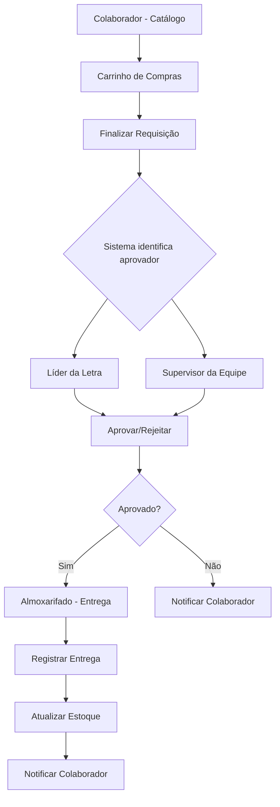

# Módulo Almoxarifado - Documento de Requisitos do Produto

## 1. Product Overview

Sistema de gestão de almoxarifado com processo de requisições de itens (ferramentas e EPIs) que inclui aprovação hierárquica e controle completo de estoque. O módulo permite que colaboradores solicitem materiais através de uma interface tipo carrinho de compras, com aprovação automática baseada na estrutura organizacional e gestão completa do ciclo de vida das requisições.

O sistema resolve o problema de controle manual de estoque e requisições, proporcionando transparência, rastreabilidade e eficiência na gestão de materiais, com foco em empresas que precisam de controle rigoroso sobre distribuição de ferramentas e equipamentos de proteção individual.

## 2. Core Features

### 2.1 User Roles

| Role | Registration Method | Core Permissions |
|------|---------------------|------------------|
| Colaborador | Usuário padrão do sistema | Criar requisições, visualizar histórico próprio |
| Líder de Letra | Definido na tabela letras | Aprovar requisições da sua letra |
| Supervisor de Equipe | Definido na tabela equipes | Aprovar requisições da sua equipe |
| Almoxarifado | Perfil específico | Gerenciar entregas, visualizar requisições aprovadas |
| Gestor Almoxarifado | Perfil administrativo | Gestão completa de itens, estoque e relatórios |

### 2.2 Feature Module

Nosso sistema de almoxarifado consiste nas seguintes páginas principais:

1. **Dashboard Almoxarifado**: indicadores gerais, requisições pendentes, alertas de estoque
2. **Catálogo de Itens**: visualização de itens disponíveis, busca e filtros
3. **Nova Requisição**: carrinho de compras para solicitar itens
4. **Minhas Requisições**: histórico e acompanhamento de requisições próprias
5. **Aprovações Pendentes**: lista de requisições aguardando aprovação (líderes/supervisores)
6. **Gestão de Entregas**: controle de entregas para equipe do almoxarifado
7. **Gestão de Itens**: cadastro e edição de itens (gestor)
8. **Gestão de Estoque**: controle de entrada/saída e ajustes de estoque
9. **Relatórios Gerenciais**: dashboards e indicadores para gestores

### 2.3 Page Details

| Page Name | Module Name | Feature description |
|-----------|-------------|---------------------|
| Dashboard Almoxarifado | Indicadores Gerais | Exibir total de requisições, itens em falta, requisições pendentes de aprovação e entrega |
| Dashboard Almoxarifado | Requisições Recentes | Listar últimas requisições com status e ações rápidas |
| Dashboard Almoxarifado | Alertas de Estoque | Mostrar itens com estoque abaixo do mínimo |
| Catálogo de Itens | Lista de Itens | Exibir itens disponíveis com foto, nome, descrição, estoque atual |
| Catálogo de Itens | Busca e Filtros | Filtrar por categoria, disponibilidade, buscar por nome |
| Catálogo de Itens | Adicionar ao Carrinho | Selecionar quantidade e adicionar item à requisição |
| Nova Requisição | Carrinho de Compras | Visualizar itens selecionados, alterar quantidades, remover itens |
| Nova Requisição | Validação de Estoque | Verificar disponibilidade em tempo real |
| Nova Requisição | Finalizar Requisição | Confirmar requisição e enviar para aprovação |
| Minhas Requisições | Lista de Requisições | Exibir requisições próprias com status e datas |
| Minhas Requisições | Detalhes da Requisição | Visualizar itens, quantidades, aprovador, histórico |
| Aprovações Pendentes | Lista para Aprovação | Exibir requisições da letra/equipe aguardando aprovação |
| Aprovações Pendentes | Aprovar/Rejeitar | Analisar requisição e tomar decisão com justificativa |
| Gestão de Entregas | Requisições Aprovadas | Listar requisições aprovadas aguardando entrega |
| Gestão de Entregas | Registrar Entrega | Confirmar entrega de itens e atualizar estoque |
| Gestão de Itens | Cadastro de Itens | Criar novos itens com foto, categoria, preços, estoque mínimo |
| Gestão de Itens | Edição de Itens | Atualizar informações, preços, categorias |
| Gestão de Estoque | Movimentações | Registrar entradas, saídas, ajustes de estoque |
| Gestão de Estoque | Inventário | Visualizar estoque atual, histórico de movimentações |
| Relatórios Gerenciais | Dashboard Executivo | Indicadores de custos, itens mais requisitados, colaboradores ativos |
| Relatórios Gerenciais | Relatórios Detalhados | Exportar relatórios por período, equipe, categoria |

## 3. Core Process

### Fluxo Principal - Colaborador:
1. Colaborador acessa o catálogo de itens
2. Seleciona itens e quantidades (carrinho de compras)
3. Finaliza requisição que é enviada para aprovação
4. Sistema identifica automaticamente o aprovador (líder da letra ou supervisor da equipe)
5. Colaborador acompanha status da requisição

### Fluxo de Aprovação - Líder/Supervisor:
1. Recebe notificação de nova requisição
2. Acessa lista de aprovações pendentes
3. Analisa requisição e itens solicitados
4. Aprova ou rejeita com justificativa
5. Sistema notifica solicitante e almoxarifado (se aprovado)

### Fluxo de Entrega - Almoxarifado:
1. Visualiza requisições aprovadas
2. Separa itens fisicamente
3. Registra entrega no sistema
4. Sistema atualiza estoque automaticamente
5. Colaborador é notificado da entrega

### Fluxo Gerencial - Gestor:
1. Monitora indicadores no dashboard
2. Gerencia cadastro de novos itens
3. Controla movimentações de estoque
4. Gera relatórios gerenciais

## 4. User Interface Design

### 4.1 Design Style

- **Cores Primárias**: Azul (#3B82F6) para ações principais, Verde (#10B981) para aprovações/estoque OK
- **Cores Secundárias**: Laranja (#F59E0B) para alertas de estoque, Vermelho (#EF4444) para rejeições
- **Estilo de Botões**: Rounded corners (8px), com estados hover e disabled
- **Fontes**: Inter, tamanhos 14px (corpo), 16px (títulos), 12px (legendas)
- **Layout**: Card-based com grid responsivo, navegação top fixa
- **Ícones**: Lucide React para consistência, com ícones específicos para carrinho, estoque, aprovação

### 4.2 Page Design Overview

| Page Name | Module Name | UI Elements |
|-----------|-------------|-------------|
| Dashboard Almoxarifado | Indicadores | Cards com números grandes, gráficos de barras coloridos, ícones representativos |
| Catálogo de Itens | Grid de Produtos | Cards com imagem, nome, estoque (badge colorido), botão "Adicionar" |
| Nova Requisição | Carrinho | Lista de itens com foto miniatura, controles +/- quantidade, total no rodapé |
| Aprovações Pendentes | Lista de Cards | Card expandível com detalhes, botões Aprovar (verde) e Rejeitar (vermelho) |
| Gestão de Entregas | Checklist | Lista com checkbox, detalhes do item, botão "Entregar" destacado |
| Gestão de Itens | Formulário | Upload de imagem drag-and-drop, campos organizados em seções |
| Relatórios | Dashboard | Gráficos interativos, filtros no topo, tabelas com paginação |

### 4.3 Responsiveness

O sistema é desktop-first com adaptação mobile completa. Interface otimizada para tablets (aprovações em campo) e smartphones (consulta de status). Carrinho de compras com interface touch-friendly para seleção de quantidades. Dashboards com layout responsivo que reorganiza cards em telas menores.