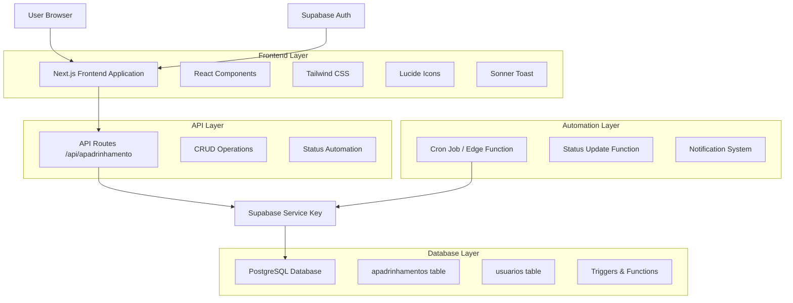
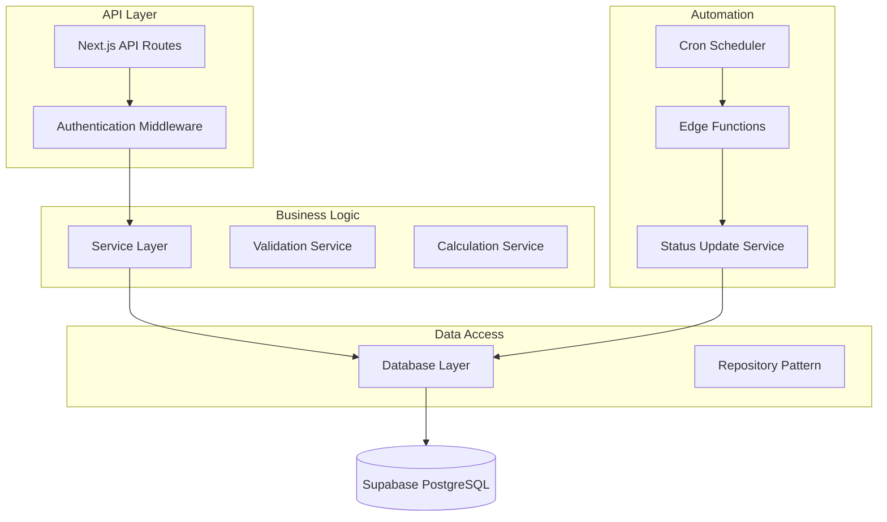
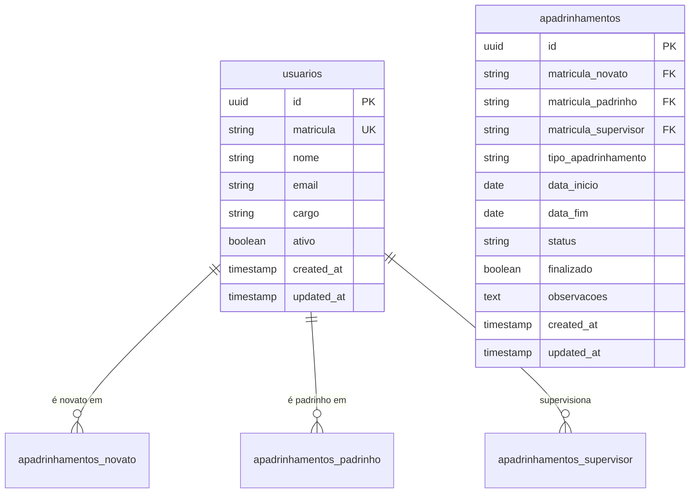

# Módulo de Apadrinhamento - Arquitetura Técnica

## 1. Architecture design



## 2. Technology Description

* **Frontend**: React\@18 + Next.js\@14 + TypeScript + Tailwind CSS\@3 + Lucide React + Sonner

* **Backend**: Next.js API Routes + Supabase Service Key

* **Database**: Supabase (PostgreSQL) com triggers e functions

* **Automation**: Supabase Edge Functions + Cron Jobs

## 3. Route definitions

| Route                      | Purpose                                            |
| -------------------------- | -------------------------------------------------- |
| /apadrinhamento            | Dashboard principal com estatísticas e visão geral |
| /apadrinhamento/lista      | Lista completa de apadrinhamentos com filtros      |
| /apadrinhamento/novo       | Formulário para cadastrar novo apadrinhamento      |
| /apadrinhamento/\[id]      | Detalhes e edição de apadrinhamento específico     |
| /apadrinhamento/relatorios | Relatórios e análises de apadrinhamentos           |

## 4. API definitions

### 4.1 Core API

**Listar Apadrinhamentos**

```
GET /api/apadrinhamento
```

Query Parameters:

| Param Name | Param Type | isRequired | Description                                    |
| ---------- | ---------- | ---------- | ---------------------------------------------- |
| page       | number     | false      | Número da página para paginação                |
| limit      | number     | false      | Limite de itens por página                     |
| status     | string     | false      | Filtrar por status (ativo, concluido, vencido) |
| tipo       | string     | false      | Filtrar por tipo de apadrinhamento             |
| supervisor | string     | false      | Filtrar por matrícula do supervisor            |

Response:

| Param Name | Param Type        | Description              |
| ---------- | ----------------- | ------------------------ |
| data       | Apadrinhamento\[] | Array de apadrinhamentos |
| total      | number            | Total de registros       |
| page       | number            | Página atual             |
| totalPages | number            | Total de páginas         |

**Criar Apadrinhamento**

```
POST /api/apadrinhamento
```

Request:

| Param Name            | Param Type | isRequired | Description                                                                   |
| --------------------- | ---------- | ---------- | ----------------------------------------------------------------------------- |
| matricula\_novato     | string     | true       | Matrícula do colaborador novato                                               |
| matricula\_padrinho   | string     | true       | Matrícula do padrinho                                                         |
| matricula\_supervisor | string     | true       | Matrícula do supervisor                                                       |
| tipo\_apadrinhamento  | string     | true       | Tipo: Novo Colaborador, Novo Operador de Ponte, Novo Operador de Empilhadeira |
| data\_inicio          | string     | true       | Data de início (ISO format)                                                   |
| observacoes           | string     | false      | Observações adicionais                                                        |

**Atualizar Apadrinhamento**

```
PUT /api/apadrinhamento/[id]
```

**Finalizar Apadrinhamento**

```
PATCH /api/apadrinhamento/[id]/finalizar
```

**Buscar por ID**

```
GET /api/apadrinhamento/[id]
```

**Estatísticas Dashboard**

```
GET /api/apadrinhamento/stats
```

Response:

```json
{
  "total_ativos": 15,
  "total_concluidos": 45,
  "total_vencidos": 3,
  "proximos_vencimento": 5,
  "por_tipo": {
    "Novo Colaborador": 10,
    "Novo Operador de Ponte": 3,
    "Novo Operador de Empilhadeira": 2
  }
}
```

## 5. Server architecture diagram



## 6. Data model

### 6.1 Data model definition



### 6.2 Data Definition Language

**Tabela de Apadrinhamentos**

```sql
-- Criar tabela apadrinhamentos
CREATE TABLE apadrinhamentos (
    id UUID PRIMARY KEY DEFAULT gen_random_uuid(),
    matricula_novato VARCHAR(20) NOT NULL,
    matricula_padrinho VARCHAR(20) NOT NULL,
    matricula_supervisor VARCHAR(20) NOT NULL,
    tipo_apadrinhamento VARCHAR(50) NOT NULL CHECK (
        tipo_apadrinhamento IN (
            'Novo Colaborador',
            'Novo Operador de Ponte', 
            'Novo Operador de Empilhadeira'
        )
    ),
    data_inicio DATE NOT NULL,
    data_fim DATE NOT NULL,
    status VARCHAR(20) DEFAULT 'Ativo' CHECK (
        status IN ('Ativo', 'Concluído', 'Vencido')
    ),
    finalizado BOOLEAN DEFAULT FALSE,
    observacoes TEXT,
    created_at TIMESTAMP WITH TIME ZONE DEFAULT NOW(),
    updated_at TIMESTAMP WITH TIME ZONE DEFAULT NOW()
);

-- Criar índices para performance
CREATE INDEX idx_apadrinhamentos_novato ON apadrinhamentos(matricula_novato);
CREATE INDEX idx_apadrinhamentos_padrinho ON apadrinhamentos(matricula_padrinho);
CREATE INDEX idx_apadrinhamentos_supervisor ON apadrinhamentos(matricula_supervisor);
CREATE INDEX idx_apadrinhamentos_status ON apadrinhamentos(status);
CREATE INDEX idx_apadrinhamentos_data_fim ON apadrinhamentos(data_fim);
CREATE INDEX idx_apadrinhamentos_tipo ON apadrinhamentos(tipo_apadrinhamento);

-- Trigger para calcular data_fim automaticamente
CREATE OR REPLACE FUNCTION calculate_data_fim()
RETURNS TRIGGER AS $$
BEGIN
    NEW.data_fim := NEW.data_inicio + INTERVAL '90 days';
    RETURN NEW;
END;
$$ LANGUAGE plpgsql;

CREATE TRIGGER trigger_calculate_data_fim
    BEFORE INSERT OR UPDATE OF data_inicio ON apadrinhamentos
    FOR EACH ROW
    EXECUTE FUNCTION calculate_data_fim();

-- Trigger para atualizar updated_at
CREATE OR REPLACE FUNCTION update_updated_at_column()
RETURNS TRIGGER AS $$
BEGIN
    NEW.updated_at = NOW();
    RETURN NEW;
END;
$$ LANGUAGE plpgsql;

CREATE TRIGGER trigger_update_apadrinhamentos_updated_at
    BEFORE UPDATE ON apadrinhamentos
    FOR EACH ROW
    EXECUTE FUNCTION update_updated_at_column();

-- Function para atualizar status automaticamente
CREATE OR REPLACE FUNCTION update_apadrinhamento_status()
RETURNS void AS $$
BEGIN
    -- Atualizar status para Vencido quando passou da data_fim e não foi finalizado
    UPDATE apadrinhamentos 
    SET status = 'Vencido'
    WHERE data_fim < CURRENT_DATE 
    AND finalizado = FALSE 
    AND status != 'Vencido';
    
    -- Manter status Concluído para apadrinhamentos finalizados
    UPDATE apadrinhamentos 
    SET status = 'Concluído'
    WHERE finalizado = TRUE 
    AND status != 'Concluído';
END;
$$ LANGUAGE plpgsql;

-- Políticas RLS (Row Level Security)
ALTER TABLE apadrinhamentos ENABLE ROW LEVEL SECURITY;

-- Política para service role (acesso total)
CREATE POLICY "Service role has full access" ON apadrinhamentos
    FOR ALL USING (auth.role() = 'service_role');

-- Política para usuários autenticados (acesso baseado em relacionamento)
CREATE POLICY "Users can view related apadrinhamentos" ON apadrinhamentos
    FOR SELECT USING (
        auth.uid()::text IN (
            SELECT id::text FROM usuarios 
            WHERE matricula IN (
                matricula_novato, 
                matricula_padrinho, 
                matricula_supervisor
            )
        )
    );

-- Dados iniciais para teste
INSERT INTO apadrinhamentos (
    matricula_novato,
    matricula_padrinho, 
    matricula_supervisor,
    tipo_apadrinhamento,
    data_inicio,
    observacoes
) VALUES 
(
    '12345',
    '67890', 
    '11111',
    'Novo Colaborador',
    CURRENT_DATE - INTERVAL '30 days',
    'Apadrinhamento em andamento - colaborador demonstrando bom progresso'
),
(
    '23456',
    '78901',
    '11111', 
    'Novo Operador de Ponte',
    CURRENT_DATE - INTERVAL '60 days',
    'Treinamento específico para operação de ponte rolante'
),
(
    '34567',
    '89012',
    '22222',
    'Novo Operador de Empilhadeira',
    CURRENT_DATE - INTERVAL '95 days',
    'Apadrinhamento próximo ao vencimento - avaliar finalização'
);
```

**Edge Function para Automação (Supabase)**

```sql
-- Criar função para ser executada via cron
CREATE OR REPLACE FUNCTION cron_update_apadrinhamento_status()
RETURNS void AS $$
BEGIN
    PERFORM update_apadrinhamento_status();
    
    -- Log da execução
    INSERT INTO system_logs (action, details, created_at)
    VALUES (
        'cron_apadrinhamento_status_update',
        'Status de apadrinhamentos atualizado automaticamente',
        NOW()
    );
END;
$$ LANGUAGE plpgsql;
```

