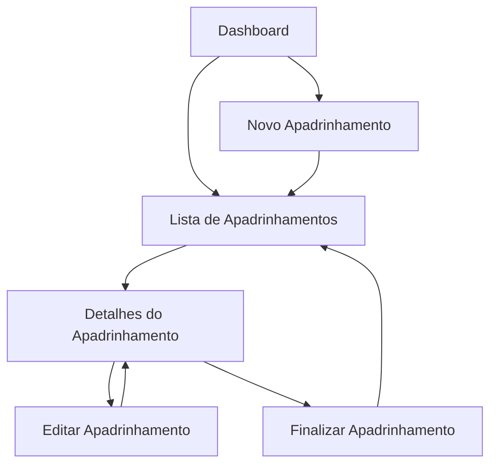

# Módulo de Apadrinhamento - PRD

## 1. Product Overview
Sistema completo para gerenciamento do período de apadrinhamento de colaboradores novatos, controlando o processo de 90 dias trabalhados onde colaboradores experientes orientam novos funcionários.
- Soluciona a necessidade de acompanhar e gerenciar o período obrigatório de apadrinhamento de novos colaboradores na empresa.
- Destinado a supervisores, RH e gestores que precisam monitorar o desenvolvimento e integração de novos funcionários.
- Automatiza o controle de prazos e status, garantindo que todos os novatos passem pelo período completo de apadrinhamento.

## 2. Core Features

### 2.1 User Roles
| Role | Registration Method | Core Permissions |
|------|---------------------|------------------|
| Supervisor | Acesso via sistema existente | Pode criar, visualizar e gerenciar apadrinhamentos da sua equipe |
| RH/Gestor | Acesso via sistema existente | Pode visualizar todos os apadrinhamentos e gerar relatórios |
| Padrinho | Acesso via sistema existente | Pode visualizar apadrinhamentos onde é responsável |

### 2.2 Feature Module
Nosso módulo de apadrinhamento consiste nas seguintes páginas principais:
1. **Dashboard de Apadrinhamentos**: visão geral, estatísticas, apadrinhamentos ativos e próximos ao vencimento.
2. **Lista de Apadrinhamentos**: listagem completa com filtros, busca e paginação.
3. **Novo Apadrinhamento**: formulário para cadastrar novo período de apadrinhamento.
4. **Detalhes do Apadrinhamento**: visualização completa e edição de apadrinhamento específico.

### 2.3 Page Details
| Page Name | Module Name | Feature description |
|-----------|-------------|---------------------|
| Dashboard | Estatísticas Gerais | Exibir total de apadrinhamentos ativos, concluídos, próximos ao vencimento e estatísticas por tipo |
| Dashboard | Apadrinhamentos Ativos | Listar apadrinhamentos em andamento com progresso visual |
| Dashboard | Alertas e Notificações | Mostrar apadrinhamentos próximos ao vencimento (últimos 7 dias) |
| Lista | Tabela de Apadrinhamentos | Exibir todos os apadrinhamentos com colunas: novato, padrinho, supervisor, tipo, data início, data fim, status, ações |
| Lista | Filtros Avançados | Filtrar por status (Ativo, Concluído, Vencido), tipo de apadrinhamento, período, supervisor |
| Lista | Busca e Paginação | Buscar por nome do novato/padrinho e navegar entre páginas |
| Novo Apadrinhamento | Formulário de Cadastro | Selecionar novato, padrinho, supervisor, tipo de apadrinhamento e data de início |
| Novo Apadrinhamento | Validações | Verificar se novato não possui apadrinhamento ativo, validar datas e relacionamentos |
| Detalhes | Informações Completas | Mostrar todos os dados do apadrinhamento com histórico de alterações |
| Detalhes | Ações de Gerenciamento | Editar dados, finalizar apadrinhamento manualmente, adicionar observações |
| Detalhes | Timeline do Progresso | Visualizar progresso dos 90 dias com marcos importantes |

## 3. Core Process
**Fluxo Principal do Supervisor:**
1. Acessa o dashboard para visualizar apadrinhamentos da equipe
2. Clica em "Novo Apadrinhamento" para cadastrar
3. Preenche dados obrigatórios (novato, padrinho, supervisor, tipo, data início)
4. Sistema calcula automaticamente data fim (+90 dias) e define status inicial
5. Apadrinhamento é criado e aparece na lista como "Ativo"
6. Sistema monitora automaticamente o progresso e atualiza status
7. Supervisor pode acompanhar progresso e finalizar manualmente se necessário

**Fluxo de Controle Automático:**
1. Sistema executa verificação diária via cron job
2. Atualiza status baseado na data atual vs data fim
3. Envia notificações para apadrinhamentos próximos ao vencimento
4. Marca como "Vencido" apadrinhamentos que passaram da data fim sem finalização

## 4. User Interface Design
### 4.1 Design Style
- **Cores Primárias**: Azul (#3B82F6) para ações principais, Verde (#10B981) para status concluído
- **Cores Secundárias**: Amarelo (#F59E0B) para alertas, Vermelho (#EF4444) para status vencido
- **Estilo de Botões**: Rounded com hover effects, ícones do Lucide React
- **Fontes**: Inter ou system fonts, tamanhos 14px (corpo), 16px (títulos), 12px (labels)
- **Layout**: Card-based design com navegação top, sidebar responsiva
- **Ícones**: Lucide React - Users para apadrinhamentos, Clock para prazos, CheckCircle para concluídos

### 4.2 Page Design Overview
| Page Name | Module Name | UI Elements |
|-----------|-------------|-------------|
| Dashboard | Cards de Estatísticas | Grid 2x2 responsivo, ícones coloridos, números grandes, cores por status |
| Dashboard | Lista de Ativos | Cards compactos com progress bar, avatar do novato/padrinho, badge de status |
| Dashboard | Alertas | Lista com ícone de warning, destaque visual para urgentes, botão de ação rápida |
| Lista | Tabela Responsiva | Colunas colapsáveis em mobile, filtros no header, paginação no footer |
| Lista | Filtros | Dropdown multi-select, date picker para períodos, chips para filtros ativos |
| Novo | Formulário Multi-step | 2 etapas: dados básicos e confirmação, validação em tempo real |
| Detalhes | Layout Split | Informações principais à esquerda, timeline/progresso à direita |
| Detalhes | Timeline Visual | Linha do tempo vertical com marcos, cores por status, datas importantes |

### 4.3 Responsiveness
- **Desktop-first** com adaptação completa para mobile e tablet
- **Breakpoints**: sm (640px), md (768px), lg (1024px), xl (1280px)
- **Touch optimization**: Botões com área mínima de 44px, gestos de swipe em cards
- **Mobile adaptations**: Sidebar colapsável, tabelas com scroll horizontal, cards empilhados