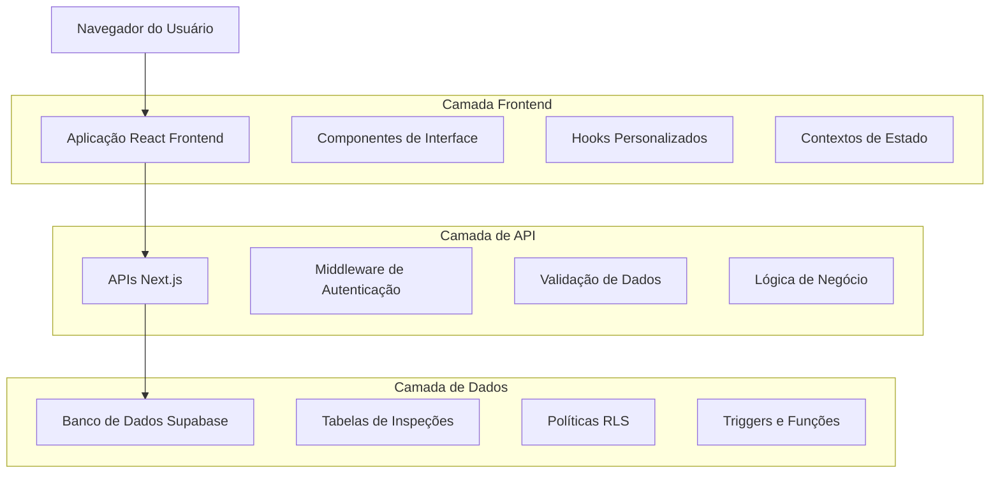
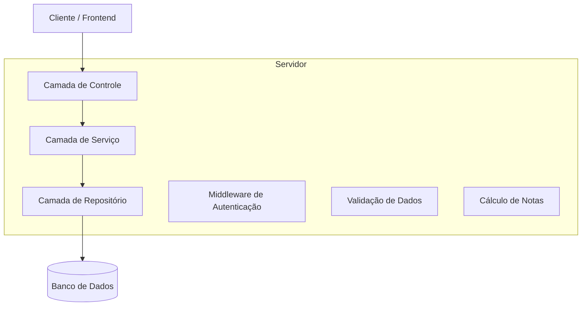
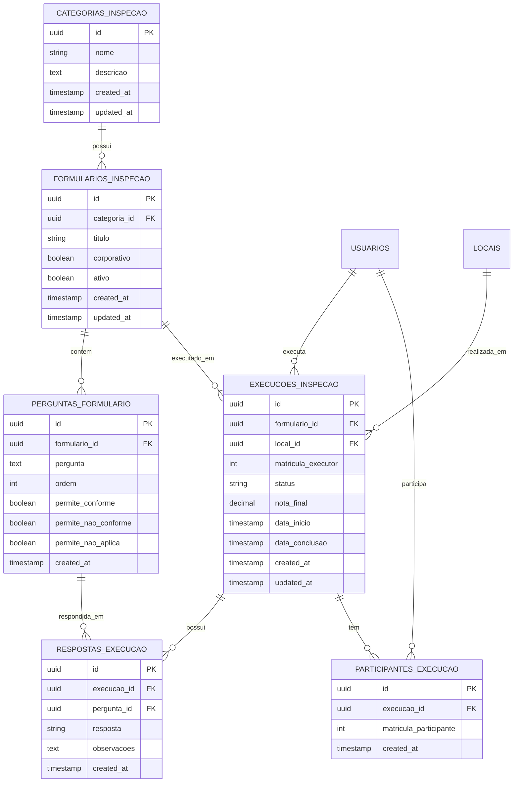

# Módulo Inspeções e Checks - Documento de Arquitetura Técnica

## 1. Arquitetura do Sistema



## 2. Descrição das Tecnologias

- Frontend: React@18 + TypeScript + Tailwind CSS@3 + Next.js@14
- Backend: Next.js API Routes + Middleware JWT
- Banco de Dados: Supabase (PostgreSQL)
- Autenticação: JWT + Supabase Auth
- Validação: Zod + validações customizadas

## 3. Definições de Rotas

| Rota | Propósito |
|------|-----------|
| /inspecoes | Dashboard principal com visão geral das inspeções |
| /inspecoes/categorias | Gestão de categorias de inspeção |
| /inspecoes/formularios | Listagem e gestão de formulários |
| /inspecoes/formularios/novo | Criação de novo formulário |
| /inspecoes/formularios/[id] | Edição de formulário específico |
| /inspecoes/executar/[id] | Execução de formulário em etapas |
| /inspecoes/execucoes | Histórico de execuções realizadas |
| /inspecoes/execucoes/[id] | Detalhes de execução específica |

## 4. Definições de API

### 4.1 APIs Principais

**Gestão de Categorias**
```
GET /api/inspecoes/categorias
POST /api/inspecoes/categorias
PUT /api/inspecoes/categorias/[id]
DELETE /api/inspecoes/categorias/[id]
```

Requisição POST:
| Parâmetro | Tipo | Obrigatório | Descrição |
|-----------|------|-------------|-----------|
| nome | string | true | Nome da categoria |
| descricao | string | false | Descrição da categoria |

Resposta:
| Parâmetro | Tipo | Descrição |
|-----------|------|-----------|
| success | boolean | Status da operação |
| data | object | Dados da categoria criada |

**Gestão de Formulários**
```
GET /api/inspecoes/formularios
POST /api/inspecoes/formularios
PUT /api/inspecoes/formularios/[id]
DELETE /api/inspecoes/formularios/[id]
```

Requisição POST:
| Parâmetro | Tipo | Obrigatório | Descrição |
|-----------|------|-------------|-----------|
| titulo | string | true | Título do formulário |
| categoria_id | uuid | true | ID da categoria |
| corporativo | boolean | false | Se é formulário corporativo |
| perguntas | array | true | Array de perguntas do formulário |

**Execução de Formulários**
```
GET /api/inspecoes/execucoes
POST /api/inspecoes/execucoes
PUT /api/inspecoes/execucoes/[id]
GET /api/inspecoes/execucoes/[id]
```

Requisição POST:
| Parâmetro | Tipo | Obrigatório | Descrição |
|-----------|------|-------------|-----------|
| formulario_id | uuid | true | ID do formulário |
| local_id | uuid | true | ID do local da inspeção |
| participantes | array | true | Array de matrículas dos participantes |

### 4.2 APIs de Apoio

**Locais disponíveis**
```
GET /api/inspecoes/locais
```

**Usuários para participação**
```
GET /api/inspecoes/usuarios
```

## 5. Arquitetura do Servidor



## 6. Modelo de Dados

### 6.1 Diagrama Entidade-Relacionamento



### 6.2 Linguagem de Definição de Dados

**Tabela de Categorias de Inspeção**
```sql
-- Criar tabela de categorias
CREATE TABLE categorias_inspecao (
    id UUID PRIMARY KEY DEFAULT gen_random_uuid(),
    nome VARCHAR(255) NOT NULL,
    descricao TEXT,
    created_at TIMESTAMP WITH TIME ZONE DEFAULT NOW(),
    updated_at TIMESTAMP WITH TIME ZONE DEFAULT NOW()
);

-- Índices
CREATE INDEX idx_categorias_inspecao_nome ON categorias_inspecao(nome);

-- Trigger para updated_at
CREATE TRIGGER trigger_updated_at_categorias_inspecao
    BEFORE UPDATE ON categorias_inspecao
    FOR EACH ROW
    EXECUTE FUNCTION update_updated_at_column();
```

**Tabela de Formulários de Inspeção**
```sql
-- Criar tabela de formulários
CREATE TABLE formularios_inspecao (
    id UUID PRIMARY KEY DEFAULT gen_random_uuid(),
    categoria_id UUID NOT NULL,
    titulo VARCHAR(500) NOT NULL,
    corporativo BOOLEAN DEFAULT false,
    ativo BOOLEAN DEFAULT true,
    created_at TIMESTAMP WITH TIME ZONE DEFAULT NOW(),
    updated_at TIMESTAMP WITH TIME ZONE DEFAULT NOW(),
    
    FOREIGN KEY (categoria_id) REFERENCES categorias_inspecao(id)
);

-- Índices
CREATE INDEX idx_formularios_categoria ON formularios_inspecao(categoria_id);
CREATE INDEX idx_formularios_ativo ON formularios_inspecao(ativo);
CREATE INDEX idx_formularios_corporativo ON formularios_inspecao(corporativo);

-- Trigger para updated_at
CREATE TRIGGER trigger_updated_at_formularios_inspecao
    BEFORE UPDATE ON formularios_inspecao
    FOR EACH ROW
    EXECUTE FUNCTION update_updated_at_column();
```

**Tabela de Perguntas do Formulário**
```sql
-- Criar tabela de perguntas
CREATE TABLE perguntas_formulario (
    id UUID PRIMARY KEY DEFAULT gen_random_uuid(),
    formulario_id UUID NOT NULL,
    pergunta TEXT NOT NULL,
    ordem INTEGER NOT NULL,
    permite_conforme BOOLEAN DEFAULT true,
    permite_nao_conforme BOOLEAN DEFAULT true,
    permite_nao_aplica BOOLEAN DEFAULT true,
    created_at TIMESTAMP WITH TIME ZONE DEFAULT NOW(),
    
    FOREIGN KEY (formulario_id) REFERENCES formularios_inspecao(id) ON DELETE CASCADE
);

-- Índices
CREATE INDEX idx_perguntas_formulario ON perguntas_formulario(formulario_id);
CREATE INDEX idx_perguntas_ordem ON perguntas_formulario(formulario_id, ordem);
```

**Tabela de Execuções de Inspeção**
```sql
-- Criar tabela de execuções
CREATE TABLE execucoes_inspecao (
    id UUID PRIMARY KEY DEFAULT gen_random_uuid(),
    formulario_id UUID NOT NULL,
    local_id UUID NOT NULL,
    matricula_executor INTEGER NOT NULL,
    status VARCHAR(50) DEFAULT 'em_andamento' CHECK (status IN ('em_andamento', 'concluida', 'cancelada')),
    nota_final DECIMAL(5,2),
    data_inicio TIMESTAMP WITH TIME ZONE DEFAULT NOW(),
    data_conclusao TIMESTAMP WITH TIME ZONE,
    created_at TIMESTAMP WITH TIME ZONE DEFAULT NOW(),
    updated_at TIMESTAMP WITH TIME ZONE DEFAULT NOW(),
    
    FOREIGN KEY (formulario_id) REFERENCES formularios_inspecao(id),
    FOREIGN KEY (local_id) REFERENCES locais(id),
    FOREIGN KEY (matricula_executor) REFERENCES usuarios(matricula)
);

-- Índices
CREATE INDEX idx_execucoes_formulario ON execucoes_inspecao(formulario_id);
CREATE INDEX idx_execucoes_executor ON execucoes_inspecao(matricula_executor);
CREATE INDEX idx_execucoes_status ON execucoes_inspecao(status);
CREATE INDEX idx_execucoes_data ON execucoes_inspecao(created_at DESC);

-- Trigger para updated_at
CREATE TRIGGER trigger_updated_at_execucoes_inspecao
    BEFORE UPDATE ON execucoes_inspecao
    FOR EACH ROW
    EXECUTE FUNCTION update_updated_at_column();
```

**Tabela de Respostas da Execução**
```sql
-- Criar tabela de respostas
CREATE TABLE respostas_execucao (
    id UUID PRIMARY KEY DEFAULT gen_random_uuid(),
    execucao_id UUID NOT NULL,
    pergunta_id UUID NOT NULL,
    resposta VARCHAR(20) NOT NULL CHECK (resposta IN ('conforme', 'nao_conforme', 'nao_aplica')),
    observacoes TEXT,
    created_at TIMESTAMP WITH TIME ZONE DEFAULT NOW(),
    
    FOREIGN KEY (execucao_id) REFERENCES execucoes_inspecao(id) ON DELETE CASCADE,
    FOREIGN KEY (pergunta_id) REFERENCES perguntas_formulario(id),
    
    UNIQUE(execucao_id, pergunta_id)
);

-- Índices
CREATE INDEX idx_respostas_execucao ON respostas_execucao(execucao_id);
CREATE INDEX idx_respostas_pergunta ON respostas_execucao(pergunta_id);
```

**Tabela de Participantes da Execução**
```sql
-- Criar tabela de participantes
CREATE TABLE participantes_execucao (
    id UUID PRIMARY KEY DEFAULT gen_random_uuid(),
    execucao_id UUID NOT NULL,
    matricula_participante INTEGER NOT NULL,
    created_at TIMESTAMP WITH TIME ZONE DEFAULT NOW(),
    
    FOREIGN KEY (execucao_id) REFERENCES execucoes_inspecao(id) ON DELETE CASCADE,
    FOREIGN KEY (matricula_participante) REFERENCES usuarios(matricula),
    
    UNIQUE(execucao_id, matricula_participante)
);

-- Índices
CREATE INDEX idx_participantes_execucao ON participantes_execucao(execucao_id);
CREATE INDEX idx_participantes_matricula ON participantes_execucao(matricula_participante);
```

**Função para Cálculo de Nota**
```sql
-- Função para calcular nota da execução
CREATE OR REPLACE FUNCTION calcular_nota_execucao(execucao_uuid UUID)
RETURNS DECIMAL(5,2) AS $$
DECLARE
    total_respostas INTEGER;
    respostas_conforme INTEGER;
    nota DECIMAL(5,2);
BEGIN
    -- Contar total de respostas (excluindo "não se aplica")
    SELECT COUNT(*) INTO total_respostas
    FROM respostas_execucao
    WHERE execucao_id = execucao_uuid
    AND resposta != 'nao_aplica';
    
    -- Contar respostas conformes
    SELECT COUNT(*) INTO respostas_conforme
    FROM respostas_execucao
    WHERE execucao_id = execucao_uuid
    AND resposta = 'conforme';
    
    -- Calcular nota
    IF total_respostas > 0 THEN
        nota := (respostas_conforme::DECIMAL / total_respostas::DECIMAL) * 100;
    ELSE
        nota := 0;
    END IF;
    
    -- Atualizar execução com a nota
    UPDATE execucoes_inspecao
    SET nota_final = nota,
        updated_at = NOW()
    WHERE id = execucao_uuid;
    
    RETURN nota;
END;
$$ LANGUAGE plpgsql;
```

**Políticas RLS (Row Level Security)**
```sql
-- Habilitar RLS
ALTER TABLE categorias_inspecao ENABLE ROW LEVEL SECURITY;
ALTER TABLE formularios_inspecao ENABLE ROW LEVEL SECURITY;
ALTER TABLE perguntas_formulario ENABLE ROW LEVEL SECURITY;
ALTER TABLE execucoes_inspecao ENABLE ROW LEVEL SECURITY;
ALTER TABLE respostas_execucao ENABLE ROW LEVEL SECURITY;
ALTER TABLE participantes_execucao ENABLE ROW LEVEL SECURITY;

-- Políticas para categorias (gestores podem gerenciar, todos podem visualizar)
CREATE POLICY "Todos podem visualizar categorias" ON categorias_inspecao
    FOR SELECT TO authenticated
    USING (true);

CREATE POLICY "Gestores podem gerenciar categorias" ON categorias_inspecao
    FOR ALL TO authenticated
    USING (
        EXISTS (
            SELECT 1 FROM usuarios 
            WHERE matricula = (auth.jwt() ->> 'matricula')::integer
            AND funcao IN ('Gestor Qualidade', 'Administrador')
        )
    );

-- Políticas para formulários
CREATE POLICY "Usuários veem formulários do contrato" ON formularios_inspecao
    FOR SELECT TO authenticated
    USING (
        corporativo = true OR
        EXISTS (
            SELECT 1 FROM usuarios 
            WHERE matricula = (auth.jwt() ->> 'matricula')::integer
            AND contrato_raiz = (
                SELECT contrato_raiz FROM usuarios 
                WHERE matricula = (auth.jwt() ->> 'matricula')::integer
            )
        )
    );

-- Políticas para execuções (usuários veem suas execuções e participações)
CREATE POLICY "Usuários veem suas execuções" ON execucoes_inspecao
    FOR SELECT TO authenticated
    USING (
        matricula_executor = (auth.jwt() ->> 'matricula')::integer OR
        EXISTS (
            SELECT 1 FROM participantes_execucao p
            WHERE p.execucao_id = id
            AND p.matricula_participante = (auth.jwt() ->> 'matricula')::integer
        )
    );
```