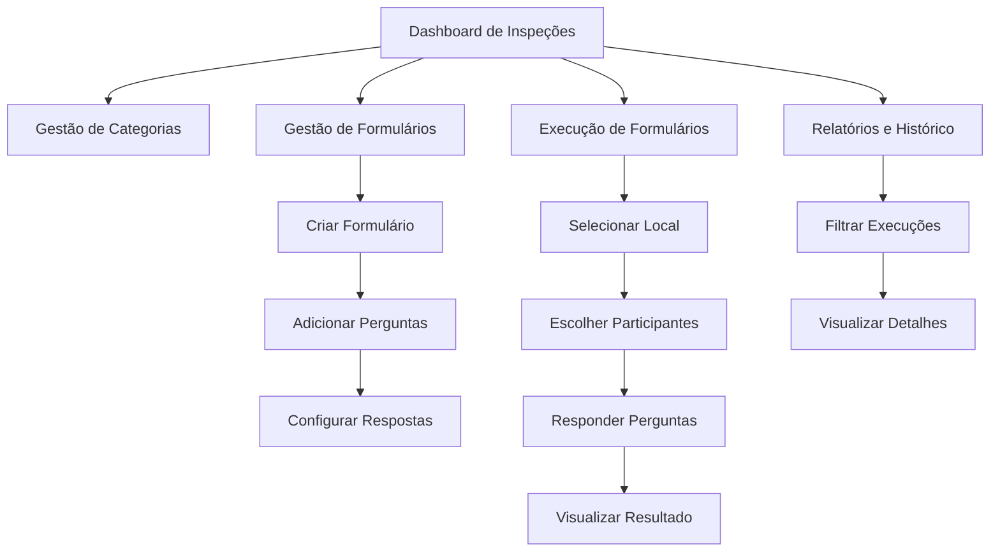

# Módulo Inspeções e Checks - Documento de Requisitos do Produto

## 1. Visão Geral do Produto

Sistema completo para criação e execução de formulários de inspeção e verificação de conformidade, permitindo a padronização de processos de auditoria e controle de qualidade.

O módulo possibilita a criação de formulários personalizados com perguntas de conformidade, execução controlada por etapas e acompanhamento de resultados com sistema de pontuação automática baseado em conformidade.

Destinado a equipes de qualidade, segurança e auditoria que necessitam de processos estruturados de verificação e controle.

## 2. Funcionalidades Principais

### 2.1 Perfis de Usuário

| Perfil | Método de Acesso | Permissões Principais |
|--------|------------------|----------------------|
| Usuário Padrão | Autenticação do sistema | Executar formulários, visualizar próprias execuções |
| Gestor de Qualidade | Função específica no sistema | Criar/editar formulários, gerenciar categorias, visualizar todas as execuções |
| Administrador | Função administrativa | Acesso completo a todas as funcionalidades |

### 2.2 Módulos Funcionais

O sistema de inspeções e checks é composto pelas seguintes páginas principais:

1. **Dashboard de Inspeções**: visão geral, estatísticas de conformidade, formulários disponíveis, execuções pendentes
2. **Gestão de Categorias**: cadastro e manutenção de categorias de inspeção
3. **Gestão de Formulários**: criação, edição e configuração de formulários de inspeção
4. **Execução de Formulários**: interface em etapas para responder formulários
5. **Relatórios e Histórico**: visualização de execuções realizadas e resultados

### 2.3 Detalhamento das Páginas

| Página | Módulo | Descrição da Funcionalidade |
|--------|--------|----------------------------|
| Dashboard de Inspeções | Painel Principal | Exibir estatísticas de conformidade, formulários disponíveis, execuções em andamento e alertas de não conformidade |
| Gestão de Categorias | Cadastro de Categorias | Criar, editar e excluir categorias de inspeção com nome e descrição |
| Gestão de Formulários | Criação de Formulários | Criar formulários com título, categoria, perguntas personalizadas e configuração de respostas disponíveis por pergunta |
| Execução de Formulários | Processo de Inspeção | Executar formulários em duas etapas: seleção de local e participantes, depois resposta às perguntas com salvamento automático |
| Relatórios e Histórico | Visualização de Resultados | Consultar execuções realizadas, filtrar por período/categoria, visualizar detalhes e notas de conformidade |
| Formulários Corporativos | Gestão Centralizada | Gerenciar formulários corporativos disponíveis para todos os contratos |

## 3. Processo Principal

### Fluxo do Usuário Padrão
O usuário acessa o dashboard, seleciona um formulário disponível, escolhe o local da inspeção e participantes, responde às perguntas do formulário e visualiza o resultado final com nota de conformidade.

### Fluxo do Gestor de Qualidade
O gestor cria categorias de inspeção, desenvolve formulários personalizados com perguntas específicas, configura quais respostas estão disponíveis para cada pergunta e acompanha os resultados das execuções.

## 4. Design da Interface

### 4.1 Estilo de Design

- **Cores Primárias**: Azul (#3B82F6) para ações principais, Verde (#10B981) para conformidade
- **Cores Secundárias**: Vermelho (#EF4444) para não conformidade, Amarelo (#F59E0B) para não se aplica
- **Estilo de Botões**: Arredondados com sombra sutil, efeitos hover suaves
- **Tipografia**: Inter ou system fonts, tamanhos 14px (corpo), 16px (títulos), 24px (cabeçalhos)
- **Layout**: Design baseado em cards, navegação superior fixa, sidebar responsiva
- **Ícones**: Lucide React com estilo outline, tamanho padrão 20px

### 4.2 Visão Geral das Páginas

| Página | Módulo | Elementos de Interface |
|--------|--------|------------------------|
| Dashboard de Inspeções | Painel Principal | Cards de estatísticas com ícones coloridos, lista de formulários disponíveis, gráficos de conformidade, botões de ação rápida |
| Gestão de Categorias | Formulário de Cadastro | Tabela responsiva com ações inline, modal de criação/edição, campos de nome e descrição, validação em tempo real |
| Gestão de Formulários | Criação Avançada | Formulário multi-etapas, drag-and-drop para perguntas, checkboxes para opções de resposta, preview do formulário |
| Execução de Formulários | Interface de Processo | Stepper visual, seleção de local com dropdown, multi-select de participantes, cards de perguntas com radio buttons |
| Relatórios e Histórico | Visualização de Dados | Filtros avançados, tabela paginada, modal de detalhes, indicadores visuais de conformidade, exportação de dados |

### 4.3 Responsividade

O sistema é desenvolvido com abordagem mobile-first, adaptando-se automaticamente para tablets e desktops. Inclui otimizações para interação touch em dispositivos móveis, com botões e áreas de toque adequadamente dimensionados.

## 5. Regras de Negócio Específicas

### 5.1 Sistema de Pontuação
- Nota calculada automaticamente: (Respostas "Conforme" / Total de perguntas respondidas) × 100
- Perguntas marcadas como "Não se aplica" não entram no cálculo
- Nota mínima para conformidade: 80%

### 5.2 Controle de Acesso
- Usuários só visualizam formulários do seu contrato_raiz
- Formulários corporativos são visíveis para todos os contratos
- Execuções podem ser pausadas e retomadas pelo mesmo usuário

### 5.3 Validações
- Formulários devem ter pelo menos uma pergunta
- Cada pergunta deve ter pelo menos uma opção de resposta habilitada
- Local e pelo menos um participante são obrigatórios para iniciar execução
- Execuções em andamento são salvas automaticamente a cada resposta