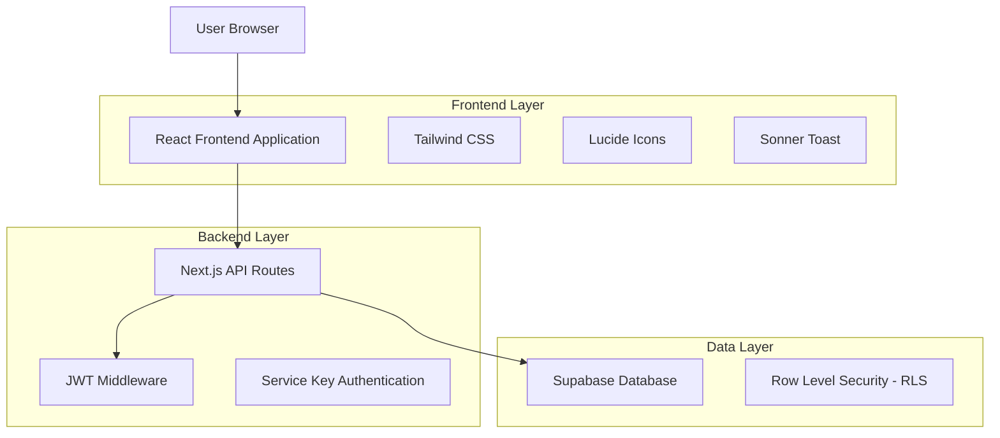
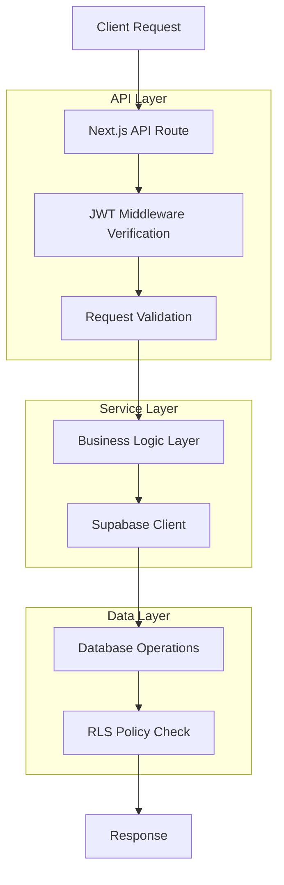
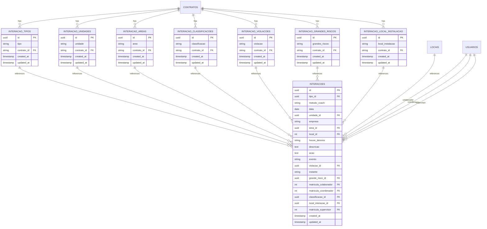

# Módulo de Interações - Documento de Arquitetura Técnica

## 1. Architecture design



## 2. Technology Description

* Frontend: React\@18 + Next.js\@14 + Tailwind CSS\@3 + Lucide React + Sonner

* Backend: Next.js API Routes + JWT Middleware

* Database: Supabase (PostgreSQL)

* Authentication: JWT tokens via localStorage

* Security: Service Key + RLS policies

## 3. Route definitions

| Route                                    | Purpose                                                    |
| ---------------------------------------- | ---------------------------------------------------------- |
| /interacoes                              | Dashboard principal com estatísticas e interações recentes |
| /interacoes/nova                         | Formulário de etapas para cadastro de nova interação       |
| /interacoes/lista                        | Listagem de todas as interações com filtros e paginação    |
| /interacoes/\[id]                        | Visualização detalhada de uma interação específica         |
| /interacoes/relatorios                   | Página de relatórios com gráficos e estatísticas           |
| /interacoes/configuracoes/tipos          | Gerenciamento de tipos de interação                        |
| /interacoes/configuracoes/unidades       | Gerenciamento de unidades de interação                     |
| /interacoes/configuracoes/areas          | Gerenciamento de áreas de interação                        |
| /interacoes/configuracoes/classificacoes | Gerenciamento de classificações                            |
| /interacoes/configuracoes/violacoes      | Gerenciamento de violações                                 |
| /interacoes/configuracoes/grandes-riscos | Gerenciamento de grandes riscos                            |

## 4. API definitions

### 4.1 Core API

#### Interações CRUD

```
GET /api/interacoes
```

Listar interações com filtros e paginação

Request Parameters:

| Param Name   | Param Type | isRequired | Description                   |
| ------------ | ---------- | ---------- | ----------------------------- |
| page         | number     | false      | Número da página (padrão: 1)  |
| limit        | number     | false      | Itens por página (padrão: 10) |
| tipo         | string     | false      | Filtro por tipo de interação  |
| data\_inicio | string     | false      | Filtro por data inicial       |
| data\_fim    | string     | false      | Filtro por data final         |
| search       | string     | false      | Busca por texto               |

Response:

| Param Name | Param Type | Description         |
| ---------- | ---------- | ------------------- |
| data       | array      | Lista de interações |
| total      | number     | Total de registros  |
| totalPages | number     | Total de páginas    |

```
POST /api/interacoes
```

Criar nova interação

Request:

| Param Name             | Param Type | isRequired | Description                             |
| ---------------------- | ---------- | ---------- | --------------------------------------- |
| tipo\_id               | string     | true       | ID do tipo de interação                 |
| metodo\_coach          | string     | true       | Sim ou Não                              |
| data                   | string     | true       | Data da interação                       |
| unidade\_id            | string     | true       | ID da unidade                           |
| empresa                | string     | true       | Nome da empresa                         |
| area\_id               | string     | true       | ID da área                              |
| local\_id              | string     | true       | ID do local                             |
| houve\_desvios         | string     | true       | Sim ou Não                              |
| descricao              | string     | true       | Descrição da interação                  |
| acao                   | string     | false      | Ação tomada                             |
| evento                 | string     | true       | ROTINA ou PARADA                        |
| violacao\_id           | string     | false      | ID da violação                          |
| instante               | string     | true       | N/A, HORA SEGURA, INSPEÇÃO DE SEGURANÇA |
| grande\_risco\_id      | string     | false      | ID do grande risco                      |
| matricula\_colaborador | number     | true       | Matrícula do colaborador                |
| matricula\_coordenador | number     | false      | Matrícula do coordenador                |
| classificacao\_id      | string     | true       | ID da classificação                     |
| local\_interacao\_id   | string     | true       | ID do local de instalação               |
| matricula\_supervisor  | number     | false      | Matrícula do supervisor                 |

```
GET /api/interacoes/[id]
```

Buscar interação por ID

```
PUT /api/interacoes/[id]
```

Atualizar interação

```
DELETE /api/interacoes/[id]
```

Excluir interação

#### Configurações CRUD

```
GET /api/interacoes/tipos
POST /api/interacoes/tipos
PUT /api/interacoes/tipos/[id]
DELETE /api/interacoes/tipos/[id]
```

```
GET /api/interacoes/unidades
POST /api/interacoes/unidades
PUT /api/interacoes/unidades/[id]
DELETE /api/interacoes/unidades/[id]
```

```
GET /api/interacoes/areas
POST /api/interacoes/areas
PUT /api/interacoes/areas/[id]
DELETE /api/interacoes/areas/[id]
```

```
GET /api/interacoes/classificacoes
POST /api/interacoes/classificacoes
PUT /api/interacoes/classificacoes/[id]
DELETE /api/interacoes/classificacoes/[id]
```

```
GET /api/interacoes/violacoes
POST /api/interacoes/violacoes
PUT /api/interacoes/violacoes/[id]
DELETE /api/interacoes/violacoes/[id]
```

```
GET /api/interacoes/grandes-riscos
POST /api/interacoes/grandes-riscos
PUT /api/interacoes/grandes-riscos/[id]
DELETE /api/interacoes/grandes-riscos/[id]
```

#### Estatísticas

```
GET /api/interacoes/stats
```

Estatísticas para dashboard e relatórios

Response:

| Param Name          | Param Type | Description               |
| ------------------- | ---------- | ------------------------- |
| total\_interacoes   | number     | Total de interações       |
| interacoes\_mes     | number     | Interações do mês atual   |
| tipos\_mais\_comuns | array      | Tipos mais frequentes     |
| areas\_mais\_ativas | array      | Áreas com mais interações |

## 5. Server architecture diagram



## 6. Data model

### 6.1 Data model definition



### 6.2 Data Definition Language

#### Tabelas de Configuração

```sql
-- Tabela de tipos de interação
CREATE TABLE interacao_tipos (
    id UUID PRIMARY KEY DEFAULT gen_random_uuid(),
    tipo VARCHAR(100) NOT NULL,
    contrato_id VARCHAR(20) NOT NULL REFERENCES contratos(codigo),
    created_at TIMESTAMP WITH TIME ZONE DEFAULT NOW(),
    updated_at TIMESTAMP WITH TIME ZONE DEFAULT NOW(),
    UNIQUE(tipo, contrato_id)
);

-- Tabela de unidades de interação
CREATE TABLE interacao_unidades (
    id UUID PRIMARY KEY DEFAULT gen_random_uuid(),
    unidade VARCHAR(100) NOT NULL,
    contrato_id VARCHAR(20) NOT NULL REFERENCES contratos(codigo),
    created_at TIMESTAMP WITH TIME ZONE DEFAULT NOW(),
    updated_at TIMESTAMP WITH TIME ZONE DEFAULT NOW(),
    UNIQUE(unidade, contrato_id)
);

-- Tabela de áreas de interação
CREATE TABLE interacao_areas (
    id UUID PRIMARY KEY DEFAULT gen_random_uuid(),
    area VARCHAR(100) NOT NULL,
    contrato_id VARCHAR(20) NOT NULL REFERENCES contratos(codigo),
    created_at TIMESTAMP WITH TIME ZONE DEFAULT NOW(),
    updated_at TIMESTAMP WITH TIME ZONE DEFAULT NOW(),
    UNIQUE(area, contrato_id)
);

-- Tabela de classificações
CREATE TABLE interacao_classificacoes (
    id UUID PRIMARY KEY DEFAULT gen_random_uuid(),
    classificacao VARCHAR(100) NOT NULL,
    contrato_id VARCHAR(20) NOT NULL REFERENCES contratos(codigo),
    created_at TIMESTAMP WITH TIME ZONE DEFAULT NOW(),
    updated_at TIMESTAMP WITH TIME ZONE DEFAULT NOW(),
    UNIQUE(classificacao, contrato_id)
);

-- Tabela de violações
CREATE TABLE interacao_violacoes (
    id UUID PRIMARY KEY DEFAULT gen_random_uuid(),
    violacao VARCHAR(100) NOT NULL,
    contrato_id VARCHAR(20) NOT NULL REFERENCES contratos(codigo),
    created_at TIMESTAMP WITH TIME ZONE DEFAULT NOW(),
    updated_at TIMESTAMP WITH TIME ZONE DEFAULT NOW(),
    UNIQUE(violacao, contrato_id)
);

-- Tabela de grandes riscos
CREATE TABLE interacao_grandes_riscos (
    id UUID PRIMARY KEY DEFAULT gen_random_uuid(),
    grandes_riscos VARCHAR(100) NOT NULL,
    contrato_id VARCHAR(20) NOT NULL REFERENCES contratos(codigo),
    created_at TIMESTAMP WITH TIME ZONE DEFAULT NOW(),
    updated_at TIMESTAMP WITH TIME ZONE DEFAULT NOW(),
    UNIQUE(grandes_riscos, contrato_id)
);

-- Tabela de locais de instalação
CREATE TABLE interacao_local_instalacao (
    id UUID PRIMARY KEY DEFAULT gen_random_uuid(),
    local_instalacao VARCHAR(100) NOT NULL,
    contrato_id VARCHAR(20) NOT NULL REFERENCES contratos(codigo),
    created_at TIMESTAMP WITH TIME ZONE DEFAULT NOW(),
    updated_at TIMESTAMP WITH TIME ZONE DEFAULT NOW(),
    UNIQUE(local_instalacao, contrato_id)
);
```

#### Tabela Principal de Interações

```sql
-- Tabela principal de interações
CREATE TABLE interacoes (
    id UUID PRIMARY KEY DEFAULT gen_random_uuid(),
    tipo_id UUID NOT NULL REFERENCES interacao_tipos(id),
    metodo_coach VARCHAR(10) NOT NULL CHECK (metodo_coach IN ('Sim', 'Não')),
    data DATE NOT NULL,
    unidade_id UUID NOT NULL REFERENCES interacao_unidades(id),
    empresa VARCHAR(100) NOT NULL,
    area_id UUID NOT NULL REFERENCES interacao_areas(id),
    local_id INTEGER NOT NULL REFERENCES locais(id),
    houve_desvios VARCHAR(10) NOT NULL CHECK (houve_desvios IN ('Sim', 'Não')),
    descricao TEXT NOT NULL,
    acao TEXT,
    evento VARCHAR(20) NOT NULL CHECK (evento IN ('ROTINA', 'PARADA')),
    violacao_id UUID REFERENCES interacao_violacoes(id),
    instante VARCHAR(30) NOT NULL CHECK (instante IN ('N/A', 'HORA SEGURA', 'INSPEÇÃO DE SEGURANÇA')),
    grande_risco_id UUID REFERENCES interacao_grandes_riscos(id),
    matricula_colaborador INTEGER NOT NULL REFERENCES usuarios(matricula),
    matricula_coordenador INTEGER REFERENCES usuarios(matricula),
    classificacao_id UUID NOT NULL REFERENCES interacao_classificacoes(id),
    local_interacao_id UUID NOT NULL REFERENCES interacao_local_instalacao(id),
    matricula_supervisor INTEGER REFERENCES usuarios(matricula),
    created_at TIMESTAMP WITH TIME ZONE DEFAULT NOW(),
    updated_at TIMESTAMP WITH TIME ZONE DEFAULT NOW()
);
```

#### Índices para Performance

```sql
-- Criar índices para melhor performance
CREATE INDEX idx_interacoes_data ON interacoes(data DESC);
CREATE INDEX idx_interacoes_tipo_id ON interacoes(tipo_id);
CREATE INDEX idx_interacoes_matricula_colaborador ON interacoes(matricula_colaborador);
CREATE INDEX idx_interacoes_created_at ON interacoes(created_at DESC);

-- Índices para tabelas de configuração
CREATE INDEX idx_interacao_tipos_contrato ON interacao_tipos(contrato_id);
CREATE INDEX idx_interacao_unidades_contrato ON interacao_unidades(contrato_id);
CREATE INDEX idx_interacao_areas_contrato ON interacao_areas(contrato_id);
CREATE INDEX idx_interacao_classificacoes_contrato ON interacao_classificacoes(contrato_id);
CREATE INDEX idx_interacao_violacoes_contrato ON interacao_violacoes(contrato_id);
CREATE INDEX idx_interacao_grandes_riscos_contrato ON interacao_grandes_riscos(contrato_id);
CREATE INDEX idx_interacao_local_instalacao_contrato ON interacao_local_instalacao(contrato_id);
```

#### Políticas RLS (Row Level Security)

```sql
-- Habilitar RLS em todas as tabelas
ALTER TABLE interacao_tipos ENABLE ROW LEVEL SECURITY;
ALTER TABLE interacao_unidades ENABLE ROW LEVEL SECURITY;
ALTER TABLE interacao_areas ENABLE ROW LEVEL SECURITY;
ALTER TABLE interacao_classificacoes ENABLE ROW LEVEL SECURITY;
ALTER TABLE interacao_violacoes ENABLE ROW LEVEL SECURITY;
ALTER TABLE interacao_grandes_riscos ENABLE ROW LEVEL SECURITY;
ALTER TABLE interacao_local_instalacao ENABLE ROW LEVEL SECURITY;
ALTER TABLE interacoes ENABLE ROW LEVEL SECURITY;

-- Políticas para usuários autenticados
CREATE POLICY "Usuários autenticados podem ver tipos" ON interacao_tipos FOR SELECT TO authenticated USING (true);
CREATE POLICY "Usuários autenticados podem ver unidades" ON interacao_unidades FOR SELECT TO authenticated USING (true);
CREATE POLICY "Usuários autenticados podem ver áreas" ON interacao_areas FOR SELECT TO authenticated USING (true);
CREATE POLICY "Usuários autenticados podem ver classificações" ON interacao_classificacoes FOR SELECT TO authenticated USING (true);
CREATE POLICY "Usuários autenticados podem ver violações" ON interacao_violacoes FOR SELECT TO authenticated USING (true);
CREATE POLICY "Usuários autenticados podem ver grandes riscos" ON interacao_grandes_riscos FOR SELECT TO authenticated USING (true);
CREATE POLICY "Usuários autenticados podem ver locais instalação" ON interacao_local_instalacao FOR SELECT TO authenticated USING (true);
CREATE POLICY "Usuários autenticados podem ver interações" ON interacoes FOR SELECT TO authenticated USING (true);

-- Políticas para inserção/atualização (apenas usuários autenticados)
CREATE POLICY "Usuários autenticados podem inserir interações" ON interacoes FOR INSERT TO authenticated WITH CHECK (true);
CREATE POLICY "Usuários autenticados podem atualizar interações" ON interacoes FOR UPDATE TO authenticated USING (true);
CREATE POLICY "Usuários autenticados podem deletar interações" ON interacoes FOR DELETE TO authenticated USING (true);

-- Permissões para role anon (leitura básica)
GRANT SELECT ON interacao_tipos TO anon;
GRANT SELECT ON interacao_unidades TO anon;
GRANT SELECT ON interacao_areas TO anon;
GRANT SELECT ON interacao_classificacoes TO anon;
GRANT SELECT ON interacao_violacoes TO anon;
GRANT SELECT ON interacao_grandes_riscos TO anon;
GRANT SELECT ON interacao_local_instalacao TO anon;

-- Permissões completas para role authenticated
GRANT ALL PRIVILEGES ON interacao_tipos TO authenticated;
GRANT ALL PRIVILEGES ON interacao_unidades TO authenticated;
GRANT ALL PRIVILEGES ON interacao_areas TO authenticated;
GRANT ALL PRIVILEGES ON interacao_classificacoes TO authenticated;
GRANT ALL PRIVILEGES ON interacao_violacoes TO authenticated;
GRANT ALL PRIVILEGES ON interacao_grandes_riscos TO authenticated;
GRANT ALL PRIVILEGES ON interacao_local_instalacao TO authenticated;
GRANT ALL PRIVILEGES ON interacoes TO authenticated;
```

#### Triggers para Updated\_at

```sql
-- Função para atualizar updated_at
CREATE OR REPLACE FUNCTION update_updated_at_column()
RETURNS TRIGGER AS $$
BEGIN
    NEW.updated_at = NOW();
    RETURN NEW;
END;
$$ language 'plpgsql';

-- Triggers para todas as tabelas
CREATE TRIGGER update_interacao_tipos_updated_at BEFORE UPDATE ON interacao_tipos FOR EACH ROW EXECUTE FUNCTION update_updated_at_column();
CREATE TRIGGER update_interacao_unidades_updated_at BEFORE UPDATE ON interacao_unidades FOR EACH ROW EXECUTE FUNCTION update_updated_at_column();
CREATE TRIGGER update_interacao_areas_updated_at BEFORE UPDATE ON interacao_areas FOR EACH ROW EXECUTE FUNCTION update_updated_at_column();
CREATE TRIGGER update_interacao_classificacoes_updated_at BEFORE UPDATE ON interacao_classificacoes FOR EACH ROW EXECUTE FUNCTION update_updated_at_column();
CREATE TRIGGER update_interacao_violacoes_updated_at BEFORE UPDATE ON interacao_violacoes FOR EACH ROW EXECUTE FUNCTION update_updated_at_column();
CREATE TRIGGER update_interacao_grandes_riscos_updated_at BEFORE UPDATE ON interacao_grandes_riscos FOR EACH ROW EXECUTE FUNCTION update_updated_at_column();
CREATE TRIGGER update_interacao_local_instalacao_updated_at BEFORE UPDATE ON interacao_local_instalacao FOR EACH ROW EXECUTE FUNCTION update_updated_at_column();
CREATE TRIGGER update_interacoes_updated_at BEFORE UPDATE ON interacoes FOR EACH ROW EXECUTE FUNCTION update_updated_at_column();
```

