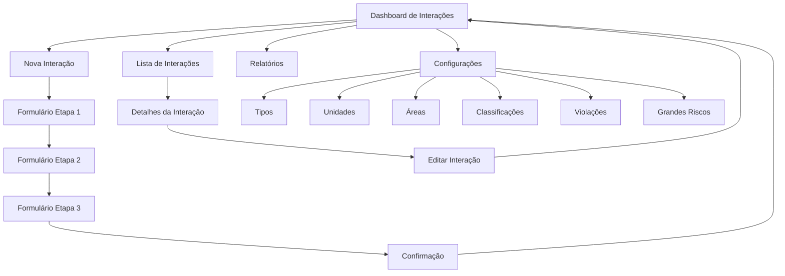

# Módulo de Interações - Documento de Requisitos do Produto

## 1. Product Overview

O módulo de Interações é um sistema completo para gestão e monitoramento de interações de segurança realizadas por usuários, líderes e gestores no ambiente de trabalho. O sistema permite o cadastro, acompanhamento e análise de diferentes tipos de interações relacionadas à segurança ocupacional.

O módulo visa centralizar o controle de interações de segurança, facilitando a identificação de padrões, riscos e oportunidades de melhoria na gestão de segurança do trabalho, contribuindo para a redução de acidentes e o fortalecimento da cultura de segurança organizacional.

## 2. Core Features

### 2.1 User Roles

| Role | Registration Method | Core Permissions |
|------|---------------------|------------------|
| Usuário Comum | Login com matrícula e senha | Pode visualizar interações próprias e criar novas interações |
| Líder/Supervisor | Login com matrícula e senha | Pode visualizar, criar e gerenciar interações da sua equipe |
| Gestor/Coordenador | Login com matrícula e senha | Pode visualizar relatórios, gerenciar configurações e todas as interações |
| Administrador | Login com matrícula e senha | Acesso completo ao sistema, incluindo cadastros de configuração |

### 2.2 Feature Module

O módulo de Interações consiste nas seguintes páginas principais:

1. **Dashboard de Interações**: visão geral com estatísticas, gráficos e interações recentes
2. **Nova Interação**: formulário de etapas para cadastro de interações
3. **Lista de Interações**: listagem com filtros e busca de todas as interações
4. **Detalhes da Interação**: visualização completa de uma interação específica
5. **Relatórios**: página com gráficos e estatísticas detalhadas
6. **Configurações**: páginas para cadastro de tipos, unidades, áreas, classificações, violações e grandes riscos

### 2.3 Page Details

| Page Name | Module Name | Feature description |
|-----------|-------------|---------------------|
| Dashboard de Interações | Estatísticas Gerais | Exibir cards com totais de interações, gráficos de tendências e lista de interações recentes |
| Dashboard de Interações | Filtros Rápidos | Permitir filtros por período, tipo de interação e status |
| Nova Interação | Formulário de Etapas | Criar formulário multi-etapas com validação e campos relacionais com busca |
| Nova Interação | Seleção de Dados | Carregar dados de dropdowns (tipos, unidades, áreas, etc.) com funcionalidade de pesquisa |
| Lista de Interações | Listagem com Paginação | Exibir interações em cards com informações resumidas e paginação |
| Lista de Interações | Filtros e Busca | Implementar filtros por data, tipo, status e busca por texto |
| Detalhes da Interação | Visualização Completa | Mostrar todos os dados da interação de forma organizada e legível |
| Detalhes da Interação | Ações de Gerenciamento | Permitir edição e exclusão da interação (conforme permissões) |
| Relatórios | Gráficos Estatísticos | Gerar gráficos de barras, pizza e linha com dados de interações |
| Relatórios | Filtros de Período | Permitir seleção de períodos personalizados para análise |
| Configurações - Tipos | CRUD de Tipos | Criar, listar, editar e excluir tipos de interação |
| Configurações - Unidades | CRUD de Unidades | Gerenciar unidades de interação por contrato |
| Configurações - Áreas | CRUD de Áreas | Administrar áreas de interação |
| Configurações - Classificações | CRUD de Classificações | Controlar classificações de interações |
| Configurações - Violações | CRUD de Violações | Gerenciar tipos de violações |
| Configurações - Grandes Riscos | CRUD de Grandes Riscos | Administrar cadastro de grandes riscos |

## 3. Core Process

### Fluxo Principal do Usuário

1. **Acesso ao Sistema**: Usuário faz login e acessa o dashboard de interações
2. **Visualização de Dados**: Consulta estatísticas, gráficos e interações recentes no dashboard
3. **Criação de Interação**: Acessa formulário de nova interação e preenche dados em etapas
4. **Gestão de Interações**: Visualiza lista de interações, filtra e acessa detalhes específicos
5. **Análise de Relatórios**: Consulta relatórios com gráficos e estatísticas detalhadas

### Fluxo do Administrador

1. **Configuração Inicial**: Cadastra tipos, unidades, áreas, classificações, violações e grandes riscos
2. **Monitoramento**: Acompanha todas as interações através do dashboard e relatórios
3. **Gestão de Dados**: Edita e mantém atualizadas as configurações do sistema

## 4. User Interface Design

### 4.1 Design Style

- **Cores Primárias**: Azul (#2563eb) e branco (#ffffff)
- **Cores Secundárias**: Cinza (#6b7280) para textos secundários e verde (#10b981) para status positivos
- **Estilo de Botões**: Arredondados (rounded-lg) com efeitos hover e estados de loading
- **Fonte**: Sistema padrão (font-sans) com tamanhos variados (text-sm, text-base, text-lg)
- **Layout**: Baseado em cards com sombras suaves (shadow-sm) e bordas arredondadas
- **Ícones**: Lucide React com tamanho padrão w-4 h-4 para botões e w-5 h-5 para títulos
- **Animações**: Transições suaves (transition-colors, transition-shadow) e loading states

### 4.2 Page Design Overview

| Page Name | Module Name | UI Elements |
|-----------|-------------|-------------|
| Dashboard de Interações | Cards de Estatísticas | Cards brancos com sombra, ícones coloridos, números grandes em fonte bold |
| Dashboard de Interações | Gráficos | Área dedicada para gráficos com fundo branco e bordas arredondadas |
| Nova Interação | Formulário de Etapas | Stepper horizontal, campos organizados em grid, botões de navegação |
| Nova Interação | Campos de Seleção | Dropdowns com busca, estilo consistente com módulo de apadrinhamento |
| Lista de Interações | Cards de Interação | Cards responsivos com informações organizadas, badges de status coloridos |
| Lista de Interações | Filtros | Barra de filtros fixa no topo com campos de busca e seleção |
| Detalhes da Interação | Layout de Detalhes | Seções organizadas em cards, informações hierarquizadas, botões de ação |
| Relatórios | Área de Gráficos | Grid responsivo para múltiplos gráficos, filtros de período |
| Configurações | Tabelas CRUD | Tabelas responsivas com ações inline, modais para edição |

### 4.3 Responsiveness

O sistema é desenvolvido com abordagem mobile-first, utilizando classes responsivas do Tailwind CSS (sm:, md:, lg:, xl:). Todos os componentes são otimizados para dispositivos móveis com navegação touch-friendly e layouts adaptativos que se reorganizam conforme o tamanho da tela.