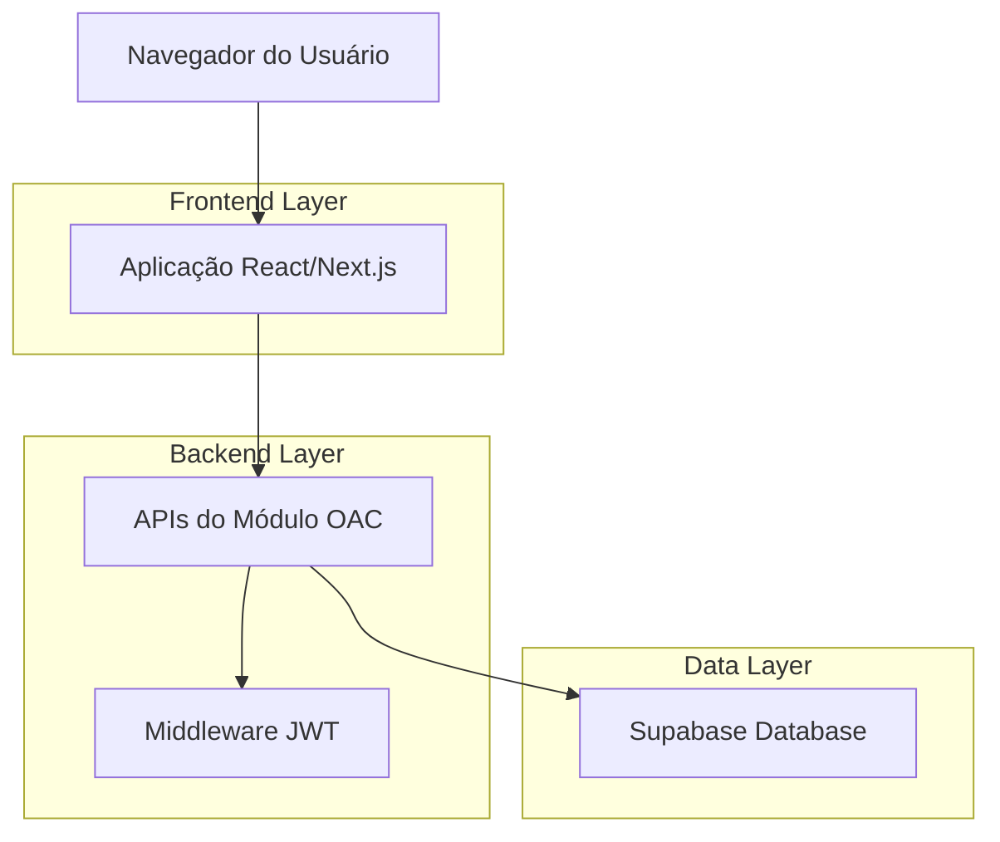
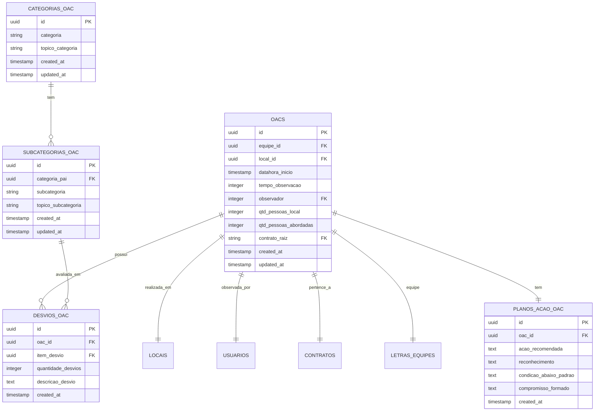

# Módulo OAC - Observações Comportamentais

## Documento de Arquitetura Técnica

## 1. Arquitetura do Sistema



## 2. Stack Tecnológica

* **Frontend**: React\@18 + Next.js\@14 + TypeScript + Tailwind CSS

* **Backend**: Next.js API Routes + Supabase

* **Database**: Supabase (PostgreSQL)

* **Autenticação**: JWT + Supabase Auth

* **UI Components**: Lucide React (ícones) + Sonner (notificações)

## 3. Definição de Rotas

| Rota            | Propósito                            |
| --------------- | ------------------------------------ |
| /oac            | Página principal do módulo OAC       |
| /oac/nova       | Formulário de registro de nova OAC   |
| /oac/historico  | Histórico de OACs realizadas         |
| /oac/relatorios | Relatórios e estatísticas            |
| /oac/categorias | Gestão de categorias e subcategorias |

## 4. APIs do Sistema

### 4.1 API de Categorias

**Listar categorias**

```
GET /api/oac/categorias
```

Request:

| Parâmetro | Tipo | Obrigatório | Descrição                                     |
| --------- | ---- | ----------- | --------------------------------------------- |
| -         | -    | -           | Retorna todas as categorias com subcategorias |

Response:

| Campo   | Tipo    | Descrição                                       |
| ------- | ------- | ----------------------------------------------- |
| data    | array   | Lista de categorias com subcategorias aninhadas |
| success | boolean | Status da operação                              |

**Criar categoria**

```
POST /api/oac/categorias
```

Request:

| Parâmetro         | Tipo   | Obrigatório | Descrição                     |
| ----------------- | ------ | ----------- | ----------------------------- |
| categoria         | string | true        | Nome da categoria             |
| topico\_categoria | string | true        | Tópico/descrição da categoria |

**Criar subcategoria**

```
POST /api/oac/subcategorias
```

Request:

| Parâmetro            | Tipo   | Obrigatório | Descrição                        |
| -------------------- | ------ | ----------- | -------------------------------- |
| categoria\_pai       | uuid   | true        | ID da categoria pai              |
| subcategoria         | string | true        | Nome da subcategoria             |
| topico\_subcategoria | string | true        | Tópico/descrição da subcategoria |

### 4.2 API de OACs

**Listar OACs**

```
GET /api/oac
```

Request:

| Parâmetro    | Tipo   | Obrigatório | Descrição                      |
| ------------ | ------ | ----------- | ------------------------------ |
| page         | number | false       | Página para paginação          |
| limit        | number | false       | Limite de registros por página |
| data\_inicio | string | false       | Filtro por data inicial        |
| data\_fim    | string | false       | Filtro por data final          |
| local\_id    | uuid   | false       | Filtro por local               |

**Criar OAC**

```
POST /api/oac
```

Request:

| Parâmetro               | Tipo     | Obrigatório | Descrição                       |
| ----------------------- | -------- | ----------- | ------------------------------- |
| local\_id               | uuid     | true        | ID do local da observação       |
| datahora\_inicio        | datetime | true        | Data e hora de início           |
| tempo\_observacao       | number   | true        | Tempo em minutos                |
| qtd\_pessoas\_local     | number   | true        | Quantidade de pessoas no local  |
| qtd\_pessoas\_abordadas | number   | true        | Quantidade de pessoas abordadas |
| desvios                 | array    | true        | Lista de desvios observados     |
| plano\_acao             | object   | true        | Dados do plano de ação          |

### 4.3 API de Relatórios

**Estatísticas gerais**

```
GET /api/oac/relatorios/estatisticas
```

Request:

| Parâmetro  | Tipo   | Obrigatório | Descrição                           |
| ---------- | ------ | ----------- | ----------------------------------- |
| periodo    | string | false       | Período para análise (30d, 90d, 1y) |
| equipe\_id | uuid   | false       | Filtro por equipe                   |

## 5. Modelo de Dados

### 5.1 Diagrama ER



### 5.2 DDL das Tabelas

**Tabela de Categorias**

```sql
-- Criar tabela de categorias OAC
CREATE TABLE categorias_oac (
    id UUID PRIMARY KEY DEFAULT gen_random_uuid(),
    categoria VARCHAR(100) NOT NULL,
    topico_categoria TEXT NOT NULL,
    created_at TIMESTAMP WITH TIME ZONE DEFAULT NOW(),
    updated_at TIMESTAMP WITH TIME ZONE DEFAULT NOW()
);

-- Índices
CREATE INDEX idx_categorias_oac_categoria ON categorias_oac(categoria);

-- RLS
ALTER TABLE categorias_oac ENABLE ROW LEVEL SECURITY;
CREATE POLICY "Usuários autenticados podem visualizar categorias" ON categorias_oac
    FOR SELECT USING (auth.role() = 'authenticated');
CREATE POLICY "Usuários autenticados podem gerenciar categorias" ON categorias_oac
    FOR ALL USING (auth.role() = 'authenticated');

-- Trigger para updated_at
CREATE TRIGGER update_categorias_oac_updated_at
    BEFORE UPDATE ON categorias_oac
    FOR EACH ROW EXECUTE FUNCTION update_updated_at_column();
```

**Tabela de Subcategorias**

```sql
-- Criar tabela de subcategorias OAC
CREATE TABLE subcategorias_oac (
    id UUID PRIMARY KEY DEFAULT gen_random_uuid(),
    categoria_pai UUID NOT NULL REFERENCES categorias_oac(id) ON DELETE CASCADE,
    subcategoria VARCHAR(150) NOT NULL,
    topico_subcategoria TEXT NOT NULL,
    created_at TIMESTAMP WITH TIME ZONE DEFAULT NOW(),
    updated_at TIMESTAMP WITH TIME ZONE DEFAULT NOW()
);

-- Índices
CREATE INDEX idx_subcategorias_oac_categoria_pai ON subcategorias_oac(categoria_pai);
CREATE INDEX idx_subcategorias_oac_subcategoria ON subcategorias_oac(subcategoria);

-- RLS
ALTER TABLE subcategorias_oac ENABLE ROW LEVEL SECURITY;
CREATE POLICY "Usuários autenticados podem visualizar subcategorias" ON subcategorias_oac
    FOR SELECT USING (auth.role() = 'authenticated');
CREATE POLICY "Usuários autenticados podem gerenciar subcategorias" ON subcategorias_oac
    FOR ALL USING (auth.role() = 'authenticated');

-- Trigger para updated_at
CREATE TRIGGER update_subcategorias_oac_updated_at
    BEFORE UPDATE ON subcategorias_oac
    FOR EACH ROW EXECUTE FUNCTION update_updated_at_column();
```

**Tabela de OACs**

```sql
-- Criar tabela de OACs
CREATE TABLE oacs (
    id UUID PRIMARY KEY DEFAULT gen_random_uuid(),
    equipe_id UUID NOT NULL REFERENCES letras_equipes(id),
    local_id UUID NOT NULL REFERENCES locais(id),
    datahora_inicio TIMESTAMP WITH TIME ZONE NOT NULL,
    tempo_observacao INTEGER NOT NULL CHECK (tempo_observacao > 0),
    observador INTEGER NOT NULL REFERENCES usuarios(matricula),
    qtd_pessoas_local INTEGER NOT NULL CHECK (qtd_pessoas_local >= 0),
    qtd_pessoas_abordadas INTEGER NOT NULL CHECK (qtd_pessoas_abordadas >= 0),
    contrato_raiz VARCHAR(50) NOT NULL REFERENCES contratos(contrato_raiz),
    created_at TIMESTAMP WITH TIME ZONE DEFAULT NOW(),
    updated_at TIMESTAMP WITH TIME ZONE DEFAULT NOW()
);

-- Índices
CREATE INDEX idx_oacs_datahora_inicio ON oacs(datahora_inicio DESC);
CREATE INDEX idx_oacs_observador ON oacs(observador);
CREATE INDEX idx_oacs_local_id ON oacs(local_id);
CREATE INDEX idx_oacs_equipe_id ON oacs(equipe_id);
CREATE INDEX idx_oacs_contrato_raiz ON oacs(contrato_raiz);

-- RLS
ALTER TABLE oacs ENABLE ROW LEVEL SECURITY;
CREATE POLICY "Usuários autenticados podem visualizar OACs" ON oacs
    FOR SELECT USING (auth.role() = 'authenticated');
CREATE POLICY "Usuários autenticados podem criar OACs" ON oacs
    FOR INSERT WITH CHECK (auth.role() = 'authenticated');
CREATE POLICY "Usuários autenticados podem atualizar OACs" ON oacs
    FOR UPDATE USING (auth.role() = 'authenticated');

-- Trigger para updated_at
CREATE TRIGGER update_oacs_updated_at
    BEFORE UPDATE ON oacs
    FOR EACH ROW EXECUTE FUNCTION update_updated_at_column();
```

**Tabela de Planos de Ação**

```sql
-- Criar tabela de planos de ação OAC
CREATE TABLE planos_acao_oac (
    id UUID PRIMARY KEY DEFAULT gen_random_uuid(),
    oac_id UUID NOT NULL REFERENCES oacs(id) ON DELETE CASCADE,
    acao_recomendada TEXT,
    reconhecimento TEXT,
    condicao_abaixo_padrao TEXT,
    compromisso_formado TEXT,
    created_at TIMESTAMP WITH TIME ZONE DEFAULT NOW()
);

-- Índices
CREATE INDEX idx_planos_acao_oac_oac_id ON planos_acao_oac(oac_id);

-- RLS
ALTER TABLE planos_acao_oac ENABLE ROW LEVEL SECURITY;
CREATE POLICY "Usuários autenticados podem gerenciar planos de ação" ON planos_acao_oac
    FOR ALL USING (auth.role() = 'authenticated');
```

**Tabela de Desvios**

```sql
-- Criar tabela de desvios OAC
CREATE TABLE desvios_oac (
    id UUID PRIMARY KEY DEFAULT gen_random_uuid(),
    oac_id UUID NOT NULL REFERENCES oacs(id) ON DELETE CASCADE,
    item_desvio UUID NOT NULL REFERENCES subcategorias_oac(id),
    quantidade_desvios INTEGER NOT NULL DEFAULT 0 CHECK (quantidade_desvios >= 0),
    descricao_desvio TEXT,
    created_at TIMESTAMP WITH TIME ZONE DEFAULT NOW()
);

-- Índices
CREATE INDEX idx_desvios_oac_oac_id ON desvios_oac(oac_id);
CREATE INDEX idx_desvios_oac_item_desvio ON desvios_oac(item_desvio);

-- RLS
ALTER TABLE desvios_oac ENABLE ROW LEVEL SECURITY;
CREATE POLICY "Usuários autenticados podem gerenciar desvios" ON desvios_oac
    FOR ALL USING (auth.role() = 'authenticated');
```

**Dados Iniciais**

```sql
-- Inserir categorias iniciais
INSERT INTO categorias_oac (categoria, topico_categoria) VALUES
('Comportamento Seguro', 'Avaliação de comportamentos seguros dos colaboradores'),
('Uso de EPIs', 'Verificação do uso correto de equipamentos de proteção individual'),
('Procedimentos', 'Cumprimento de procedimentos operacionais padrão'),
('Condições do Ambiente', 'Avaliação das condições de segurança do ambiente de trabalho');

-- Inserir subcategorias iniciais
INSERT INTO subcategorias_oac (categoria_pai, subcategoria, topico_subcategoria) 
SELECT c.id, s.subcategoria, s.topico_subcategoria
FROM categorias_oac c
CROSS JOIN (VALUES
    ('Comportamento Seguro', 'Postura Corporal', 'Avaliação da postura durante execução das atividades'),
    ('Comportamento Seguro', 'Atenção e Foco', 'Nível de atenção e concentração na tarefa'),
    ('Uso de EPIs', 'Capacete', 'Uso correto do capacete de segurança'),
    ('Uso de EPIs', 'Óculos de Proteção', 'Uso adequado de óculos de proteção'),
    ('Procedimentos', 'Bloqueio e Etiquetagem', 'Cumprimento dos procedimentos de LOTO'),
    ('Procedimentos', 'Permissão de Trabalho', 'Verificação de permissões necessárias'),
    ('Condições do Ambiente', 'Organização e Limpeza', 'Estado de organização da área de trabalho'),
    ('Condições do Ambiente', 'Sinalização', 'Adequação da sinalização de segurança')
) AS s(cat_nome, subcategoria, topico_subcategoria)
WHERE c.categoria = s.cat_nome;
```

