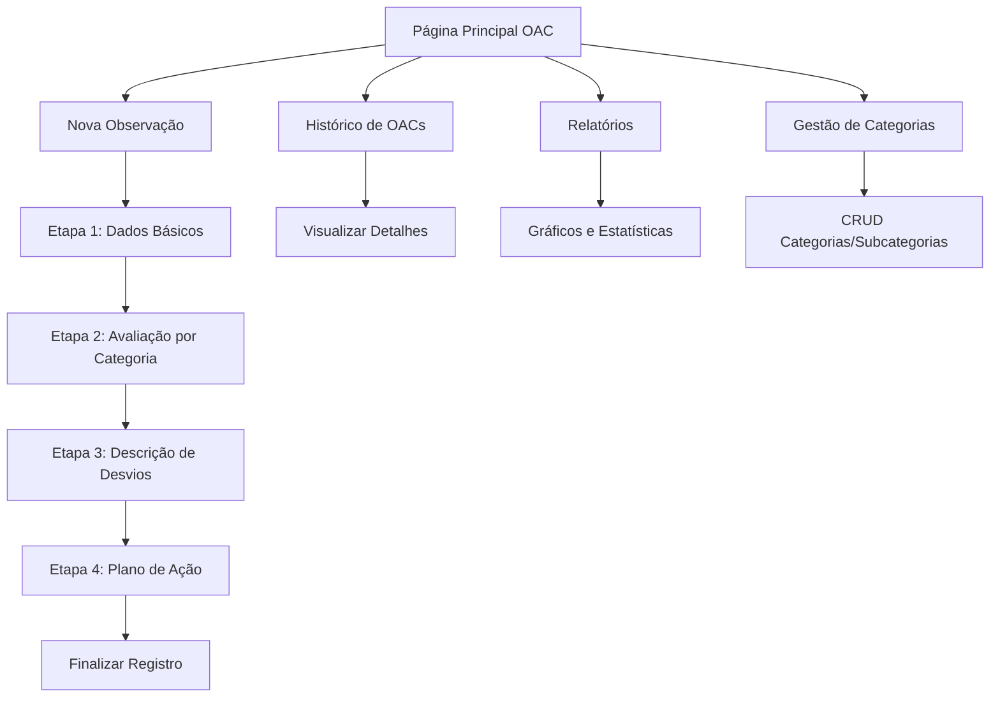

# Módulo OAC - Observações Comportamentais
## Documento de Requisitos do Produto (PRD)

## 1. Visão Geral do Produto

O módulo OAC (Observações Comportamentais) é uma ferramenta para gestão e registro de observações comportamentais realizadas no ambiente de trabalho, permitindo o acompanhamento sistemático de práticas de segurança e comportamentos dos colaboradores.

- **Objetivo**: Facilitar o registro, acompanhamento e análise de observações comportamentais para melhoria contínua da segurança no trabalho
- **Usuários**: Supervisores, líderes de equipe, técnicos de segurança e gestores
- **Valor**: Promover uma cultura de segurança através do monitoramento comportamental estruturado

## 2. Funcionalidades Principais

### 2.1 Papéis de Usuário
| Papel | Método de Acesso | Permissões Principais |
|-------|------------------|----------------------|
| Observador | Login padrão do sistema | Registrar OACs, visualizar próprias OACs |
| Supervisor | Login padrão do sistema | Todas as permissões do observador + visualizar OACs da equipe |
| Gestor | Login padrão do sistema | Visualizar relatórios gerais, gerenciar categorias |

### 2.2 Estrutura de Páginas

O módulo OAC consiste nas seguintes páginas principais:

1. **Página Principal OAC**: dashboard com resumo e navegação rápida
2. **Registro de OAC**: formulário em etapas para nova observação
3. **Histórico de OACs**: listagem e visualização de observações realizadas
4. **Relatórios**: gráficos e estatísticas das observações
5. **Gestão de Categorias**: cadastro e manutenção de categorias e subcategorias

### 2.3 Detalhamento das Funcionalidades

| Página | Módulo | Descrição da Funcionalidade |
|--------|--------|----------------------------|
| Página Principal | Dashboard OAC | Exibir resumo de OACs, botões de acesso rápido, estatísticas básicas |
| Registro de OAC | Formulário Multi-etapas | Etapa 1: dados básicos (local, data/hora, tempo, quantidades). Etapa 2: lista de subcategorias com campos de quantidade. Etapa 3: descrição de desvios. Etapa 4: plano de ação |
| Histórico de OACs | Lista de Observações | Listar OACs com filtros por data, local, observador. Visualizar detalhes completos de cada OAC |
| Relatórios | Gráficos e Estatísticas | Gráficos de desvios por categoria, estatísticas de observações, relatórios por período |
| Gestão de Categorias | CRUD Categorias | Cadastrar, editar, excluir categorias e subcategorias para formulário |

## 3. Fluxo Principal de Uso

### Fluxo do Observador:
1. Acessa a página principal do módulo OAC
2. Clica em "Nova Observação"
3. Preenche dados básicos da observação (local, data/hora, etc.)
4. Avalia cada subcategoria informando quantidade de desvios
5. Descreve os desvios observados
6. Preenche o plano de ação
7. Finaliza o registro

### Fluxo do Gestor:
1. Acessa relatórios para análise
2. Visualiza estatísticas e gráficos
3. Gerencia categorias conforme necessário

## 4. Design da Interface

### 4.1 Estilo de Design
- **Cores Primárias**: Azul (#3B82F6) e cinza (#6B7280)
- **Cores Secundárias**: Verde para sucesso (#10B981), vermelho para alertas (#EF4444)
- **Estilo de Botões**: Arredondados com efeitos hover
- **Fonte**: Sistema padrão (Inter/system-ui)
- **Layout**: Cards com sombras suaves, navegação em breadcrumbs
- **Ícones**: Lucide React (Eye, FileText, BarChart3, Settings, Plus)

### 4.2 Visão Geral das Páginas

| Página | Módulo | Elementos da Interface |
|--------|--------|----------------------|
| Página Principal | Dashboard | Cards de resumo, botões de ação rápida, gráfico de tendência simples |
| Registro de OAC | Formulário Multi-etapas | Stepper de progresso, campos organizados em seções, botões de navegação |
| Histórico | Lista com Filtros | Tabela responsiva, filtros por data/local/observador, modal de detalhes |
| Relatórios | Gráficos | Cards de estatísticas, gráficos de barras e pizza, filtros de período |
| Categorias | CRUD Interface | Tabela de categorias, modal de edição, árvore de subcategorias |

### 4.3 Responsividade
- **Desktop-first**: Otimizado para uso em desktop e tablets
- **Mobile-adaptive**: Interface adaptável para smartphones
- **Touch-friendly**: Botões e campos adequados para interação touch