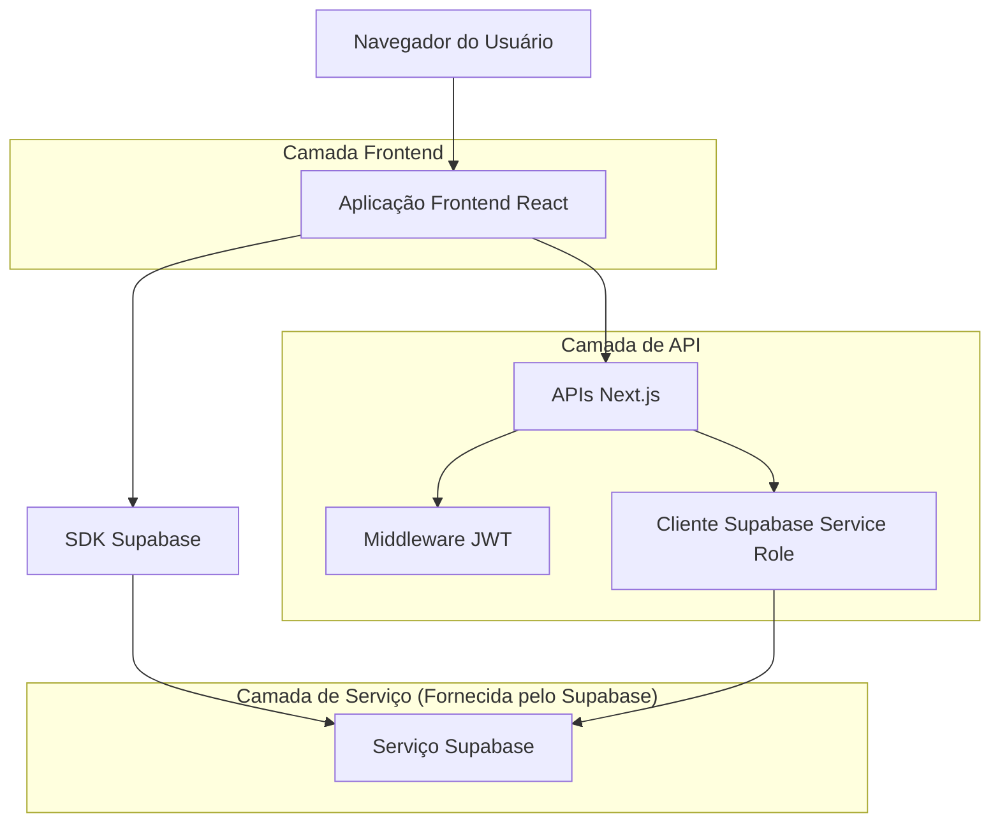
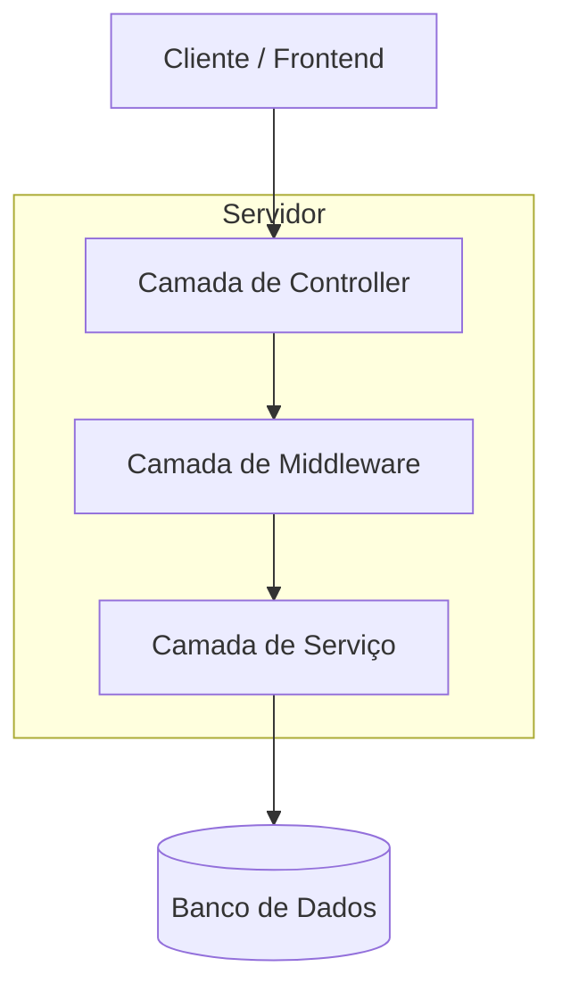
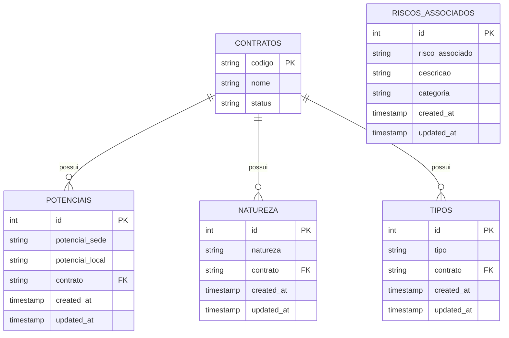

# Módulo de Parametrização de Segurança - Arquitetura Técnica

## 1. Design da Arquitetura



## 2. Descrição da Tecnologia

* Frontend: React\@18 + Next.js\@14 + TailwindCSS\@3 + TypeScript

* Backend: Next.js API Routes + Supabase

* Banco de Dados: Supabase (PostgreSQL)

* Autenticação: JWT + Middleware customizado

## 3. Definições de Rotas

| Rota                              | Propósito                                    |
| --------------------------------- | -------------------------------------------- |
| /security-params                  | Página principal do módulo de parametrização |
| /security-params/potentials       | Parametrização de potenciais de risco        |
| /security-params/natures          | Parametrização de naturezas                  |
| /security-params/types            | Parametrização de tipos                      |
| /security-params/associated-risks | Parametrização de riscos associados          |

## 4. Definições de API

### 4.1 APIs Principais

**Parametrização de Potenciais**

```
GET /api/security-params/potentials
POST /api/security-params/potentials
PUT /api/security-params/potentials/[id]
DELETE /api/security-params/potentials/[id]
```

Request (POST/PUT):

| Nome do Parâmetro | Tipo   | Obrigatório | Descrição                                                              |
| ----------------- | ------ | ----------- | ---------------------------------------------------------------------- |
| potencial\_sede   | string | true        | Tipo de risco sede (Risco Intolerável, Substancial, Moderado, Trivial) |
| potencial\_local  | string | true        | Nome do potencial local equivalente                                    |
| contrato          | string | true        | Código do contrato                                                     |

Response:

| Nome do Parâmetro | Tipo    | Descrição           |
| ----------------- | ------- | ------------------- |
| success           | boolean | Status da operação  |
| data              | object  | Dados do potencial  |
| message           | string  | Mensagem de retorno |

**Parametrização de Natureza**

```
GET /api/security-params/natures
POST /api/security-params/natures
PUT /api/security-params/natures/[id]
DELETE /api/security-params/natures/[id]
```

Request (POST/PUT):

| Nome do Parâmetro | Tipo   | Obrigatório | Descrição             |
| ----------------- | ------ | ----------- | --------------------- |
| natureza          | string | true        | Descrição da natureza |
| contrato          | string | true        | Código do contrato    |

**Parametrização de Tipos**

```
GET /api/security-params/types
POST /api/security-params/types
PUT /api/security-params/types/[id]
DELETE /api/security-params/types/[id]
```

Request (POST/PUT):

| Nome do Parâmetro | Tipo   | Obrigatório | Descrição          |
| ----------------- | ------ | ----------- | ------------------ |
| tipo              | string | true        | Descrição do tipo  |
| contrato          | string | true        | Código do contrato |

**Parametrização de Riscos Associados**

```
GET /api/security-params/associated-risks
POST /api/security-params/associated-risks
PUT /api/security-params/associated-risks/[id]
DELETE /api/security-params/associated-risks/[id]
```

Request (POST/PUT):

| Nome do Parâmetro | Tipo   | Obrigatório | Descrição                    |
| ----------------- | ------ | ----------- | ---------------------------- |
| risco\_associado  | string | true        | Descrição do risco associado |
| descricao         | string | false       | Descrição detalhada          |
| categoria         | string | false       | Categoria do risco           |

## 5. Arquitetura do Servidor



## 6. Modelo de Dados

### 6.1 Definição do Modelo de Dados



### 6.2 Linguagem de Definição de Dados

**Tabela de Potenciais**

```sql
-- Criar tabela
CREATE TABLE potenciais (
    id SERIAL PRIMARY KEY,
    potencial_sede VARCHAR(50) NOT NULL CHECK (potencial_sede IN ('Risco Intolerável', 'Risco Substancial', 'Risco Moderado', 'Risco Trivial')),
    potencial_local VARCHAR(100) NOT NULL,
    contrato VARCHAR(20) NOT NULL REFERENCES contratos(codigo),
    created_at TIMESTAMP WITH TIME ZONE DEFAULT NOW(),
    updated_at TIMESTAMP WITH TIME ZONE DEFAULT NOW(),
    UNIQUE(potencial_sede, contrato)
);

-- Criar índices
CREATE INDEX idx_potenciais_contrato ON potenciais(contrato);
CREATE INDEX idx_potenciais_sede ON potenciais(potencial_sede);

-- Políticas RLS
ALTER TABLE potenciais ENABLE ROW LEVEL SECURITY;
CREATE POLICY "Usuários autenticados podem ver potenciais" ON potenciais FOR SELECT TO authenticated USING (true);
CREATE POLICY "Usuários autenticados podem inserir potenciais" ON potenciais FOR INSERT TO authenticated WITH CHECK (true);
CREATE POLICY "Usuários autenticados podem atualizar potenciais" ON potenciais FOR UPDATE TO authenticated USING (true);
CREATE POLICY "Usuários autenticados podem deletar potenciais" ON potenciais FOR DELETE TO authenticated USING (true);
```

**Tabela de Natureza**

```sql
-- Criar tabela
CREATE TABLE natureza (
    id SERIAL PRIMARY KEY,
    natureza VARCHAR(100) NOT NULL,
    contrato VARCHAR(20) NOT NULL REFERENCES contratos(codigo),
    created_at TIMESTAMP WITH TIME ZONE DEFAULT NOW(),
    updated_at TIMESTAMP WITH TIME ZONE DEFAULT NOW(),
    UNIQUE(natureza, contrato)
);

-- Criar índices
CREATE INDEX idx_natureza_contrato ON natureza(contrato);
CREATE INDEX idx_natureza_nome ON natureza(natureza);

-- Políticas RLS
ALTER TABLE natureza ENABLE ROW LEVEL SECURITY;
CREATE POLICY "Usuários autenticados podem ver natureza" ON natureza FOR SELECT TO authenticated USING (true);
CREATE POLICY "Usuários autenticados podem inserir natureza" ON natureza FOR INSERT TO authenticated WITH CHECK (true);
CREATE POLICY "Usuários autenticados podem atualizar natureza" ON natureza FOR UPDATE TO authenticated USING (true);
CREATE POLICY "Usuários autenticados podem deletar natureza" ON natureza FOR DELETE TO authenticated USING (true);
```

**Tabela de Tipos**

```sql
-- Criar tabela
CREATE TABLE tipos (
    id SERIAL PRIMARY KEY,
    tipo VARCHAR(100) NOT NULL,
    contrato VARCHAR(20) NOT NULL REFERENCES contratos(codigo),
    created_at TIMESTAMP WITH TIME ZONE DEFAULT NOW(),
    updated_at TIMESTAMP WITH TIME ZONE DEFAULT NOW(),
    UNIQUE(tipo, contrato)
);

-- Criar índices
CREATE INDEX idx_tipos_contrato ON tipos(contrato);
CREATE INDEX idx_tipos_nome ON tipos(tipo);

-- Políticas RLS
ALTER TABLE tipos ENABLE ROW LEVEL SECURITY;
CREATE POLICY "Usuários autenticados podem ver tipos" ON tipos FOR SELECT TO authenticated USING (true);
CREATE POLICY "Usuários autenticados podem inserir tipos" ON tipos FOR INSERT TO authenticated WITH CHECK (true);
CREATE POLICY "Usuários autenticados podem atualizar tipos" ON tipos FOR UPDATE TO authenticated USING (true);
CREATE POLICY "Usuários autenticados podem deletar tipos" ON tipos FOR DELETE TO authenticated USING (true);
```

**Tabela de Riscos Associados**

```sql
-- Criar tabela
CREATE TABLE riscos_associados (
    id SERIAL PRIMARY KEY,
    risco_associado VARCHAR(200) NOT NULL,
    descricao TEXT,
    categoria VARCHAR(50),
    created_at TIMESTAMP WITH TIME ZONE DEFAULT NOW(),
    updated_at TIMESTAMP WITH TIME ZONE DEFAULT NOW()
);

-- Criar índices
CREATE INDEX idx_riscos_associados_categoria ON riscos_associados(categoria);
CREATE INDEX idx_riscos_associados_nome ON riscos_associados(risco_associado);

-- Políticas RLS
ALTER TABLE riscos_associados ENABLE ROW LEVEL SECURITY;
CREATE POLICY "Usuários autenticados podem ver riscos associados" ON riscos_associados FOR SELECT TO authenticated USING (true);
CREATE POLICY "Usuários autenticados podem inserir riscos associados" ON riscos_associados FOR INSERT TO authenticated WITH CHECK (true);
CREATE POLICY "Usuários autenticados podem atualizar riscos associados" ON riscos_associados FOR UPDATE TO authenticated USING (true);
CREATE POLICY "Usuários autenticados podem deletar riscos associados" ON riscos_associados FOR DELETE TO authenticated USING (true);

-- Dados iniciais
INSERT INTO riscos_associados (risco_associado, descricao, categoria) VALUES
('Queda de altura', 'Risco de queda em trabalhos em altura', 'Físico'),
('Choque elétrico', 'Risco de choque em instalações elétricas', 'Elétrico'),
('Exposição a produtos químicos', 'Risco de exposição a substâncias químicas', 'Químico');
```

