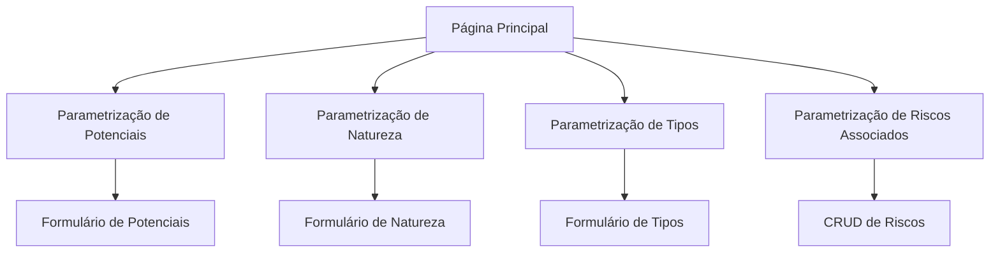

# Módulo de Parametrização de Segurança - PRD

## 1. Visão Geral do Produto

O módulo de Parametrização de Segurança permite configurar dados essenciais de segurança que serão utilizados por outros módulos do sistema. Centraliza a gestão de potenciais de risco, naturezas, tipos e riscos associados por contrato.

Este módulo resolve a necessidade de padronização e customização de parâmetros de segurança específicos para cada contrato, garantindo flexibilidade na classificação de riscos e conformidade com diferentes padrões organizacionais.

## 2. Funcionalidades Principais

### 2.1 Papéis de Usuário

| Papel | Método de Registro | Permissões Principais |
|-------|-------------------|----------------------|
| Administrador | Acesso via sistema existente | Acesso completo a todas as parametrizações |
| Editor | Acesso via sistema existente | Pode visualizar e editar parametrizações |
| Visualizador | Acesso via sistema existente | Apenas visualização das parametrizações |

### 2.2 Módulos de Funcionalidade

Nosso módulo de Parametrização de Segurança consiste nas seguintes páginas principais:

1. **Página Principal**: navegação entre submodelos, resumo das parametrizações
2. **Parametrização de Potenciais**: gestão de equivalências de riscos por contrato
3. **Parametrização de Natureza**: cadastro de naturezas por contrato
4. **Parametrização de Tipos**: cadastro de tipos por contrato
5. **Parametrização de Riscos Associados**: CRUD completo de riscos associados

### 2.3 Detalhes das Páginas

| Nome da Página | Nome do Módulo | Descrição da Funcionalidade |
|----------------|----------------|-----------------------------|
| Página Principal | Dashboard de Parametrização | Exibir resumo das parametrizações, navegação rápida entre submodelos, estatísticas por contrato |
| Parametrização de Potenciais | Gestão de Potenciais | Mapear potencial local para potencial sede (Risco Intolerável, Substancial, Moderado, Trivial), filtrar por contrato, validar mapeamentos obrigatórios |
| Parametrização de Natureza | Gestão de Natureza | Cadastrar natureza por contrato, validar duplicatas, buscar e filtrar registros |
| Parametrização de Tipos | Gestão de Tipos | Cadastrar tipos por contrato, validar duplicatas, buscar e filtrar registros |
| Parametrização de Riscos Associados | Gestão de Riscos | Criar, visualizar, editar e excluir riscos associados, buscar e filtrar registros |

## 3. Processo Principal

### Fluxo do Administrador
1. Acessa o módulo de Parametrização de Segurança
2. Seleciona o tipo de parametrização desejada
3. Escolhe o contrato (quando aplicável)
4. Realiza as configurações necessárias
5. Salva as parametrizações
6. Visualiza resumo das configurações

### Fluxo de Navegação

## 4. Design da Interface do Usuário

### 4.1 Estilo de Design

- **Cores primárias**: Azul (#3B82F6) e cinza (#6B7280)
- **Cores secundárias**: Verde (#10B981) para sucesso, vermelho (#EF4444) para alertas
- **Estilo de botões**: Arredondados com sombra sutil
- **Fonte**: Inter, tamanhos 14px (corpo), 16px (títulos), 12px (labels)
- **Layout**: Baseado em cards com navegação superior
- **Ícones**: Lucide React para consistência

### 4.2 Visão Geral do Design das Páginas

| Nome da Página | Nome do Módulo | Elementos da UI |
|----------------|----------------|----------------|
| Página Principal | Dashboard | Cards de navegação com ícones, estatísticas em grid 2x2, cores azul e cinza |
| Parametrização de Potenciais | Formulário de Potenciais | Dropdown de contratos, grid 4x1 para mapeamentos de risco, botões de ação primários |
| Parametrização de Natureza | Formulário de Natureza | Input de texto para natureza, dropdown de contratos, tabela de registros existentes |
| Parametrização de Tipos | Formulário de Tipos | Input de texto para tipo, dropdown de contratos, tabela de registros existentes |
| Parametrização de Riscos | CRUD de Riscos | Formulário modal, tabela com ações inline, busca e filtros, paginação |

### 4.3 Responsividade

O módulo é desktop-first com adaptação para tablets e mobile. Inclui otimização para interação touch em dispositivos móveis, com botões maiores e espaçamento adequado.