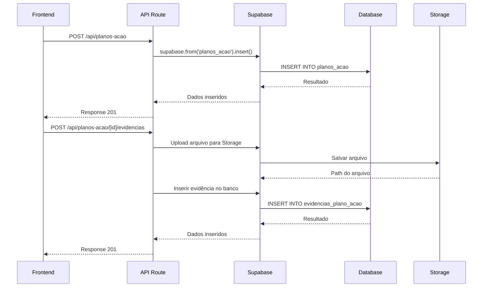

# Arquitetura Técnica - Plano de Ação para Não Conformidades

## 1. Arquitetura Geral

```mermaid
graph TD
    A[Frontend React] --> B[API Routes Next.js]
    B --> C[Supabase Client]
    C --> D[Supabase Database]
    C --> E[Supabase Storage]
    
    subgraph "Frontend Layer"
        A1[PlanoAcaoForm]
        A2[PlanoAcaoList]
        A3[EvidenciasUpload]
        A4[NaoConformidadeCard]
    end
    
    subgraph "API Layer"
        B1[/api/planos-acao]
        B2[/api/planos-acao/[id]/evidencias]
        B3[/api/inspecoes/execucoes/[id]/validar-finalizacao]
    end
    
    subgraph "Data Layer"
        D1[(planos_acao)]
        D2[(evidencias_plano_acao)]
        D3[(execucoes_inspecao)]
        D4[(usuarios)]
    end
    
    subgraph "Storage Layer"
        E1[evidencias-planos-acao]
    end
    
    A --> A1
    A --> A2
    A --> A3
    A --> A4
    
    A1 --> B1
    A2 --> B1
    A3 --> B2
    A4 --> B3
    
    B1 --> C
    B2 --> C
    B3 --> C
    
    C --> D1
    C --> D2
    C --> D3
    C --> D4
    C --> E1
```

## 2. Tecnologias Utilizadas

### Frontend
- **Next.js 15.5.5** - Framework React full-stack
- **React 18** - Biblioteca de UI
- **TypeScript** - Superset JavaScript com tipagem estática
- **Tailwind CSS** - Framework CSS utilitário
- **Lucide React** - Biblioteca de ícones
- **Sonner** - Biblioteca de notificações

### Backend e Banco de Dados
- **Supabase** - Backend-as-a-Service com PostgreSQL
- **PostgreSQL** - Banco de dados relacional
- **JWT** - Autenticação via tokens

### Ferramentas de Desenvolvimento
- **Next.js** para build e desenvolvimento
- **TypeScript** para tipagem estática
- **ESLint** para linting
- **Prettier** para formatação

## 3. Definições de Rotas

### Rotas de API
| Rota | Método | Descrição |
|------|--------|-----------|
| /api/inspecoes/planos-acao | GET | Listar planos de ação por execução |
| /api/inspecoes/planos-acao | POST | Criar novo plano de ação |
| /api/inspecoes/planos-acao/[id] | PUT | Atualizar plano de ação |
| /api/inspecoes/planos-acao/[id] | DELETE | Excluir plano de ação |
| /api/inspecoes/planos-acao/[id]/evidencias | POST | Upload de evidências |
| /api/inspecoes/planos-acao/evidencias/[id] | DELETE | Excluir evidência |
| /api/inspecoes/execucoes/[id]/validar-planos | GET | Validar planos obrigatórios |

### Rotas Frontend
| Rota | Componente | Descrição |
|------|------------|-----------|
| /inspecoes/execucoes/[id]/planos | GerenciarPlanosPage | Página de gestão de planos de ação |
| /inspecoes/planos-acao/[id]/editar | EditarPlanoPage | Modal/overlay para editar plano |

## 4. Modelos de Dados TypeScript

### Interfaces Principais
```typescript
interface PlanoAcao {
  id?: string;
  execucao_id: string;
  pergunta_id: string;
  desvio: string;
  oque_fazer: string;
  como_fazer: string;
  matricula_cadastrante: number;
  matricula_responsavel: number;
  prazo: string;
  status: 'pendente' | 'em_andamento' | 'concluido';
  created_at?: string;
  updated_at?: string;
  
  // Relacionamentos
  cadastrante?: Usuario;
  responsavel?: Usuario;
  evidencias?: EvidenciaPlanoAcao[];
}

interface EvidenciaPlanoAcao {
  id?: string;
  plano_acao_id: string;
  execucao_id: string;
  tipo_evidencia: 'nao_conformidade' | 'conclusao';
  nome_arquivo: string;
  caminho_arquivo: string;
  tamanho_arquivo: number;
  tipo_mime: string;
  uploaded_by: string;
  created_at?: string;
  
  // Relacionamentos
  uploader?: Usuario;
}

interface NaoConformidadeComPlano {
  pergunta_id: string;
  pergunta_texto: string;
  categoria: string;
  planos_acao: PlanoAcao[];
  pode_finalizar: boolean;
}

interface ValidacaoFinalizacao {
  pode_finalizar: boolean;
  nao_conformidades_sem_plano: Array<{
    pergunta_id: string;
    pergunta_texto: string;
    categoria: string;
  }>;
}
```

## 5. Arquitetura do Servidor

### Estrutura de Diretórios
```
src/
├── app/
│   ├── api/
│   │   └── planos-acao/
│   │       ├── route.ts           # GET, POST
│   │       ├── [id]/
│   │       │   └── route.ts       # PUT, DELETE
│   │       └── [id]/
│   │           └── evidencias/
│   │               └── route.ts   # POST
│   ├── inspecoes/
│   │   ├── executar/
│   │   │   └── [id]/
│   │   │       └── page.tsx       # Com gestão planos
│   │   └── execucoes/
│   │       └── continuar/
│   │           └── [id]/
│   │               └── page.tsx   # Com gestão planos
├── components/
│   └── planos-acao/
│       ├── PlanoAcaoForm.tsx
│       ├── PlanoAcaoList.tsx
│       ├── EvidenciasUpload.tsx
│       └── NaoConformidadeCard.tsx
├── lib/
│   ├── services/
│   │   └── planos-acao-service.ts
│   └── utils/
│       └── planos-acao-utils.ts
└── types/
    └── planos-acao.ts
```

### Fluxo de Requisição


## 5. Exemplos de Código Baseados no Módulo de Inspeções

### 5.1 Estrutura de Formulário (baseado em `executar/[id]/page.tsx`)
```tsx
// app/inspecoes/planos-acao/[execucaoId]/page.tsx
'use client';

import { useState, useEffect, useCallback } from 'react';
import { useRouter, useParams } from 'next/navigation';
import { useAuth } from '@/hooks/useAuth';
import MainLayout from '@/components/Layout/MainLayout';
import { Card, CardContent, CardHeader, CardTitle } from '@/components/ui/card';
import { Button } from '@/components/ui/button';
import { Input } from '@/components/ui/input';
import { 
  AlertCircle, 
  CheckCircle, 
  Clock, 
  User, 
  Calendar,
  Plus,
  Edit,
  Trash2,
  Upload,
  FileText
} from 'lucide-react';
import { toast } from 'sonner';

interface PlanoAcao {
  id: string;
  desvio: string;
  oque_fazer: string;
  como_fazer: string;
  matricula_responsavel: number;
  prazo: string;
  status: 'pendente' | 'em_andamento' | 'concluido';
  responsavel: {
    matricula: number;
    nome: string;
  };
  evidencias: Evidencia[];
}

interface Evidencia {
  id: string;
  nome_arquivo: string;
  tipo_evidencia: 'nao_conformidade' | 'conclusao';
}
```

### 5.2 Validação de Finalização (similar à validação de perguntas respondidas)
```tsx
// Validação baseada no padrão do módulo de inspeções
const validarPlanosObrigatorios = (respostas: Resposta[], planos: PlanoAcao[]) => {
  const naoConformidades = respostas.filter(r => r.valor === 'nao_conforme');
  
  return naoConformidades.every(nc => {
    const planosDaPergunta = planos.filter(p => p.pergunta_id === nc.pergunta_id);
    return planosDaPergunta.length > 0; // Pelo menos 1 plano por não conformidade
  });
};

// Uso na finalização (similar a `todasPerguntasRespondidas`)
const podeFinalizarExecucao = () => {
  if (!todasPerguntasRespondidas()) return false;
  
  const respostasNaoConformes = execucaoData.respostas.filter(r => r.valor === 'nao_conforme');
  if (respostasNaoConformes.length === 0) return true;
  
  // Validar se todas as não conformidades têm planos de ação
  return validarPlanosObrigatorios(execucaoData.respostas, planosAcao);
};
```

### 5.3 Estrutura de API Baseada no Padrão Existente
```tsx
// app/api/inspecoes/planos-acao/route.ts
import { NextRequest, NextResponse } from 'next/server';
import { createClient } from '@supabase/supabase-js';
import { verifyJWTToken } from '@/lib/jwt-middleware';

const supabase = createClient(
  process.env.NEXT_PUBLIC_SUPABASE_URL!,
  process.env.SUPABASE_SERVICE_ROLE_KEY!
);

// GET /api/inspecoes/planos-acao?execucao_id={id}
export async function GET(request: NextRequest) {
  try {
    const authResult = await verifyJWTToken(request);
    if (!authResult.success) {
      return NextResponse.json({ error: authResult.error }, { status: 401 });
    }

    const { searchParams } = new URL(request.url);
    const execucaoId = searchParams.get('execucao_id');

    if (!execucaoId) {
      return NextResponse.json({ error: 'execucao_id é obrigatório' }, { status: 400 });
    }

    const { data, error } = await supabase
      .from('planos_acao')
      .select(`
        *,
        responsavel:usuarios!matricula_responsavel(matricula, nome),
        cadastrante:usuarios!matricula_cadastrante(matricula, nome),
        evidencias:evidencias_plano_acao(*)
      `)
      .eq('execucao_id', execucaoId);

    if (error) {
      console.error('Erro ao buscar planos:', error);
      return NextResponse.json({ error: 'Erro ao buscar planos' }, { status: 500 });
    }

    return NextResponse.json({ success: true, data });
  } catch (error) {
    console.error('Erro na API:', error);
    return NextResponse.json({ error: 'Erro interno' }, { status: 500 });
  }
}
```

## 6. Serviços e Utilitários

### PlanoAcaoService
```typescript
class PlanoAcaoService {
  async criarPlano(dados: PlanoAcao): Promise<PlanoAcao>;
  async atualizarPlano(id: string, dados: Partial<PlanoAcao>): Promise<PlanoAcao>;
  async excluirPlano(id: string): Promise<void>;
  async listarPorExecucao(execucaoId: string): Promise<PlanoAcao[]>;
  async listarPorPergunta(execucaoId: string, perguntaId: string): Promise<PlanoAcao[]>;
  async validarFinalizacao(execucaoId: string): Promise<ValidacaoFinalizacao>;
}
```

### EvidenciaService
```typescript
class EvidenciaService {
  async uploadEvidencia(
    planoId: string,
    execucaoId: string,
    arquivo: File,
    tipo: 'nao_conformidade' | 'conclusao',
    userId: string
  ): Promise<EvidenciaPlanoAcao>;
  
  async excluirEvidencia(id: string): Promise<void>;
  async listarPorPlano(planoId: string): Promise<EvidenciaPlanoAcao[]>;
}
```

### Utilitários
```typescript
// Validações
export const validarPlanoAcao = (dados: PlanoAcao): ValidationError[] => {
  const erros: ValidationError[] = [];
  
  if (!dados.desvio?.trim()) erros.push({ campo: 'desvio', mensagem: 'Desvio é obrigatório' });
  if (!dados.oque_fazer?.trim()) erros.push({ campo: 'oque_fazer', mensagem: 'O que fazer é obrigatório' });
  if (!dados.como_fazer?.trim()) erros.push({ campo: 'como_fazer', mensagem: 'Como fazer é obrigatório' });
  if (!dados.matricula_responsavel) erros.push({ campo: 'responsavel', mensagem: 'Responsável é obrigatório' });
  if (!dados.prazo) erros.push({ campo: 'prazo', mensagem: 'Prazo é obrigatório' });
  
  // Validar prazo futuro
  if (dados.prazo && new Date(dados.prazo) < new Date()) {
    erros.push({ campo: 'prazo', mensagem: 'Prazo deve ser futuro' });
  }
  
  return erros;
};

// Verificar se pode finalizar
export const podeFinalizarExecucao = (
  naoConformidades: any[],
  planosAcao: PlanoAcao[]
): ValidacaoFinalizacao => {
  const naoConformidadesSemPlano = naoConformidades.filter(nc => 
    !planosAcao.some(plano => plano.pergunta_id === nc.pergunta_id)
  );
  
  return {
    pode_finalizar: naoConformidadesSemPlano.length === 0,
    nao_conformidades_sem_plano: naoConformidadesSemPlano
  };
};
```

## 7. Estado e Gerenciamento de Estado

### Estado do Componente
```typescript
interface PlanoAcaoState {
  planos: PlanoAcao[];
  naoConformidades: NaoConformidadeComPlano[];
  isLoading: boolean;
  error: string | null;
  validation: ValidacaoFinalizacao | null;
}

interface PlanoAcaoFormState {
  formData: Partial<PlanoAcao>;
  errors: ValidationError[];
  isSubmitting: boolean;
  uploadProgress: number;
}
```

### React Query Hooks
```typescript
// Hook para gerenciar planos de ação
export const usePlanosAcao = (execucaoId: string) => {
  return useQuery({
    queryKey: ['planos-acao', execucaoId],
    queryFn: () => planoAcaoService.listarPorExecucao(execucaoId),
    enabled: !!execucaoId
  });
};

// Hook para validação de finalização
export const useValidarFinalizacao = (execucaoId: string) => {
  return useQuery({
    queryKey: ['validar-finalizacao', execucaoId],
    queryFn: () => planoAcaoService.validarFinalizacao(execucaoId),
    enabled: !!execucaoId
  });
};
```

## 8. Segurança e Performance

### Segurança
- Validação de entrada em todos os endpoints
- Sanitização de textos antes de salvar
- Verificação de permissões por matrícula
- Rate limiting para uploads (10 req/min)
- Tamanho máximo de arquivo: 10MB por arquivo, 50MB total

### Performance
- Índices otimizados no banco de dados
- Paginação para listas (20 itens por página)
- Lazy loading para evidências
- Cache de dados de usuários
- Compressão de imagens no frontend

### Tratamento de Erros
```typescript
export class PlanoAcaoError extends Error {
  constructor(
    message: string,
    public code: string,
    public statusCode: number = 400
  ) {
    super(message);
    this.name = 'PlanoAcaoError';
  }
}

// Error handler
export const handlePlanoAcaoError = (error: any): Response => {
  if (error instanceof PlanoAcaoError) {
    return NextResponse.json(
      { error: error.message, code: error.code },
      { status: error.statusCode }
    );
  }
  
  // Log error for monitoring
  console.error('PlanoAcao Error:', error);
  
  return NextResponse.json(
    { error: 'Erro interno do servidor' },
    { status: 500 }
  );
};
```

## 9. Testes

### Testes Unitários
- Validações de formulário
- Cálculos de prazo e status
- Formatação de dados

### Testes de Integração
- CRUD completo de planos de ação
- Upload e exclusão de evidências
- Validação de finalização
- Permissões e segurança

### Testes E2E
- Fluxo completo de não conformidade
- Upload múltiplo de arquivos
- Validação antes de finalizar
- Gestão de planos de ação

## 10. Monitoramento e Logs

### Métricas Importantes
- Tempo de upload de evidências
- Quantidade de planos por execução
- Taxa de finalização com sucesso
- Erros de validação

### Logs
```typescript
// Estrutura de log
interface PlanoAcaoLog {
  timestamp: string;
  action: 'create' | 'update' | 'delete' | 'upload' | 'finalize';
  user_id: string;
  execucao_id: string;
  plano_id?: string;
  metadata?: any;
}
```

## 11. Deployment e Manutenção

### Migrations
- Criar migration para novas tabelas
- Configurar bucket de storage
- Popular dados iniciais (se necessário)

### Rollback
- Manter migration de rollback
- Backup de dados críticos
- Script de recuperação de arquivos

### Manutenção
- Limpeza de arquivos órfãos
- Monitoramento de espaço em storage
- Rotina de backup dos dados