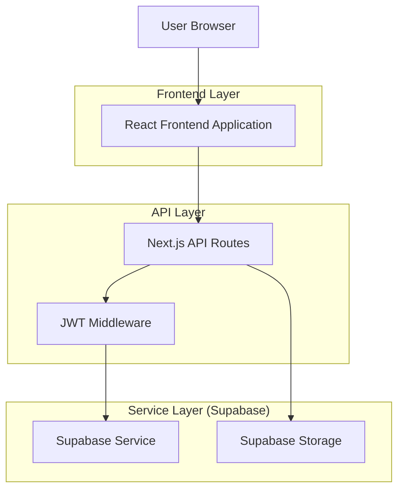
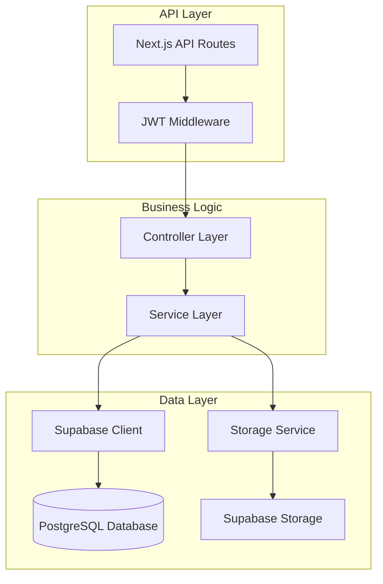
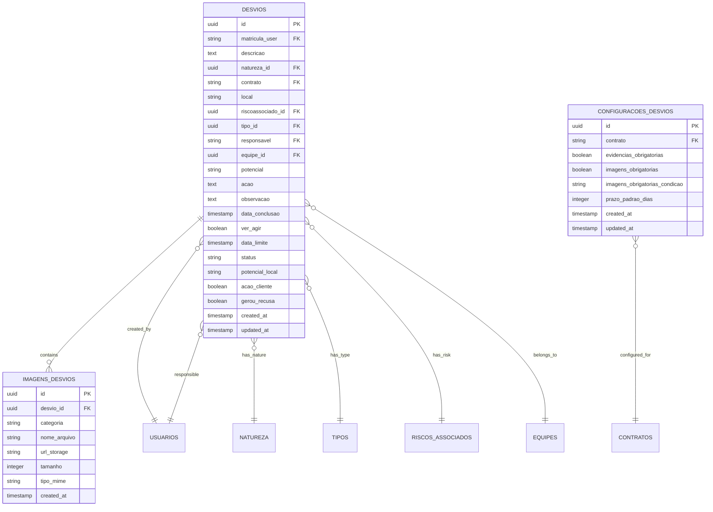

# Arquitetura Técnica: Módulo de Relatos/Desvios de Segurança

## 1. Architecture design



## 2. Technology Description

* Frontend: React\@18 + Next.js\@14 + TypeScript + TailwindCSS\@3

* Backend: Next.js API Routes + JWT Authentication

* Database: Supabase (PostgreSQL) + RLS Policies

* Storage: Supabase Storage para imagens

* Charts: Recharts para gráficos do dashboard

## 3. Route definitions

| Route                  | Purpose                                        |
| ---------------------- | ---------------------------------------------- |
| /desvios               | Dashboard principal com indicadores e gráficos |
| /desvios/meus          | Lista de desvios registrados pelo usuário      |
| /desvios/avaliar       | Interface para avaliação de desvios pendentes  |
| /desvios/pendencias    | Desvios sob responsabilidade do usuário        |
| /desvios/configuracoes | Configurações do módulo por contrato           |
| /desvios/novo          | Formulário interativo para cadastro            |
| /desvios/\[id]         | Detalhes específicos de um desvio              |

## 4. API definitions

### 4.1 Core API

**Desvios CRUD**

```
GET /api/desvios
```

Request:

| Param Name  | Param Type | isRequired | Description             |
| ----------- | ---------- | ---------- | ----------------------- |
| status      | string     | false      | Filtrar por status      |
| contrato    | string     | false      | Filtrar por contrato    |
| responsavel | string     | false      | Filtrar por responsável |
| page        | number     | false      | Paginação               |
| limit       | number     | false      | Limite por página       |

Response:

| Param Name | Param Type | Description              |
| ---------- | ---------- | ------------------------ |
| success    | boolean    | Status da operação       |
| data       | array      | Lista de desvios         |
| total      | number     | Total de registros       |
| pagination | object     | Informações de paginação |

```
POST /api/desvios
```

Request:

| Param Name         | Param Type | isRequired | Description           |
| ------------------ | ---------- | ---------- | --------------------- |
| descricao          | string     | true       | Descrição do desvio   |
| natureza\_id       | string     | true       | ID da natureza        |
| contrato           | string     | true       | Código do contrato    |
| local              | string     | true       | Local do desvio       |
| riscoassociado\_id | string     | true       | ID do risco associado |
| tipo\_id           | string     | true       | ID do tipo            |
| potencial          | string     | true       | Potencial sede        |
| ver\_agir          | boolean    | true       | Se é ação ver e agir  |
| acao\_cliente      | boolean    | false      | Se envolve cliente    |
| gerou\_recusa      | boolean    | false      | Se gerou recusa       |

**Avaliação de Desvios**

```
PUT /api/desvios/[id]/avaliar
```

Request:

| Param Name   | Param Type | isRequired | Description                |
| ------------ | ---------- | ---------- | -------------------------- |
| responsavel  | string     | true       | Matrícula do responsável   |
| data\_limite | string     | true       | Data limite para conclusão |
| acao         | string     | false      | Ação corretiva             |
| observacao   | string     | false      | Observações da avaliação   |

**Upload de Imagens**

```
POST /api/desvios/[id]/imagens
```

Request:

| Param Name | Param Type | isRequired | Description             |
| ---------- | ---------- | ---------- | ----------------------- |
| file       | File       | true       | Arquivo de imagem       |
| categoria  | string     | true       | 'desvio' ou 'evidencia' |

**Dashboard Statistics**

```
GET /api/desvios/stats
```

Response:

| Param Name            | Param Type | Description                |
| --------------------- | ---------- | -------------------------- |
| total\_desvios        | number     | Total de desvios           |
| aguardando\_avaliacao | number     | Desvios pendentes          |
| em\_andamento         | number     | Desvios em andamento       |
| concluidos            | number     | Desvios concluídos         |
| vencidos              | number     | Desvios vencidos           |
| por\_tipo             | array      | Distribuição por tipo      |
| por\_potencial        | array      | Distribuição por potencial |

## 5. Server architecture diagram



## 6. Data model

### 6.1 Data model definition



### 6.2 Data Definition Language

**Tabela de Desvios**

```sql
-- Criar tabela desvios
CREATE TABLE desvios (
  id UUID PRIMARY KEY DEFAULT gen_random_uuid(),
  matricula_user VARCHAR(20) NOT NULL,
  descricao TEXT NOT NULL,
  natureza_id UUID NOT NULL,
  contrato VARCHAR(50) NOT NULL,
  local VARCHAR(255) NOT NULL,
  riscoassociado_id UUID NOT NULL,
  tipo_id UUID NOT NULL,
  responsavel VARCHAR(20),
  equipe_id UUID,
  potencial VARCHAR(50) NOT NULL CHECK (potencial IN ('Intolerável', 'Substancial', 'Moderado', 'Trivial')),
  acao TEXT,
  observacao TEXT,
  data_conclusao TIMESTAMP WITH TIME ZONE,
  ver_agir BOOLEAN NOT NULL DEFAULT false,
  data_limite TIMESTAMP WITH TIME ZONE,
  status VARCHAR(50) NOT NULL DEFAULT 'Aguardando Avaliação' CHECK (status IN ('Aguardando Avaliação', 'Em Andamento', 'Concluído', 'Vencido')),
  potencial_local VARCHAR(255),
  acao_cliente BOOLEAN DEFAULT false,
  gerou_recusa BOOLEAN DEFAULT false,
  created_at TIMESTAMP WITH TIME ZONE DEFAULT NOW(),
  updated_at TIMESTAMP WITH TIME ZONE DEFAULT NOW()
);

-- Criar índices
CREATE INDEX idx_desvios_matricula_user ON desvios(matricula_user);
CREATE INDEX idx_desvios_responsavel ON desvios(responsavel);
CREATE INDEX idx_desvios_status ON desvios(status);
CREATE INDEX idx_desvios_contrato ON desvios(contrato);
CREATE INDEX idx_desvios_data_limite ON desvios(data_limite);
CREATE INDEX idx_desvios_created_at ON desvios(created_at DESC);

-- RLS Policy
ALTER TABLE desvios ENABLE ROW LEVEL SECURITY;
GRANT SELECT, INSERT, UPDATE, DELETE ON desvios TO authenticated;
CREATE POLICY "Usuários autenticados podem gerenciar desvios" ON desvios FOR ALL TO authenticated USING (true);
```

**Tabela de Imagens**

```sql
-- Criar tabela imagens_desvios
CREATE TABLE imagens_desvios (
  id UUID PRIMARY KEY DEFAULT gen_random_uuid(),
  desvio_id UUID NOT NULL REFERENCES desvios(id) ON DELETE CASCADE,
  categoria VARCHAR(20) NOT NULL CHECK (categoria IN ('desvio', 'evidencia')),
  nome_arquivo VARCHAR(255) NOT NULL,
  url_storage TEXT NOT NULL,
  tamanho INTEGER,
  tipo_mime VARCHAR(100),
  created_at TIMESTAMP WITH TIME ZONE DEFAULT NOW()
);

-- Criar índices
CREATE INDEX idx_imagens_desvios_desvio_id ON imagens_desvios(desvio_id);
CREATE INDEX idx_imagens_desvios_categoria ON imagens_desvios(categoria);

-- RLS Policy
ALTER TABLE imagens_desvios ENABLE ROW LEVEL SECURITY;
GRANT SELECT, INSERT, UPDATE, DELETE ON imagens_desvios TO authenticated;
CREATE POLICY "Usuários autenticados podem gerenciar imagens" ON imagens_desvios FOR ALL TO authenticated USING (true);
```

**Tabela de Configurações**

```sql
-- Criar tabela configuracoes_desvios
CREATE TABLE configuracoes_desvios (
  id UUID PRIMARY KEY DEFAULT gen_random_uuid(),
  contrato VARCHAR(50) NOT NULL UNIQUE,
  evidencias_obrigatorias BOOLEAN DEFAULT false,
  imagens_obrigatorias BOOLEAN DEFAULT false,
  imagens_obrigatorias_condicao VARCHAR(50) DEFAULT 'todos' CHECK (imagens_obrigatorias_condicao IN ('todos', 'intoleravel', 'recusa')),
  prazo_padrao_dias INTEGER DEFAULT 30,
  created_at TIMESTAMP WITH TIME ZONE DEFAULT NOW(),
  updated_at TIMESTAMP WITH TIME ZONE DEFAULT NOW()
);

-- RLS Policy
ALTER TABLE configuracoes_desvios ENABLE ROW LEVEL SECURITY;
GRANT SELECT, INSERT, UPDATE, DELETE ON configuracoes_desvios TO authenticated;
CREATE POLICY "Usuários autenticados podem gerenciar configurações" ON configuracoes_desvios FOR ALL TO authenticated USING (true);
```

**Função para Atualização Automática de Status**

```sql
-- Função para atualizar status vencidos
CREATE OR REPLACE FUNCTION atualizar_status_vencidos()
RETURNS void AS $$
BEGIN
  UPDATE desvios 
  SET status = 'Vencido', updated_at = NOW()
  WHERE status IN ('Aguardando Avaliação', 'Em Andamento')
    AND data_limite < NOW()
    AND data_conclusao IS NULL;
END;
$$ LANGUAGE plpgsql;

-- Trigger para atualizar updated_at
CREATE OR REPLACE FUNCTION update_updated_at_column()
RETURNS TRIGGER AS $$
BEGIN
  NEW.updated_at = NOW();
  RETURN NEW;
END;
$$ LANGUAGE plpgsql;

CREATE TRIGGER update_desvios_updated_at BEFORE UPDATE ON desvios
  FOR EACH ROW EXECUTE FUNCTION update_updated_at_column();

CREATE TRIGGER update_configuracoes_updated_at BEFORE UPDATE ON configuracoes_desvios
  FOR EACH ROW EXECUTE FUNCTION update_updated_at_column();
```

