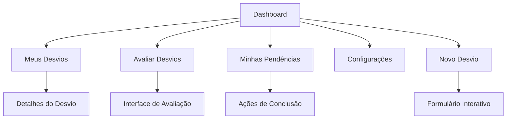

# Produto: Módulo de Relatos/Desvios de Segurança

## 1. Product Overview
Módulo completo para gestão de relatos e desvios de segurança, permitindo cadastro, avaliação, acompanhamento e resolução de ocorrências com fluxo automatizado de status e interface interativa.

O sistema resolve a necessidade de controle eficiente de desvios de segurança, oferecendo rastreabilidade completa desde o registro até a conclusão, com gestão de responsabilidades e prazos automatizados.

## 2. Core Features

### 2.1 User Roles
| Role | Registration Method | Core Permissions |
|------|---------------------|------------------|
| Usuário | Login existente | Pode registrar desvios, visualizar seus próprios registros |
| Editor | Login existente | Pode avaliar desvios, gerenciar pendências, configurar módulo |
| Admin | Login existente | Acesso completo a todas funcionalidades e configurações |

### 2.2 Feature Module
Nosso módulo de Relatos/Desvios consiste nas seguintes páginas principais:
1. **Dashboard**: indicadores, gráficos de status, métricas de performance
2. **Meus Desvios**: listagem e detalhes dos desvios registrados pelo usuário
3. **Avaliar Desvios**: interface para avaliação e aprovação de desvios pendentes
4. **Minhas Pendências**: desvios sob responsabilidade do usuário logado
5. **Configurações**: configurações por contrato para evidências e obrigatoriedades
6. **Formulário Interativo**: cadastro passo-a-passo com interface conversacional

### 2.3 Page Details
| Page Name | Module Name | Feature description |
|-----------|-------------|---------------------|
| Dashboard | Indicadores Gerais | Exibir métricas de desvios por status, gráficos de tendências, alertas de vencimento |
| Dashboard | Gráficos Interativos | Visualizar distribuição por tipo, natureza, potencial e responsável |
| Meus Desvios | Lista de Desvios | Filtrar e visualizar desvios próprios por status, data, tipo |
| Meus Desvios | Detalhes do Desvio | Visualizar informações completas, imagens, histórico de status |
| Avaliar Desvios | Lista de Avaliação | Listar desvios pendentes de avaliação com filtros |
| Avaliar Desvios | Interface de Avaliação | Avaliar desvio, definir responsável, prazo, ações corretivas |
| Minhas Pendências | Lista de Responsabilidades | Visualizar desvios sob responsabilidade do usuário |
| Minhas Pendências | Ações de Conclusão | Marcar como concluído, anexar evidências de conclusão |
| Configurações | Configurações por Contrato | Definir obrigatoriedade de evidências, imagens por contrato |
| Configurações | Regras de Negócio | Configurar regras específicas por potencial e tipo |
| Formulário Interativo | Cadastro Passo-a-Passo | Interface conversacional para registro de desvios |
| Formulário Interativo | Upload de Imagens | Anexar imagens do desvio via Supabase Storage |

## 3. Core Process

### Fluxo Principal do Usuário:
1. **Registro**: Usuário acessa formulário interativo e registra desvio passo-a-passo
2. **Classificação Automática**: Sistema define status inicial baseado em "ver_agir"
3. **Avaliação**: Editor/Admin avalia desvios pendentes e define responsáveis
4. **Acompanhamento**: Responsável acompanha desvio em "Minhas Pendências"
5. **Conclusão**: Responsável marca como concluído com evidências (se obrigatório)
6. **Controle Automático**: Sistema atualiza status baseado em prazos

### Fluxo de Status Automatizado:
- **Ver e Agir = true**: Status "Concluído" imediatamente
- **Ver e Agir = false**: Status "Aguardando Avaliação" → "Em Andamento" → "Concluído/Vencido"

## 4. User Interface Design

### 4.1 Design Style
- **Cores Primárias**: Azul (#3B82F6) para ações principais, Vermelho (#EF4444) para alertas
- **Cores Secundárias**: Verde (#10B981) para concluído, Amarelo (#F59E0B) para pendente
- **Estilo de Botões**: Arredondados com sombras suaves, efeitos hover
- **Fontes**: Inter para textos, tamanhos 14px (corpo), 18px (títulos), 24px (cabeçalhos)
- **Layout**: Card-based com navegação lateral, design responsivo
- **Ícones**: Lucide React para consistência visual

### 4.2 Page Design Overview
| Page Name | Module Name | UI Elements |
|-----------|-------------|-------------|
| Dashboard | Indicadores | Cards com métricas, gráficos coloridos, alertas visuais |
| Formulário Interativo | Interface Conversacional | Overlay fullscreen, animações de transição, progress bar |
| Meus Desvios | Lista | Tabela responsiva, filtros dropdown, badges de status |
| Avaliar Desvios | Interface de Avaliação | Modal de avaliação, campos de formulário, botões de ação |
| Minhas Pendências | Lista de Responsabilidades | Cards com countdown, botões de ação rápida |
| Configurações | Configurações | Toggle switches, dropdowns, formulários organizados |

### 4.3 Responsiveness
Design mobile-first com adaptação para desktop, otimizado para touch interaction em dispositivos móveis, formulário interativo especialmente otimizado para telas menores.

## 5. Regras de Negócio Específicas

### 5.1 Fluxo de Status
- **Aguardando Avaliação**: Status inicial para desvios com ver_agir = false
- **Em Andamento**: Após avaliação, enquanto dentro do prazo
- **Concluído**: Quando marcado como resolvido ou ver_agir = true
- **Vencido**: Quando data_limite é ultrapassada sem conclusão

### 5.2 Configurações por Contrato
- **Evidências Obrigatórias**: Configurável por contrato
- **Imagens Obrigatórias**: Para todos os registros ou apenas para potencial "Intolerável" e "gerou_recusa = true"
- **Prazos Padrão**: Configuráveis por tipo de desvio

### 5.3 Gestão de Imagens
- **Categorias**: "desvio" (imagem do problema) e "evidencia" (prova de conclusão)
- **Storage**: Supabase Storage com organização por desvio_id
- **Validação**: Formatos aceitos (JPG, PNG, PDF), tamanho máximo 10MB

### 5.4 Notificações e Alertas
- **Prazos**: Alertas automáticos 3 dias antes do vencimento
- **Status**: Notificações de mudança de status para responsáveis
- **Avaliação**: Notificação para avaliadores quando novo desvio é registrado