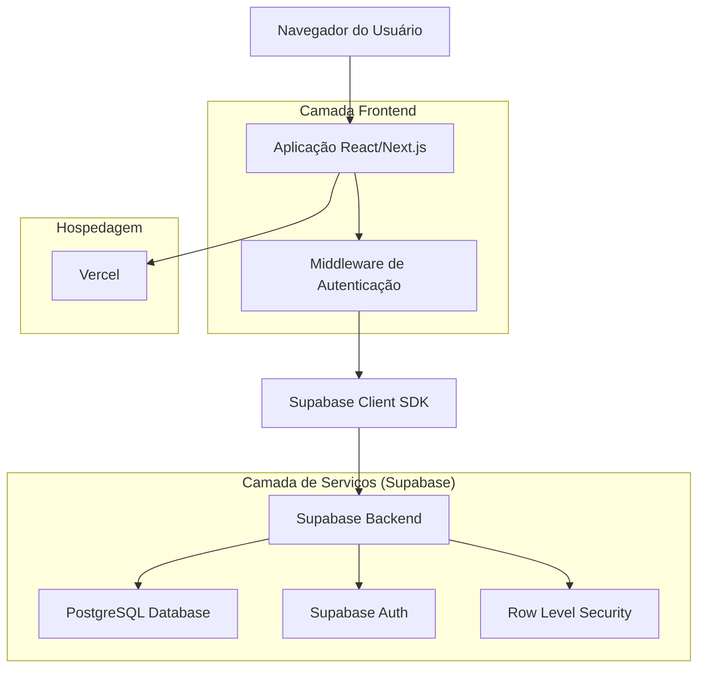
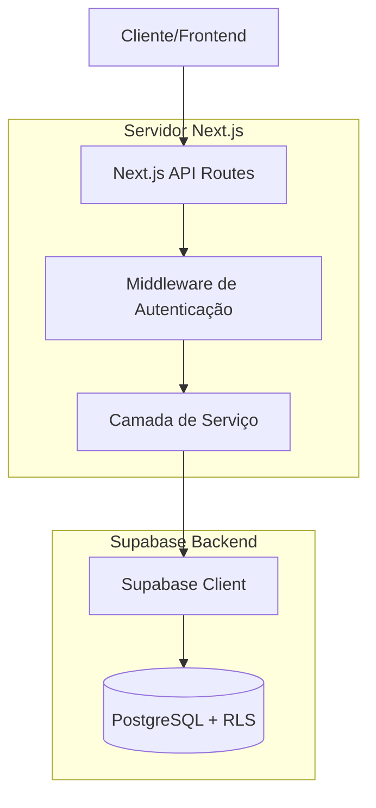
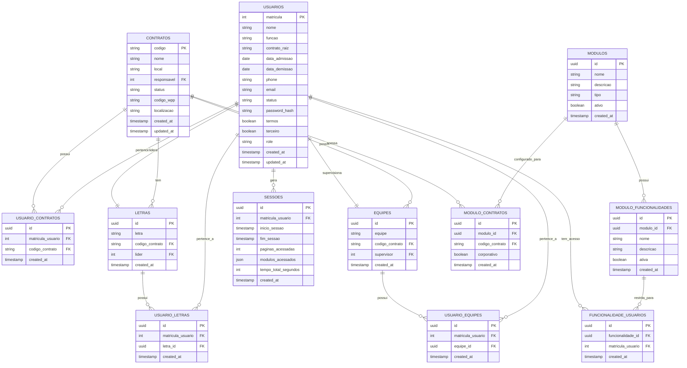

# Sistema de Gestão de Ferramentas de Segurança do Trabalho - Arquitetura Técnica

## 1. Design da Arquitetura



## 2. Descrição das Tecnologias

### 2.1 Implementação do Sistema de Temas

**Configuração Tailwind CSS:**

```javascript
// tailwind.config.js
module.exports = {
  darkMode: 'class',
  theme: {
    extend: {
      colors: {
        'royal-blue': {
          DEFAULT: '#1e40af',
          light: '#3b82f6',
          dark: '#1e3a8a'
        }
      }
    }
  }
}
```

**Context de Tema:**

```typescript
// contexts/ThemeContext.tsx
interface ThemeContextType {
  theme: 'light' | 'dark';
  toggleTheme: () => void;
}
```

**Implementação:**

* Modo claro habilitado por padrão

* Preferência salva no localStorage

* Toggle switch no header principal

* Transições suaves entre temas

* Frontend: React\@18 + Next.js\@14 + Tailwind CSS\@3 + TypeScript

* Backend: Supabase (PostgreSQL + Auth + RLS)

* Hospedagem: Vercel

* Autenticação: JWT customizado com Supabase secret + bcrypt

* UI Components: Lucide React, Headless UI

* Gerenciamento de Tema: Context API + localStorage, modo claro padrão

* Cores: Azul del rey (#1e40af) como cor principal

## 3. Definições de Rotas

| Rota                  | Propósito                                                 |
| --------------------- | --------------------------------------------------------- |
| /                     | Página inicial - redirecionamento para dashboard ou login |
| /login                | Página de login com autenticação por matrícula ou email   |
| /dashboard            | Dashboard principal com visão geral do sistema            |
| /usuarios             | Gestão completa de usuários do sistema                    |
| /contratos            | Gestão de contratos de prestação de serviço               |
| /modulos              | Gestão de módulos e funcionalidades do sistema            |
| /modulos/\[id]/config | Configuração específica de cada módulo                    |
| /letras               | Gestão de letras vinculadas aos contratos                 |
| /equipes              | Gestão de equipes por contrato                            |
| /sessoes              | Monitoramento de dados de sessão dos usuários             |
| /relatorios           | Geração de relatórios do sistema                          |
| /configuracoes        | Configurações gerais do sistema                           |
| /perfil               | Perfil e configurações do usuário logado                  |

## 4. Definições de API

### 4.1 APIs Principais

**Autenticação customizada**

```
POST /api/auth/login
```

Request:

| Nome do Parâmetro | Tipo   | Obrigatório | Descrição                     |
| ----------------- | ------ | ----------- | ----------------------------- |
| identifier        | string | true        | Matrícula ou email do usuário |
| password          | string | true        | Senha em texto plano          |

Response:

| Nome do Parâmetro | Tipo    | Descrição                    |
| ----------------- | ------- | ---------------------------- |
| success           | boolean | Status da autenticação       |
| token             | string  | JWT token assinado           |
| user              | object  | Dados do usuário autenticado |

Exemplo:

```json
{
  "identifier": "12345",
  "password": "senhaSegura123"
}
```

**Gestão de Usuários**

```
GET /api/usuarios
POST /api/usuarios
PUT /api/usuarios/[matricula]
DELETE /api/usuarios/[matricula]
```

**Gestão de Contratos**

```
GET /api/contratos
POST /api/contratos
PUT /api/contratos/[codigo]
```

**Monitoramento de Sessões**

```
POST /api/sessoes/track
GET /api/sessoes/analytics
```

## 5. Arquitetura do Servidor



## 6. Modelo de Dados

### 6.1 Definição do Modelo de Dados



### 6.2 Linguagem de Definição de Dados

**Tabela de Usuários (usuarios)**

```sql
-- Criar tabela
CREATE TABLE usuarios (
    matricula INTEGER PRIMARY KEY,
    nome VARCHAR(255) NOT NULL,
    funcao VARCHAR(100),
    contrato_raiz VARCHAR(50),
    data_admissao DATE,
    data_demissao DATE,
    phone VARCHAR(20),
    email VARCHAR(255) UNIQUE NOT NULL,
    status VARCHAR(20) DEFAULT 'ativo' CHECK (status IN ('ativo', 'inativo')),
    password_hash VARCHAR(255) NOT NULL,
    termos BOOLEAN DEFAULT false,
    terceiro BOOLEAN DEFAULT false,
    role VARCHAR(20) DEFAULT 'Usuario' CHECK (role IN ('Admin', 'Editor', 'Usuario')),
    created_at TIMESTAMP WITH TIME ZONE DEFAULT NOW(),
    updated_at TIMESTAMP WITH TIME ZONE DEFAULT NOW()
);

-- Criar índices
CREATE INDEX idx_usuarios_email ON usuarios(email);
CREATE INDEX idx_usuarios_status ON usuarios(status);
CREATE INDEX idx_usuarios_role ON usuarios(role);

-- Políticas RLS
ALTER TABLE usuarios ENABLE ROW LEVEL SECURITY;
GRANT SELECT ON usuarios TO anon;
GRANT ALL PRIVILEGES ON usuarios TO authenticated;
```

**Tabela de Contratos (contratos)**

```sql
CREATE TABLE contratos (
    codigo VARCHAR(50) PRIMARY KEY,
    nome VARCHAR(255) NOT NULL,
    local VARCHAR(255),
    responsavel INTEGER REFERENCES usuarios(matricula),
    status VARCHAR(20) DEFAULT 'ativo' CHECK (status IN ('ativo', 'inativo')),
    codigo_wpp VARCHAR(20),
    localizacao TEXT, -- JSON com lat/lng
    created_at TIMESTAMP WITH TIME ZONE DEFAULT NOW(),
    updated_at TIMESTAMP WITH TIME ZONE DEFAULT NOW()
);

ALTER TABLE contratos ENABLE ROW LEVEL SECURITY;
GRANT SELECT ON contratos TO anon;
GRANT ALL PRIVILEGES ON contratos TO authenticated;
```

**Tabela de Letras (letras)**

```sql
CREATE TABLE letras (
    id UUID PRIMARY KEY DEFAULT gen_random_uuid(),
    letra VARCHAR(10) NOT NULL,
    codigo_contrato VARCHAR(50) REFERENCES contratos(codigo),
    lider INTEGER REFERENCES usuarios(matricula),
    created_at TIMESTAMP WITH TIME ZONE DEFAULT NOW()
);

ALTER TABLE letras ENABLE ROW LEVEL SECURITY;
GRANT SELECT ON letras TO anon;
GRANT ALL PRIVILEGES ON letras TO authenticated;
```

**Tabela de Equipes (equipes)**

````sql
CREATE TABLE equipes (
    id UUID PRIMARY KEY DEFAULT gen_random_uuid(),
    equipe VARCHAR(100) NOT NULL,
    codigo_contrato VARCHAR(50) REFERENCES contratos(codigo),
    supervisor INTEGER REFERENCES usuarios(matricula),
    created_at TIMESTAMP WITH TIME ZONE DEFAULT NOW()
);

ALTER TABLE equipes ENABLE ROW LEVEL SECURITY;
GRANT SELECT ON equipes TO anon;
GRANT ALL PRIVILEGES ON equipes TO authenticated;

**Tabela de Relacionamento Usuário-Letras (usuario_letras)**
```sql
CREATE TABLE usuario_letras (
    id UUID PRIMARY KEY DEFAULT gen_random_uuid(),
    matricula_usuario INTEGER REFERENCES usuarios(matricula),
    letra_id UUID REFERENCES letras(id),
    created_at TIMESTAMP WITH TIME ZONE DEFAULT NOW(),
    UNIQUE(matricula_usuario, letra_id)
);

CREATE INDEX idx_usuario_letras_usuario ON usuario_letras(matricula_usuario);
CREATE INDEX idx_usuario_letras_letra ON usuario_letras(letra_id);

ALTER TABLE usuario_letras ENABLE ROW LEVEL SECURITY;
GRANT SELECT ON usuario_letras TO anon;
GRANT ALL PRIVILEGES ON usuario_letras TO authenticated;
````

**Tabela de Relacionamento Usuário-Equipes (usuario\_equipes)**

```sql
CREATE TABLE usuario_equipes (
    id UUID PRIMARY KEY DEFAULT gen_random_uuid(),
    matricula_usuario INTEGER REFERENCES usuarios(matricula),
    equipe_id UUID REFERENCES equipes(id),
    created_at TIMESTAMP WITH TIME ZONE DEFAULT NOW(),
    UNIQUE(matricula_usuario, equipe_id)
);

CREATE INDEX idx_usuario_equipes_usuario ON usuario_equipes(matricula_usuario);
CREATE INDEX idx_usuario_equipes_equipe ON usuario_equipes(equipe_id);

ALTER TABLE usuario_equipes ENABLE ROW LEVEL SECURITY;
GRANT SELECT ON usuario_equipes TO anon;
GRANT ALL PRIVILEGES ON usuario_equipes TO authenticated;
```

**Tabela de Módulos (modulos)**

```sql
CREATE TABLE modulos (
    id UUID PRIMARY KEY DEFAULT gen_random_uuid(),
    nome VARCHAR(255) NOT NULL,
    descricao TEXT,
    tipo VARCHAR(20) DEFAULT 'corporativo' CHECK (tipo IN ('corporativo', 'exclusivo')),
    ativo BOOLEAN DEFAULT true,
    created_at TIMESTAMP WITH TIME ZONE DEFAULT NOW()
);

ALTER TABLE modulos ENABLE ROW LEVEL SECURITY;
GRANT SELECT ON modulos TO anon;
GRANT ALL PRIVILEGES ON modulos TO authenticated;
```

**Tabela de Sessões (sessoes)**

```sql
CREATE TABLE sessoes (
    id UUID PRIMARY KEY DEFAULT gen_random_uuid(),
    matricula_usuario INTEGER REFERENCES usuarios(matricula),
    inicio_sessao TIMESTAMP WITH TIME ZONE DEFAULT NOW(),
    fim_sessao TIMESTAMP WITH TIME ZONE,
    paginas_acessadas INTEGER DEFAULT 0,
    modulos_acessados JSONB DEFAULT '[]',
    tempo_total_segundos INTEGER DEFAULT 0,
    created_at TIMESTAMP WITH TIME ZONE DEFAULT NOW()
);

CREATE INDEX idx_sessoes_usuario ON sessoes(matricula_usuario);
CREATE INDEX idx_sessoes_data ON sessoes(inicio_sessao DESC);

ALTER TABLE sessoes ENABLE ROW LEVEL SECURITY;
GRANT SELECT ON sessoes TO anon;
GRANT ALL PRIVILEGES ON sessoes TO authenticated;
```

**Dados Iniciais**

```sql
-- Usuário administrador inicial
INSERT INTO usuarios (matricula, nome, funcao, email, password_hash, role, termos, status)
VALUES (1, 'Administrador', 'Administrador do Sistema', 'admin@sistema.com', '$2b$10$exemplo_hash', 'Admin', true, 'ativo');

-- Módulos básicos do sistema
INSERT INTO modulos (nome, descricao, tipo) VALUES
('Gestão de Usuários', 'Módulo para gerenciamento completo de usuários', 'corporativo'),
('Gestão de Contratos', 'Módulo para gerenciamento de contratos', 'corporativo'),
('Monitoramento de Sessões', 'Módulo para análise de sessões de usuários', 'exclusivo')
```

