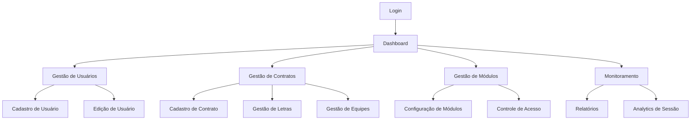

# Sistema de Gestão de Ferramentas de Segurança do Trabalho - PRD

## 1. Visão Geral do Produto

Sistema web modular para gestão completa de ferramentas de segurança do trabalho, focado em controle de usuários, contratos de prestação de serviço e monitoramento de sessões.

O produto resolve problemas de controle de acesso granular em ambientes corporativos, permitindo gestão flexível de módulos e funcionalidades por contrato e usuário específico.

Objetivo: Criar uma plataforma escalável que permita controle total sobre permissões de acesso e monitoramento de atividades em tempo real.

## 2. Funcionalidades Principais

### 2.1 Papéis de Usuário

| Papel | Método de Registro | Permissões Principais |
|-------|-------------------|----------------------|
| Admin | Criação manual pelo sistema | Acesso total: gestão de usuários, contratos, módulos e configurações |
| Editor | Convite por Admin | Pode editar dados, gerenciar equipes e letras, configurar módulos |
| Usuário | Registro por matrícula/email | Acesso limitado aos módulos permitidos pelo seu contrato |

### 2.2 Módulos Funcionais

Nosso sistema de gestão de segurança do trabalho consiste nas seguintes páginas principais:

1. **Dashboard Principal**: visão geral do sistema, estatísticas de uso, módulos ativos
2. **Gestão de Usuários**: cadastro, edição, controle de status, vinculação a contratos
3. **Gestão de Contratos**: criação, edição, configuração de responsáveis e localização
4. **Gestão de Módulos**: cadastro de módulos, configuração de funcionalidades, controle de acesso
5. **Configuração de Módulos**: página específica para cada módulo definir acesso por contrato e funcionalidade
6. **Gestão de Letras**: cadastro e vinculação de letras aos contratos
7. **Gestão de Equipes**: criação e gerenciamento de equipes por contrato
8. **Monitoramento de Sessões**: visualização de dados de sessão, tempo de uso, páginas acessadas
9. **Relatórios**: geração de relatórios de uso, acesso e atividades
10. **Configurações do Sistema**: configurações gerais, termos de uso, parâmetros de segurança
11. **Login/Registro**: autenticação por matrícula ou email
12. **Perfil do Usuário**: edição de dados pessoais, alteração de senha

### 2.3 Detalhes das Páginas

| Nome da Página | Nome do Módulo | Descrição da Funcionalidade |
|----------------|----------------|-----------------------------|
| Dashboard Principal | Visão Geral | Exibir estatísticas de uso, módulos ativos, alertas do sistema, gráficos de atividade |
| Gestão de Usuários | CRUD Usuários | Criar, editar, desativar usuários. Definir matrícula, função, contrato raiz, letra, equipe |
| Gestão de Contratos | CRUD Contratos | Gerenciar contratos: nome, código, local, responsável, status, WhatsApp, coordenadas |
| Gestão de Módulos | CRUD Módulos | Cadastrar módulos do sistema, definir funcionalidades, configurar como corporativo/exclusivo |
| Configuração de Módulos | Controle de Acesso | Configurar acesso por contrato e funcionalidade específica para cada módulo |
| Gestão de Letras | CRUD Letras | Cadastrar e vincular letras aos contratos específicos |
| Gestão de Equipes | CRUD Equipes | Criar e gerenciar equipes vinculadas aos contratos |
| Monitoramento de Sessões | Analytics | Visualizar tempo de sessão, páginas visitadas, módulos acessados por usuário |
| Relatórios | Geração de Reports | Gerar relatórios de uso, acesso, atividades por período, usuário ou contrato |
| Configurações do Sistema | Administração | Configurar parâmetros gerais, termos de uso, políticas de segurança |
| Login/Registro | Autenticação | Autenticar usuários via matrícula ou email, hash de senha com bcrypt |
| Perfil do Usuário | Gestão Pessoal | Editar dados pessoais, alterar senha, visualizar contratos vinculados |

## 3. Processo Principal

### Fluxo do Administrador
1. Login no sistema → Dashboard → Gestão de Contratos → Cadastro de Usuários → Configuração de Módulos → Monitoramento

### Fluxo do Editor
1. Login → Dashboard → Gestão de Equipes/Letras → Configuração de Módulos (limitada) → Relatórios

### Fluxo do Usuário
1. Login → Dashboard → Módulos Permitidos → Perfil → Logout

## 4. Regras de Negócio

1. O sistema deve ter uma construção modular, cada módulo construído deve ser cadastrado na gestão de módulos, as funcionalidades do módulo também devem ser cadastradas, cada módulo deve ser 1 menu e as funcionalidades submenus.
2. Cada módulo construído deve ter sua própria página de configurações onde para cada funcionalidade do módulo devemos marcar para quais contratos o módulo deve ser informado se é um módulo corporativo ou exclusivo, caso seja corporativo o módulo fica liberado para todos os contratos e usuários, caso seja exclusivo deve ser informado quais contratos têm acesso ao módulo, e em cada funcionalidade deve ser informado se ela é geral ou exclusiva, em caso de exclusiva deve ser marcado quais colaboradores têm acesso a determinada funcionalidade.
3. Usuários devem ter role = Admin, Editor, Usuario.
4. Toda tabela que for relacionada ao usuário tem que ser relacionada pela matrícula do usuário (código numérico, único para cada usuário).
5. Usuários podem fazer parte de vários contratos.
6. **Colaboradores podem pertencer a múltiplas letras e múltiplas equipes simultaneamente.**
7. Cadastro de letras vinculadas a um contrato, **cada letra deve ter um líder selecionado dos usuários do sistema.**
8. Cadastro de equipes vinculadas a um contrato, **cada equipe deve ter um supervisor selecionado dos usuários do sistema.**
9. Todo relacionamento com contrato deve ser através do código do contrato.

## 5. Estrutura de Tabelas

**Tabela de usuários:** matricula, nome, funcao (profissão), contrato_raiz, data_admissao, data_demissao, phone, email, status (ativo ou inativo), password (hash da senha), termos (indica se o usuário aceitou os termos de uso do sistema), terceiro (informa se o usuário é um colaborador terceirizado) e demais colunas necessárias para a regra de negócio.

**Tabela de contratos:** nome, codigo, local, responsavel (deve ser um dos usuários do sistema), status, codigo_wpp, localizacao (latlng).

**Tabela de letras:** letra, codigo_contrato (relacionamento com o contrato), **lider (matrícula do usuário líder da letra)**.

**Tabela de equipes:** equipe, codigo_contrato (relacionamento com contrato), **supervisor (matrícula do usuário supervisor da equipe)**.

**Tabela de relacionamento usuário-letras:** matricula_usuario, letra_id (permite que usuários pertençam a múltiplas letras).

**Tabela de relacionamento usuário-equipes:** matricula_usuario, equipe_id (permite que usuários pertençam a múltiplas equipes).

**Tabela de módulos e contratos:** criar colunas de acordo com a necessidade para o funcionamento da regra de negócio desenhada.

## 6. Design da Interface do Usuário

### 4.1 Estilo de Design

- **Cor Principal**: Azul del rey (#1e40af) - utilizada em botões, links e elementos de destaque
- **Cores Secundárias**: Verde segurança (#16a34a), Cinza neutro (#64748b)
- **Cores de Fundo**: Branco (#ffffff) para modo claro, Cinza escuro (#1f2937) para modo escuro
- **Modo de Tema**: Sistema com suporte a modo claro e escuro, com modo claro habilitado por padrão
- **Estilo de Botões**: Arredondados com sombra sutil, cor azul del rey, efeitos hover suaves
- **Fontes**: Inter (títulos), Open Sans (corpo do texto), tamanhos 14px-24px
- **Layout**: Design baseado em cards, navegação lateral retrátil, breadcrumbs
- **Ícones**: Lucide React, estilo minimalista e consistente

### 4.2 Visão Geral do Design das Páginas

| Nome da Página | Nome do Módulo | Elementos da UI |
|----------------|----------------|----------------|
| Dashboard Principal | Visão Geral | Cards com estatísticas, gráficos interativos, cor principal azul del rey (#1e40af), layout grid responsivo, alternância de tema |
| Gestão de Usuários | CRUD Usuários | Tabela com filtros, modal de edição, badges de status, botões azul del rey com ícones |
| Gestão de Contratos | CRUD Contratos | Formulário em steps, mapa interativo, validação em tempo real, botões primários em azul del rey |
| Configuração de Módulos | Controle de Acesso | Toggle switches azul del rey, árvore de permissões, cores diferenciadas por tipo |
| Login | Autenticação | Design centrado, gradiente com azul del rey, animações de transição, campos com validação visual |

### 4.3 Responsividade

Sistema desktop-first com adaptação completa para mobile e tablet. Otimização para interação touch em dispositivos móveis, com navegação por gestos e menus colapsáveis.

### 4.4 Sistema de Temas

**Modo Claro (Padrão)**:
- Fundo principal: Branco (#ffffff)
- Texto: Cinza escuro (#1f2937)
- Elementos primários: Azul del rey (#1e40af)
- Cards: Fundo branco com sombra sutil

**Modo Escuro**:
- Fundo principal: Cinza escuro (#1f2937)
- Texto: Branco (#ffffff)
- Elementos primários: Azul del rey mais claro (#3b82f6)
- Cards: Fundo cinza médio (#374151) com bordas sutis

**Alternância de Tema**: Toggle switch no header do sistema, preferência salva no localStorage do usuário.