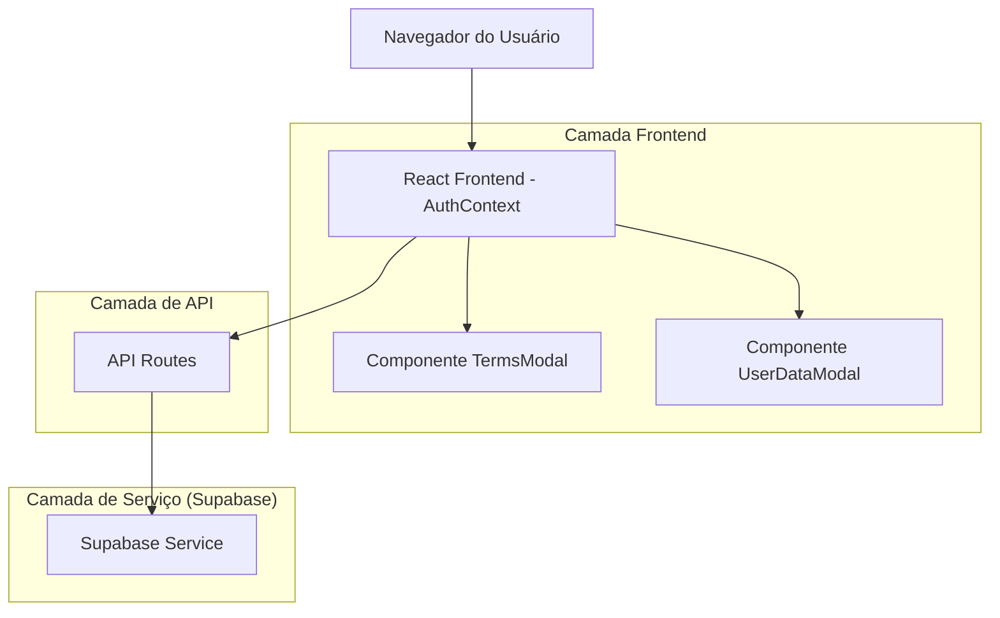
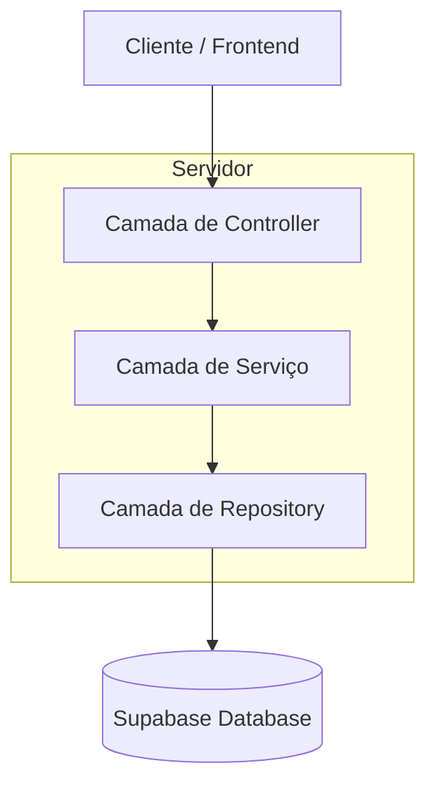
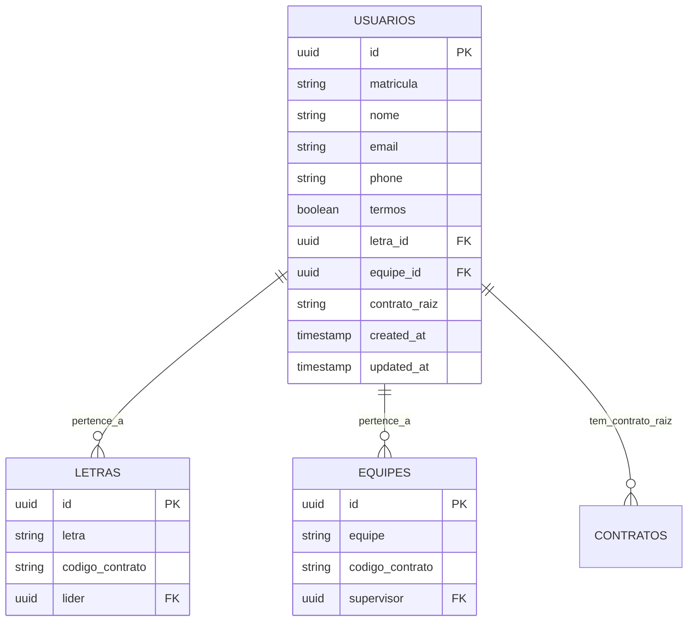

# Arquitetura Técnica - Verificação de Termos de Uso e Dados Obrigatórios

## 1. Design da Arquitetura



## 2. Descrição da Tecnologia

* Frontend: React\@18 + TypeScript + Tailwind CSS\@3 + Vite

* Backend: Next.js API Routes + Supabase

* Autenticação: Supabase Auth + JWT

* Banco de Dados: Supabase (PostgreSQL)

## 3. Definições de Rotas

| Rota                      | Propósito                                                      |
| ------------------------- | -------------------------------------------------------------- |
| /api/users/terms          | Atualizar aceitação de termos do usuário                       |
| /api/users/profile/update | Atualizar dados obrigatórios (telefone, letra\_id, equipe\_id) |
| /api/users/verification   | Verificar status de termos e dados obrigatórios                |

## 4. Definições de API

### 4.1 APIs Principais

**Verificação de Status do Usuário**

```
GET /api/users/verification
```

Headers:

| Nome do Parâmetro | Tipo   | Obrigatório | Descrição        |
| ----------------- | ------ | ----------- | ---------------- |
| Authorization     | string | true        | Bearer token JWT |

Response:

| Nome do Parâmetro | Tipo    | Descrição                               |
| ----------------- | ------- | --------------------------------------- |
| success           | boolean | Status da resposta                      |
| termsAccepted     | boolean | Se os termos foram aceitos              |
| hasRequiredData   | boolean | Se dados obrigatórios estão preenchidos |
| missingFields     | array   | Lista de campos faltantes               |
| userData          | object  | Dados atuais do usuário                 |

Exemplo de Response:

```json
{
  "success": true,
  "termsAccepted": false,
  "hasRequiredData": false,
  "missingFields": ["phone", "letra_id", "equipe_id"],
  "userData": {
    "id": "123",
    "nome": "João Silva",
    "email": "joao@reframax.com",
    "phone": null,
    "letra_id": null,
    "equipe_id": null,
    "termos": false
  }
}
```

**Atualização de Termos**

```
PUT /api/users/terms
```

Request:

| Nome do Parâmetro | Tipo    | Obrigatório | Descrição                  |
| ----------------- | ------- | ----------- | -------------------------- |
| accepted          | boolean | true        | Se os termos foram aceitos |

Response:

| Nome do Parâmetro | Tipo    | Descrição               |
| ----------------- | ------- | ----------------------- |
| success           | boolean | Status da operação      |
| message           | string  | Mensagem de confirmação |

Exemplo de Request:

```json
{
  "accepted": true
}
```

**Atualização de Dados Obrigatórios**

```
PUT /api/users/profile/update
```

Request:

| Nome do Parâmetro | Tipo   | Obrigatório | Descrição                |
| ----------------- | ------ | ----------- | ------------------------ |
| phone             | string | false       | Número de telefone       |
| letra\_id         | string | false       | ID da letra selecionada  |
| equipe\_id        | string | false       | ID da equipe selecionada |

Response:

| Nome do Parâmetro | Tipo    | Descrição                    |
| ----------------- | ------- | ---------------------------- |
| success           | boolean | Status da operação           |
| message           | string  | Mensagem de confirmação      |
| user              | object  | Dados atualizados do usuário |

Exemplo de Request:

```json
{
  "phone": "(11) 99999-9999",
  "letra_id": "letra-123",
  "equipe_id": "equipe-456"
}
```

## 5. Arquitetura do Servidor



## 6. Modelo de Dados

### 6.1 Definição do Modelo de Dados



### 6.2 Linguagem de Definição de Dados

**Atualização da Tabela Usuarios (se necessário)**

```sql
-- Verificar se coluna termos existe
ALTER TABLE usuarios ADD COLUMN IF NOT EXISTS termos BOOLEAN DEFAULT false;

-- Criar índices para performance
CREATE INDEX IF NOT EXISTS idx_usuarios_termos ON usuarios(termos);
CREATE INDEX IF NOT EXISTS idx_usuarios_phone ON usuarios(phone);
CREATE INDEX IF NOT EXISTS idx_usuarios_letra_equipe ON usuarios(letra_id, equipe_id);

-- Atualizar RLS policies
CREATE POLICY "Users can update their own terms and profile data" ON usuarios
    FOR UPDATE USING (auth.uid() = id)
    WITH CHECK (auth.uid() = id);

-- Permitir leitura para verificação de status
CREATE POLICY "Users can read their own verification status" ON usuarios
    FOR SELECT USING (auth.uid() = id);

-- Dados iniciais para teste (opcional)
-- UPDATE usuarios SET termos = false WHERE termos IS NULL;
```

**Estrutura de Componentes React**

```typescript
// Tipos TypeScript para a funcionalidade
interface UserVerificationStatus {
  termsAccepted: boolean;
  hasRequiredData: boolean;
  missingFields: string[];
  userData: {
    id: string;
    nome: string;
    email: string;
    phone?: string;
    letra_id?: string;
    equipe_id?: string;
    termos: boolean;
  };
}

interface TermsModalProps {
  isOpen: boolean;
  onAccept: () => void;
  onDecline: () => void;
}

interface UserDataModalProps {
  isOpen: boolean;
  missingFields: string[];
  onComplete: (data: UserDataUpdate) => void;
  userContractCode: string;
}

interface UserDataUpdate {
  phone?: string;
  letra_id?: string;
  equipe_id?: string;
}
```

## 7. Fluxo de Implementação

### 7.1 Componentes a Criar

1. **TermsModal.tsx** - Modal para exibição e aceitação de termos
2. **UserDataModal.tsx** - Modal para preenchimento de dados obrigatórios
3. **VerificationProvider.tsx** - Context provider para gerenciar estado de verificação
4. **useVerification.ts** - Hook customizado para lógica de verificação

### 7.2 APIs a Criar

1. **src/app/api/users/verification/route.ts** - Verificar status do usuário
2. **src/app/api/users/terms/route.ts** - Atualizar aceitação de termos
3. **src/app/api/users/profile/update/route.ts** - Atualizar dados obrigatórios

### 7.3 Integração com AuthContext

* Modificar AuthContext para incluir verificação pós-login

* Adicionar estados para controle de modais

* Implementar lógica de logout automático

* Gerenciar fluxo de verificação completo

### 7.4 Segurança e Validações

* Todas as APIs protegidas por JWT via service role

* Validação de dados no frontend e backend

* Sanitização de inputs

* Rate limiting para APIs de atualização

* Logs de auditoria para aceitação de termos

