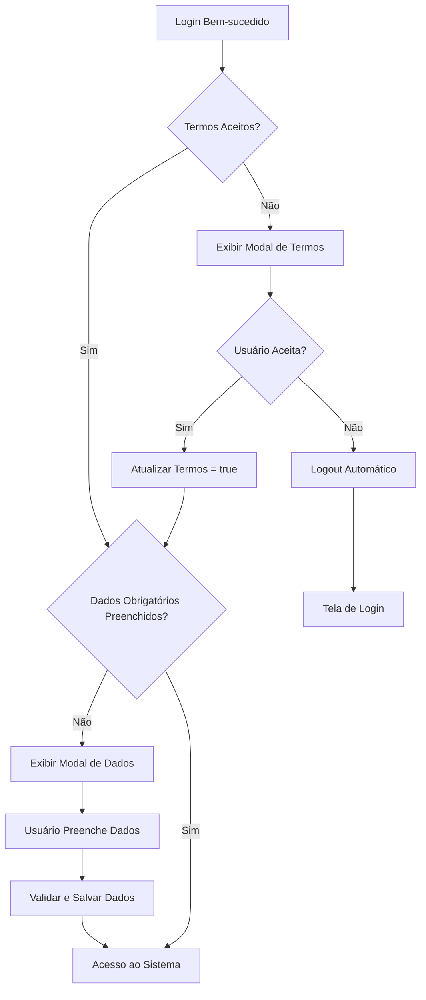

# Funcionalidade de Verificação de Termos de Uso e Dados Obrigatórios

## 1. Visão Geral do Produto

Esta funcionalidade garante que todos os usuários do SystemMax tenham aceitado os termos de uso e preenchido informações obrigatórias (telefone, letra e equipe) antes de utilizar o sistema. A funcionalidade integra-se ao fluxo de autenticação existente para verificar e solicitar dados pendentes após o login.

## 2. Funcionalidades Principais

### 2.1 Papéis de Usuário

| Papel | Método de Registro | Permissões Principais |
|-------|-------------------|----------------------|
| Usuário Autenticado | Login existente | Deve aceitar termos e preencher dados obrigatórios |
| Administrador | Login existente | Mesmo fluxo de verificação que usuários comuns |

### 2.2 Módulo de Funcionalidades

Nossa funcionalidade de verificação consiste nas seguintes páginas principais:

1. **Modal de Termos de Uso**: exibição dos termos, botões aceitar/recusar, logout automático em caso de recusa.
2. **Modal de Dados Obrigatórios**: formulário para preenchimento de telefone, seleção de letra e equipe.
3. **Integração no AuthContext**: verificação automática após login bem-sucedido.

### 2.3 Detalhes das Páginas

| Nome da Página | Nome do Módulo | Descrição da Funcionalidade |
|----------------|----------------|-----------------------------|
| Modal de Termos | Exibição de Termos | Mostrar texto completo dos termos de uso, validar aceitação, fazer logout se recusado |
| Modal de Termos | Botões de Ação | Botões "Aceitar" e "Recusar" com ações correspondentes |
| Modal de Dados | Formulário de Telefone | Campo de entrada para número de telefone com validação |
| Modal de Dados | Seleção de Letra | Dropdown para seleção de letra baseado no contrato do usuário |
| Modal de Dados | Seleção de Equipe | Dropdown para seleção de equipe baseado no contrato do usuário |
| Modal de Dados | Validação e Envio | Validar campos obrigatórios e enviar dados via API |
| AuthContext | Verificação Pós-Login | Verificar status de termos e dados obrigatórios após autenticação |

## 3. Processo Principal

**Fluxo de Verificação Pós-Login:**

1. Usuário efetua login com sucesso
2. Sistema verifica se campo 'termos' = true
3. Se termos não aceitos, exibe modal com termos de uso
4. Se usuário recusa termos, sistema faz logout automático
5. Se usuário aceita termos, sistema atualiza campo 'termos' = true
6. Sistema verifica campos obrigatórios: phone, letra_id, equipe_id
7. Se dados faltantes, exibe modal para preenchimento
8. Usuário preenche dados e sistema valida/salva
9. Após completar todas as verificações, usuário acessa sistema normalmente

## 4. Design da Interface do Usuário

### 4.1 Estilo de Design

- **Cores primárias**: Azul (#3B82F6) para botões de ação positiva, Vermelho (#EF4444) para ações de recusa
- **Cores secundárias**: Cinza (#6B7280) para texto secundário, Branco (#FFFFFF) para fundos
- **Estilo de botões**: Arredondados com sombra sutil
- **Fonte**: Inter ou system font, tamanhos 14px (corpo), 18px (títulos), 24px (cabeçalhos)
- **Layout**: Modal centralizado com overlay escuro, cards com bordas arredondadas
- **Ícones**: Lucide React para consistência com o sistema existente

### 4.2 Visão Geral do Design das Páginas

| Nome da Página | Nome do Módulo | Elementos da UI |
|----------------|----------------|----------------|
| Modal de Termos | Container Principal | Modal centralizado 600px largura, fundo branco, sombra suave |
| Modal de Termos | Cabeçalho | Título "Termos de Uso" em azul #3B82F6, fonte 24px |
| Modal de Termos | Área de Conteúdo | Texto dos termos em container scrollável, altura máxima 400px |
| Modal de Termos | Rodapé de Ações | Botões "Recusar" (cinza) e "Aceitar" (azul) alinhados à direita |
| Modal de Dados | Container Principal | Modal centralizado 500px largura, fundo branco |
| Modal de Dados | Formulário | Campos de entrada com labels, dropdowns estilizados |
| Modal de Dados | Campo Telefone | Input com máscara de telefone brasileiro |
| Modal de Dados | Seleções | Dropdowns para letra e equipe com busca |
| Modal de Dados | Botão Salvar | Botão azul "Salvar Dados" com loading state |

### 4.3 Responsividade

A funcionalidade é desktop-first com adaptação para mobile. Em dispositivos móveis, os modais ocupam 95% da largura da tela com padding adequado. Touch interactions são otimizadas para botões e campos de formulário.

## 5. Termos de Uso

**Texto Completo dos Termos:**

Este documento estabelece os termos e condições de uso do software SystemMax, de propriedade da REFRAMAX, desenvolvido exclusivamente para a gestão interna e otimização de processos empresariais. Ao utilizar o software, o colaborador concorda integralmente com os termos aqui dispostos, sendo obrigatória sua leitura e aceitação.

**1. Propriedade Intelectual**
O SystemMax é uma solução proprietária da REFRAMAX, protegido por leis de direitos autorais (Lei nº 9.610/98) e outras normas aplicáveis à propriedade intelectual. Nenhuma parte do software pode ser copiada, distribuída, ou usada fora do escopo permitido sem a expressa autorização da empresa.

**2. Licença de Uso**
O uso do SystemMax é estritamente limitado ao ambiente empresarial interno da REFRAMAX, sendo vedada sua utilização para fins pessoais ou externos à empresa. Esta licença é de caráter intransferível e não exclusivo, conforme disposto no art. 9º da Lei do Software (Lei nº 9.609/98).

**3. Acesso e Restrição**
Todos os dados processados e armazenados no SystemMax são confidenciais e de propriedade da REFRAMAX, conforme os princípios estabelecidos na Lei Geral de Proteção de Dados (Lei nº 13.709/18). É terminantemente proibida a divulgação de qualquer dado, informação ou material resultante do uso do software para partes externas sem autorização prévia e por escrito da empresa.

**4. Segurança e Confidencialidade**
O SystemMax adere a rigorosos padrões de segurança da informação e confidencialidade, garantindo a integridade e a proteção dos dados empresariais. A empresa segue as diretrizes da LGPD (Lei Geral de Proteção de Dados) e demais legislações aplicáveis, assegurando que as informações sensíveis sejam tratadas com a devida cautela.

**5. Suporte e Manutenção**
A REFRAMAX oferece suporte técnico completo e contínuo para o SystemMax, garantindo seu funcionamento adequado e a implementação de atualizações necessárias para melhorias e correções de possíveis falhas, em conformidade com as melhores práticas de manutenção de software.

**6. Limitação de Responsabilidade**
A REFRAMAX não se responsabiliza por qualquer prejuízo, direto ou indireto, decorrente do uso inadequado do SystemMax ou da violação destes termos. O uso do software deve ser conduzido de acordo com as finalidades para as quais foi desenvolvido, sendo o colaborador responsável por qualquer dano causado por mau uso ou desvio das funcionalidades.

**7. Alterações nos Termos**
A REFRAMAX reserva-se o direito de alterar os presentes termos e condições a qualquer momento. Qualquer mudança será previamente informada aos usuários. O uso contínuo do SystemMax após a comunicação dessas alterações implicará na aceitação automática dos novos termos.

**8. Rescisão de Uso**
A utilização do SystemMax pode ser suspensa ou encerrada pela REFRAMAX em caso de violação destes termos, condutas inadequadas ou por decisão da empresa, sem que haja necessidade de notificação prévia.

**9. Contato por WhatsApp**
O colaborador autoriza expressamente a REFRAMAX a contatá-lo via WhatsApp em ocasiões que se fizerem necessárias para assuntos relacionados ao uso do SystemMax ou comunicações sobre o suporte técnico do software, conforme regulamentado pelo Código de Defesa do Consumidor (Lei nº 8.078/90).