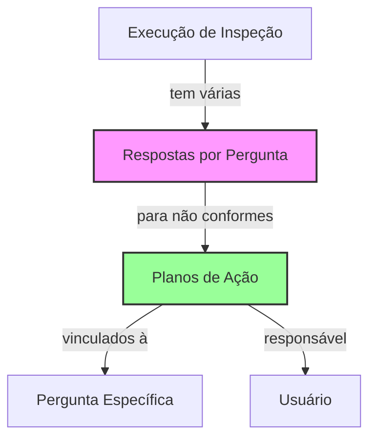

# Correção: Vinculação de Planos de Ação às Respostas de Não Conformidade

## Análise do Problema

### Situação Atual
- A tabela `planos_acao` foi criada sem a coluna `pergunta_id`
- Os planos de ação estão vinculados apenas à `execucao_inspecao_id`
- Não há rastreabilidade direta entre plano de ação e a pergunta específica que gerou a não conformidade
- O modal de plano de ação não recebe contexto da pergunta

### Requisitos Corrigidos
1. **Adicionar coluna `pergunta_id`** na tabela `planos_acao`
2. **Permitir múltiplos planos de ação por pergunta** (sem constraint único)
3. **Garantir pelo menos 1 plano para cada pergunta não conforme**
4. **Manter interface intuitiva** para o usuário criar planos vinculados às perguntas

## Solução Técnica Completa

### 1. Migração SQL - Adicionar pergunta_id

```sql
-- Adicionar coluna pergunta_id na tabela planos_acao
ALTER TABLE planos_acao 
ADD COLUMN pergunta_id UUID REFERENCES inspecoes_perguntas(id) ON DELETE CASCADE;

-- Criar índice para performance
CREATE INDEX idx_planos_acao_pergunta_id ON planos_acao(pergunta_id);

-- Criar índice composto para buscar planos por execução + pergunta
CREATE INDEX idx_planos_acao_execucao_pergunta ON planos_acao(execucao_inspecao_id, pergunta_id);
```

### 2. Atualização da Estrutura de Dados

#### Interface TypeScript Atualizada
```typescript
// types/plano-acao.ts
export interface PlanoAcao {
  id: string;
  execucao_inspecao_id: string;
  pergunta_id: string; // NOVO: Vincula à pergunta específica
  desvio: string;
  o_que_fazer: string;
  como_fazer: string;
  responsavel_matricula: number;
  prazo: string;
  status: 'pendente' | 'em_andamento' | 'concluido';
  cadastrado_por_matricula: number;
  created_at: string;
  updated_at: string;
}

// Dados para criação
export interface CreatePlanoAcaoData {
  execucao_inspecao_id: string;
  pergunta_id: string; // NOVO: Obrigatório
  desvio: string;
  o_que_fazer: string;
  como_fazer: string;
  responsavel_matricula: number;
  prazo: string;
}
```

### 3. Alterações no Frontend

#### A. Componente PerguntaItem - Adicionar Botão por Pergunta
```tsx
// components/inspecoes/PerguntaItem.tsx
interface PerguntaItemProps {
  pergunta: PerguntaFormulario;
  resposta: RespostaExecucao;
  onRespostaChange: (perguntaId: string, valor: string, observacao: string) => void;
  execucaoId: string;
  planosCount: number; // NOVO: Quantidade de planos para esta pergunta
  onCriarPlano: (perguntaId: string, desvio: string) => void; // NOVO: Callback para criar plano
}

export default function PerguntaItem({
  pergunta,
  resposta,
  onRespostaChange,
  execucaoId,
  planosCount,
  onCriarPlano
}: PerguntaItemProps) {
  
  return (
    <div className="border rounded-lg p-4 space-y-3">
      {/* ... conteúdo existente ... */}
      
      {/* NOVO: Seção de Planos de Ação para Não Conformes */}
      {resposta.valor === 'nao_conforme' && (
        <div className="bg-red-50 border border-red-200 rounded p-3 mt-3">
          <div className="flex items-center justify-between">
            <div className="flex items-center space-x-2">
              <AlertTriangle className="w-4 h-4 text-red-600" />
              <span className="text-sm font-medium text-red-800">
                {planosCount > 0 
                  ? `${planosCount} plano${planosCount > 1 ? 's' : ''} de ação criado${planosCount > 1 ? 's' : ''}`
                  : 'Nenhum plano de ação criado'
                }
              </span>
            </div>
            <Button
              size="sm"
              variant="outline"
              onClick={() => onCriarPlano(pergunta.id, resposta.observacao || pergunta.texto)}
              className="border-red-300 text-red-700 hover:bg-red-100"
            >
              <Plus className="w-3 h-3 mr-1" />
              {planosCount > 0 ? 'Adicionar Plano' : 'Criar Plano'}
            </Button>
          </div>
        </div>
      )}
    </div>
  );
}
```

#### B. Modal PlanoAcao - Receber Contexto da Pergunta
```tsx
// components/inspecoes/PlanoAcaoModal.tsx
interface PlanoAcaoModalProps {
  // ... props existentes ...
  perguntaId?: string; // NOVO: ID da pergunta (obrigatório para novo plano)
  desvioTexto?: string; // NOVO: Texto do desvio pré-preenchido
}

// Atualizar formulário para mostrar contexto
const [formData, setFormData] = useState<FormData>({
  titulo: '',
  descricao: desvioTexto || '', // Pré-preencher com o desvio
  responsavel: 0,
  prazo: '',
  prioridade: 'alta', // Prioridade alta para não conformidades
  status: 'pendente',
  observacoes: ''
});

// Adicionar cabeçalho com contexto
<DialogHeader>
  <DialogTitle>
    {plano ? 'Editar Plano de Ação' : 'Criar Plano de Ação'}
  </DialogTitle>
  {perguntaId && (
    <DialogDescription className="text-sm text-gray-600">
      Plano de ação para não conformidade na pergunta
    </DialogDescription>
  )}
</DialogHeader>
```

#### C. Página de Execução - Gerenciar Planos por Pergunta
```tsx
// pages/inspecoes/executar/[id]/page.tsx
const [planosPorPergunta, setPlanosPorPergunta] = useState<Record<string, number>>({});

// Buscar quantidade de planos por pergunta
const buscarPlanosPorPergunta = useCallback(async () => {
  if (!execucaoId) return;
  
  try {
    const token = localStorage.getItem('auth_token');
    const response = await fetch(`/api/inspecoes/execucoes/${execucaoId}/planos-acao/resumo`, {
      headers: { 'Authorization': `Bearer ${token}` }
    });
    
    if (response.ok) {
      const data = await response.json();
      setPlanosPorPergunta(data.resumo || {});
    }
  } catch (error) {
    console.error('Erro ao buscar resumo de planos:', error);
  }
}, [execucaoId]);

// Handler para criar plano vinculado à pergunta
const handleCriarPlanoPorPergunta = (perguntaId: string, desvio: string) => {
  setPlanoModalData({
    perguntaId,
    desvioTexto: desvio
  });
  setPlanoModalOpen(true);
};

// Renderizar perguntas com contador de planos
{formulario.perguntas.map((pergunta) => {
  const resposta = execucaoData.respostas.find(r => r.pergunta_id === pergunta.id);
  const planosCount = planosPorPergunta[pergunta.id] || 0;
  
  return (
    <PerguntaItem
      key={pergunta.id}
      pergunta={pergunta}
      resposta={resposta || { pergunta_id: pergunta.id, valor: '', observacao: '' }}
      onRespostaChange={handleRespostaChange}
      execucaoId={execucaoId}
      planosCount={planosCount}
      onCriarPlano={handleCriarPlanoPorPergunta}
    />
  );
})}
```

### 4. Atualizações nas APIs

#### A. API de Criação de Plano - Receber pergunta_id
```typescript
// app/api/inspecoes/execucoes/[id]/planos-acao/route.ts
export async function POST(request: NextRequest) {
  try {
    // ... autenticação e validações ...
    
    const body = await request.json();
    const { execucao_inspecao_id, pergunta_id, desvio, o_que_fazer, 
            como_fazer, responsavel_matricula, prazo } = body;
    
    // Validar que pergunta_id foi fornecido
    if (!pergunta_id) {
      return NextResponse.json(
        { error: 'pergunta_id é obrigatório' }, 
        { status: 400 }
      );
    }
    
    // Validar que a pergunta existe e pertence ao formulário da execução
    const { data: pergunta } = await supabase
      .from('inspecoes_perguntas')
      .select('id, formulario_id')
      .eq('id', pergunta_id)
      .single();
      
    if (!pergunta) {
      return NextResponse.json(
        { error: 'Pergunta não encontrada' }, 
        { status: 404 }
      );
    }
    
    // Validar que a execução usa este formulário
    const { data: execucao } = await supabase
      .from('execucoes_inspecao')
      .select('id, formulario_id')
      .eq('id', execucao_inspecao_id)
      .single();
      
    if (!execucao || execucao.formulario_id !== pergunta.formulario_id) {
      return NextResponse.json(
        { error: 'Pergunta não pertence ao formulário da execução' }, 
        { status: 400 }
      );
    }
    
    // Criar plano com pergunta_id
    const { data: plano, error } = await supabase
      .from('planos_acao')
      .insert([{
        execucao_inspecao_id,
        pergunta_id, // NOVO: Vincular à pergunta
        desvio,
        o_que_fazer,
        como_fazer,
        responsavel_matricula,
        prazo,
        cadastrado_por_matricula: authResult.user?.matricula
      }])
      .select()
      .single();
      
    // ... resto da implementação ...
  }
}
```

#### B. Novo Endpoint - Resumo de Planos por Pergunta
```typescript
// app/api/inspecoes/execucoes/[id]/planos-acao/resumo/route.ts
export async function GET(
  request: NextRequest,
  context: { params: Promise<{ id: string }> }
) {
  try {
    // ... autenticação ...
    
    const { id } = await context.params;
    
    // Buscar resumo de planos por pergunta
    const { data, error } = await supabase
      .from('planos_acao')
      .select('pergunta_id, count(*)')
      .eq('execucao_inspecao_id', id)
      .group('pergunta_id');
      
    if (error) {
      return NextResponse.json(
        { error: 'Erro ao buscar resumo de planos' }, 
        { status: 500 }
      );
    }
    
    // Transformar em objeto { pergunta_id: count }
    const resumo = data.reduce((acc, item) => {
      acc[item.pergunta_id] = parseInt(item.count);
      return acc;
    }, {} as Record<string, number>);
    
    return NextResponse.json({
      success: true,
      resumo
    });
    
  } catch (error) {
    // ... tratamento de erro ...
  }
}
```

### 5. Validação na Finalização

```typescript
// Validação aprimorada na finalização
const validarPlanosPorPergunta = async (): Promise<boolean> => {
  const perguntasNaoConforme = execucaoData.respostas.filter(r => r.valor === 'nao_conforme');
  
  if (perguntasNaoConforme.length === 0) return true;
  
  try {
    const token = localStorage.getItem('auth_token');
    const response = await fetch(`/api/inspecoes/execucoes/${execucaoId}/planos-acao/resumo`, {
      headers: { 'Authorization': `Bearer ${token}` }
    });
    
    if (!response.ok) {
      toast.error('Erro ao verificar planos de ação');
      return false;
    }
    
    const { resumo } = await response.json();
    
    // Verificar se cada pergunta não conforme tem pelo menos 1 plano
    const perguntasSemPlano = perguntasNaoConforme.filter(pergunta => {
      const count = resumo[pergunta.pergunta_id] || 0;
      return count === 0;
    });
    
    if (perguntasSemPlano.length > 0) {
      toast.error(`Existem ${perguntasSemPlano.length} pergunta(s) não conforme sem plano de ação. Crie pelo menos um plano para cada não conformidade.`);
      return false;
    }
    
    return true;
  } catch (error) {
    console.error('Erro na validação:', error);
    toast.error('Erro ao validar planos de ação');
    return false;
  }
};

// Usar na finalização
const finalizarExecucao = async () => {
  // ... validações existentes ...
  
  // NOVO: Validar planos por pergunta
  const planosValidos = await validarPlanosPorPergunta();
  if (!planosValidos) return;
  
  // ... continuar com finalização ...
};
```

### 6. Estrutura de Dados Final



## Benefícios da Solução

1. **Rastreabilidade Completa**: Cada plano sabe exatamente qual pergunta está tratando
2. **Múltiplas Soluções**: Permite vários planos para uma mesma não conformidade
3. **Validação Robusta**: Garante que todas as não conformidades sejam tratadas
4. **Interface Intuitiva**: Botões contextuais por pergunta
5. **Performance Otimizada**: Índices e queries eficientes

## Próximos Passos

1. Executar a migração SQL para adicionar `pergunta_id`
2. Atualizar os componentes frontend com os botões por pergunta
3. Modificar o modal para receber contexto da pergunta
4. Implementar o novo endpoint de resumo
5. Atualizar a lógica de validação na finalização
6. Testar o fluxo completo com múltiplos planos por pergunta