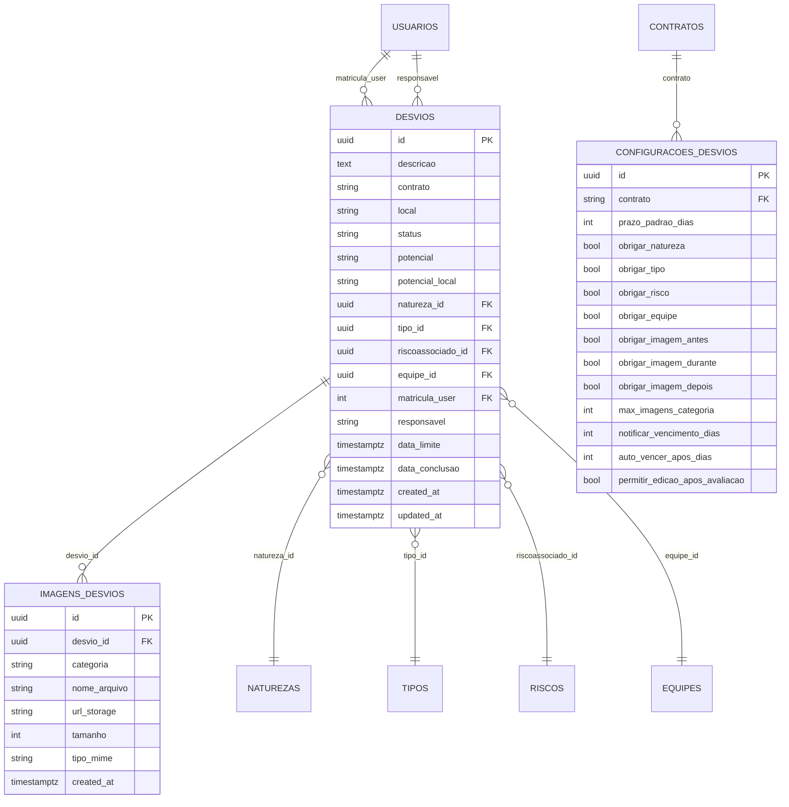

# Módulo de Desvios - Arquitetura Técnica

## 1. Arquitetura Geral

```mermaid
graph TD
    A[DesviosDashboard<br/>Next.js Client] --> B[/api/desvios<br/>CRUD + filtros/]
    A --> C[/api/desvios/stats/]
    A --> D[/api/desvios/[id] | [id]/avaliar/]
    A --> E[/api/desvios/[id]/imagens | /imagens | /upload-image/]
    A --> F[/api/desvios/configuracoes/]
    A --> G[/api/desvios/realtime/]
    A --> H[Componente FormularioConversacional<br/>(criação inline)]

    B --> I[(Supabase Postgres)]
    C --> I
    D --> I
    E --> I
    F --> I
    G --> I
    E --> J[(Supabase Storage<br/>bucket desvios-images)]

    subgraph "Frontend Layer"
        A
        K[Filtros período/tipo visão]
        L[Cards de indicadores]
        M[Distribuição por status]
        N[Próximos vencimentos]
        O[Menu de ações rápidas]
        H
    end

    subgraph "Backend Layer"
        B
        C
        D
        E
        F
        G
    end

    subgraph "Data Layer"
        I
        J
    end
```

## 2. Stack Tecnológico

* **Frontend**: Next.js (app router) + React 18 + TypeScript + Tailwind CSS + lucide-react + sonner
* **Backend**: Next.js API Routes com validação JWT
* **Banco**: Supabase (PostgreSQL) – tabelas de desvios, naturezas, tipos, riscos, equipes, usuários, imagens e configurações
* **Storage**: Supabase Storage (bucket `desvios-images`)
* **Realtime**: @supabase/realtime-js via SSE em `/api/desvios/realtime`

## 3. Definições de Rotas

| Rota                                   | Propósito                                                                 |
| -------------------------------------- | ------------------------------------------------------------------------- |
| /desvios                               | Dashboard de desvios (cards, filtros, gráficos, criação)                  |
| /desvios/meus                          | Listagem dos desvios do usuário                                           |
| /desvios/avaliar                       | Fluxo de avaliação (Admin/Editor)                                         |
| /desvios/pendencias                    | Pendências do usuário                                                     |
| /desvios/gerais                        | Visão geral de desvios                                                    |
| /desvios/kanban                        | Kanban de desvios                                                         |
| /desvios/central-monitoramento         | Monitoramento em tempo real                                               |
| /desvios/configuracoes                 | Configurações do módulo (Admin)                                           |
| /api/desvios                           | GET lista com filtros; POST cria; PUT atualiza; DELETE remove (Admin/Editor) |
| /api/desvios/stats                     | GET estatísticas para dashboard                                           |
| /api/desvios/[id]                      | GET detalhe com relacionamentos; PUT resolver (responsável)               |
| /api/desvios/[id]/avaliar              | GET dados para avaliação; PUT atribui responsável/prazo (Admin/Editor)    |
| /api/desvios/[id]/imagens              | GET lista por desvio; POST upload; DELETE remove imagem                   |
| /api/desvios/imagens                   | POST salva URL; GET lista por `desvio_id`                                 |
| /api/desvios/upload-image              | POST upload genérico para storage                                         |
| /api/desvios/configuracoes             | GET/POST/PUT/DELETE configuração por contrato (Admin)                     |
| /api/desvios/realtime                  | GET stream SSE de mudanças na tabela `desvios`                            |

## 4. APIs Necessárias

### 4.1 CRUD de Desvios

**Endpoint**: `GET | POST | PUT | DELETE /api/desvios`  
**Headers**: `Authorization: Bearer <jwt>`

Filtros de GET: `status`, `contrato`, `responsavel`, `matricula_user`, `meus=true`, `search`, `potencial_local`, `page`, `limit`.  
* GET retorna lista paginada com joins (`natureza`, `tipo`, `risco_associado`, `equipe`, `criador`) e resolve nome do responsável.  
* POST cria desvio com status inicial `Aguardando Avaliação` ou `Concluído` (se `ver_agir=true`), vinculando `equipe_id` do usuário.  
* PUT atualiza campos livres, respeitando permissão (Admin/Editor ou dono).  
* DELETE somente Admin/Editor, remove registro (imagens em cascade).

**Response (GET)**:

```json
{
  "success": true,
  "data": [
    {
      "id": "uuid",
      "descricao": "Queda de material",
      "status": "Em Andamento",
      "contrato": "CTR-01",
      "natureza": { "id": "uuid", "natureza": "Comportamental" },
      "tipo": { "id": "uuid", "tipo": "Ato inseguro" },
      "risco_associado": { "id": "uuid", "risco_associado": "Queda de nível" },
      "responsavel": "123",
      "responsavel_nome": "João Silva",
      "data_limite": "2024-01-20T00:00:00.000Z"
    }
  ],
  "pagination": { "page": 1, "limit": 10, "total": 42, "totalPages": 5 }
}
```

### 4.2 Estatísticas do Dashboard

**Endpoint**: `GET /api/desvios/stats`  
**Query**: `periodo` (dias, default 30), `tipo` (`geral` ou `meus`), `contrato` (opcional).  
Retorna indicadores (total, novos, aguardando, em andamento, concluídos, vencidos, tempo médio), distribuições por status/natureza/tipo, evolução temporal, top responsáveis (Admin/Editor), e próximos vencimentos (7 dias) filtrando por contrato ou pelo usuário (tipo `meus`).

### 4.3 Detalhe e Resolução de Desvio

**Endpoint**: `GET | PUT /api/desvios/[id]`  
* GET traz desvio com joins (`natureza`, `tipo`, `risco_associado`, `equipe`), criador, responsável e imagens.  
* PUT (resolver) exige ser responsável; atualiza `status`, `observacao`, `data_conclusao`.

### 4.4 Avaliação de Desvio

**Endpoint**: `GET | PUT /api/desvios/[id]/avaliar`  
Permite Admin/Editor atribuir responsável, prazo (valida futuro ou usa `configuracoes_desvios.prazo_padrao_dias`), ajustar potenciais, ação e observação. GET retorna desvio, imagens, criador, responsável e configuração do contrato.

### 4.5 Imagens de Desvio

* `POST /api/desvios/[id]/imagens` – upload para bucket `desvios-images`, valida tipo (jpeg/png/webp), 5MB, max 5 por categoria, owner/Admin/Editor.  
* `GET /api/desvios/[id]/imagens` – lista imagens por desvio, opcional `categoria`, agrupa por categoria.  
* `DELETE /api/desvios/[id]/imagens?imagem_id=...` – remove storage + registro (permissão owner/Admin/Editor).  
* `POST /api/desvios/imagens` – salva URL e metadados já gerados (usa `desvio_id`).  
* `GET /api/desvios/imagens?desvio_id=...` – lista imagens de um desvio.  
* `POST /api/desvios/upload-image` – upload genérico autenticado (JWT) para `desvios-images`, retorna `publicUrl`.

### 4.6 Configurações por Contrato

**Endpoint**: `GET | POST | PUT | DELETE /api/desvios/configuracoes`  
* GET exige `contrato`, retorna config salva ou default (prazos, obrigatoriedade de campos/imagens, limites, notificações, auto-vencimento, permitir edição após avaliação).  
* POST/PUT somente Admin; cria ou atualiza configuração do contrato com validações de faixa.  
* DELETE somente Admin; remove configuração (volta ao default).

### 4.7 Realtime

**Endpoint**: `GET /api/desvios/realtime?token=<jwt>`  
Stream SSE de mudanças na tabela `desvios` usando @supabase/realtime-js com Service Role Key. Valida JWT do app antes de abrir o canal `desvios-monitoramento`.

## 5. Estrutura de Componentes

```mermaid
graph TD
    D[DesviosDashboard] --> H[Header gradiente + CTA "Novo Desvio"]
    D --> F[Filtros período/tipo visão]
    D --> C[Cards de indicadores]
    D --> DS[Distribuição por Status]
    D --> PV[Próximos Vencimentos]
    D --> MQ[Menu de Ações Rápidas]
    D --> FC[FormularioConversacional (modal)]
```

### 5.1 Componentes Principais

* **DesviosDashboard** – controla estado e fetch de stats (`/api/desvios/stats`), filtros `periodo` e `tipoVisao`, gatilha modal de criação.  
* **Cards de Indicadores** – total, aguardando avaliação, em andamento (com vencidos), concluídos (tempo médio).  
* **Distribuição por Status** – lista status->contagem (usa `data.distribuicoes.por_status`).  
* **Próximos Vencimentos** – top 5 vencimentos próximos com natureza/responsável, formata `data_limite`.  
* **Menu de Ações Rápidas** – links para sub-rotas (`/desvios/meus`, `/avaliar`, `/pendencias`, `/gerais`, `/central-monitoramento`, `/kanban`, `/configuracoes`).  
* **FormularioConversacional** – modal de criação; chama `POST /api/desvios`.

## 6. Hooks Customizados

### 6.1 useAuth

Fornece `user` e `hasRole`, usado para: restringir acesso a ações (avaliar/excluir), exibir CTA de avaliação para Admin/Editor, filtrar stats no modo "meus" (matrícula).

## 7. Modelo de Dados



### 7.1 Consultas e Operações Principais

* **Listagem**: select paginado com joins e filtros (status, contrato, responsável, matrícula, potencial_local, search em `descricao`/`local`, `meus=true` usa `matricula_user` do token).  
* **Stats**: múltiplas consultas head/count por status, período, distribuição (status/natureza/tipo), evolução (últimos 30 dias), top responsáveis, próximos vencimentos (7 dias).  
* **Avaliação**: atualiza responsável, prazo (valida futuro ou usa prazo padrão), status -> `Em Andamento`, registra ação/observação e potenciais.  
* **Resolução**: responsável atualiza status/observação/data_conclusao.  
* **Imagens**: upload para bucket `desvios-images` com limite de categoria, grava em `imagens_desvios`.  
* **Configuração**: upsert por contrato com defaults quando ausente.

## 8. Considerações de Performance

* Listagem paginada (`page`, `limit`) e filtros server-side; evitar fetch sem token.  
* Stats executa múltiplas consultas; considerar cache por contrato/período se volume crescer.  
* Upload de imagens limita 5MB e 5 por categoria para evitar storage excessivo.  
* Realtime usa SSE; fechar conexões ao encerrar página para liberar canal.  
* Próximos vencimentos limitados a janela de 7 dias e 5 itens no dashboard.

## 9. Segurança e Permissões

* Todas as rotas exigem JWT (`Authorization: Bearer`).  
* Avaliar/Excluir só Admin/Editor; resolver só o responsável; criar/editar próprio desvio permitido ao dono.  
* Upload/Listagem/Remoção de imagens restrita a dono ou Admin/Editor, com validação de tipo/tamanho/limite.  
* Configurações somente Admin; delete de config requer `contrato`.  
* Service Role Key usada apenas no backend; endpoints verificam token antes de acessar Supabase.  
* Realtime valida JWT recebido na query antes de abrir canal WebSocket/SSE.
