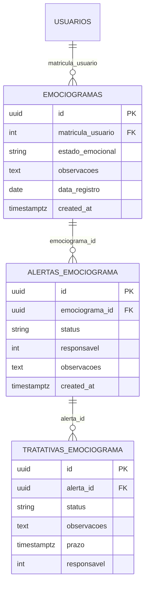

# Modulo de Emociograma - Arquitetura Tecnica

## 1. Arquitetura Geral

```mermaid
graph TD
    A[EmociogramaDashboard<br/>Next.js Client] --> B[/api/emociograma/stats/]
    A --> C[/api/emociograma<br/>listagem + criacao/]
    A --> D[/api/emociograma/alertas/]
    A --> E[/api/emociograma/tratativas/]
    A --> F[/emociograma/dds | historico | tratativas | historico-tratativas | relatorios]

    B --> G[(Supabase Postgres)]
    C --> G
    D --> G
    E --> G

    subgraph "Frontend Layer"
        A
        H[Cards resumo]
        I[Alertas ativos]
        J[Tendencia 7d]
        K[Ultimo registro]
        L[CTA Novo registro]
        M[CTA DDS]
        N[Atalhos historico/tratativas/relatorios]
        O[ModalRegistro]
    end

    subgraph "Backend Layer"
        B
        C
        D
        E
    end

    subgraph "Data Layer"
        G
    end
```

## 2. Stack Tecnologico

* **Frontend**: Next.js (app router) + React 18 + TypeScript + Tailwind CSS + lucide-react + sonner
* **Backend**: Next.js API Routes com validacao JWT
* **Banco**: Supabase (PostgreSQL) – tabela `emociogramas`, alertas e tratativas relacionadas a usuarios/equipes
* **Jobs/Servicos**: RPC `check_last_emociograma` e servico `criarAlertaEmociograma`

## 3. Definicoes de Rotas

| Rota                             | Proposito                                                        |
| -------------------------------- | ---------------------------------------------------------------- |
| /emociograma                     | Dashboard pessoal (stats, ultimo registro, alertas)              |
| /emociograma/dds                 | Fluxo de DDS ligado ao bem-estar                                 |
| /emociograma/historico           | Listagem completa de registros                                   |
| /emociograma/tratativas          | Tratativas ativas                                                |
| /emociograma/historico-tratativas| Historico de tratativas/alertas                                  |
| /emociograma/relatorios          | Relatorios e analises                                            |
| /api/emociograma                 | GET lista (filtros, paginacao); POST cria registro               |
| /api/emociograma/stats           | GET estatisticas (resumo, tendencia, alertas)                    |
| /api/emociograma/alertas         | GET/PUT/POST alertas (criar/atualizar estados)                   |
| /api/emociograma/tratativas      | GET/POST/PUT tratativas de alertas/usuarios                      |

## 4. APIs Necessarias

### 4.1 Listagem e Criacao de Emociogramas

**Endpoint**: `GET | POST /api/emociograma`  
**Headers**: `Authorization: Bearer <jwt>`

Filtros de GET: `periodo` (`7d|30d|90d`), `meus=true`, `equipe=true`, paginacao (`page`, `limit`). Retorna lista com usuario (matricula, nome, email) e metadados.  
POST cria registro com `estado_emocional` (`bem|regular|pessimo`) e `observacoes`; valida intervalo minimo via RPC `check_last_emociograma` (8h). Se estado for `regular|pessimo`, tenta `criarAlertaEmociograma` e retorna payload de alerta.

### 4.2 Estatisticas

**Endpoint**: `GET /api/emociograma/stats`  
**Query**: `periodo` (ex.: `7d`), `escopo` (`individual` ou equipe).  
Retorna `resumo` (total, bem/regular/pessimo), `tendencia` diaria (contagens e total) e `alertas` (ativos, resolvidos, em_tratamento) filtrados pelo escopo/logado.

### 4.3 Alertas

**Endpoint**: `GET | POST | PUT /api/emociograma/alertas`  
Gerencia alertas criados a partir de registros críticos ou de atenção: cria, lista por status/responsavel/usuario, atualiza estado (em_tratamento, resolvido), vincula observacoes.

### 4.4 Tratativas

**Endpoint**: `GET | POST | PUT /api/emociograma/tratativas`  
Permite abrir, listar e atualizar tratativas decorrentes de alertas/usuarios; campos incluem responsável, prazo, status e observacoes. Usado nas páginas `/tratativas` e `/historico-tratativas`.

## 5. Estrutura de Componentes

```mermaid
graph TD
    D[EmociogramaDashboard] --> UR[Ultimo Registro]
    D --> CR[Cards Resumo]
    D --> AL[Alertas Ativos]
    D --> TN[Tendencia 7d]
    D --> AT[Atalhos (historico/tratativas/relatorios)]
    D --> MR[ModalRegistro]
```

### 5.1 Componentes Principais

* **EmociogramaDashboard** – carrega stats (`/api/emociograma/stats`), ultimo registro (`/api/emociograma?limit=1`), controla modal e gating (1 registro/dia).  
* **Ultimo Registro** – exibe estado, data, observacoes e badges de cor.  
* **Cards Resumo** – total, positivos, atenção, críticos (percentuais do período).  
* **Alertas Ativos** – contagem de novos/em tratamento/resolvidos.  
* **Tendencia 7d** – linhas diarias com contagem por estado.  
* **Atalhos** – navega para histórico, tratativas, histórico de tratativas e relatórios.  
* **ModalRegistro** – formulario para novo registro; ao sucesso recarrega stats e ultimo registro.

## 6. Hooks Customizados

### 6.1 useAuth

Fornece `user` para personalizar CTA/saudacao e aplicar filtros de escopo (meus/equipe) no frontend.

## 7. Modelo de Dados



### 7.1 Consultas e Operacoes Principais

* **Listagem**: filtro por periodo e escopo (meus/equipe) com joins de usuario; paginada.  
* **Criacao**: valida intervalo via RPC, insere registro e, se critico/atencao, dispara `criarAlertaEmociograma`.  
* **Stats**: agrega contagens e tendencia por dia; traz situacao de alertas vinculados.  
* **Alertas/Tratativas**: CRUD de alertas e tratativas associadas a emociogramas e usuarios.

## 8. Consideracoes de Performance

* Lista paginada (`page`, `limit`) e filtro server-side por periodo/escopo.  
* Stats limitadas ao periodo (ex.: 7d) para reduzir agregacao.  
* RPC `check_last_emociograma` previne chamadas redundantes se registro recente (<8h).  
* Evitar chamadas duplicadas: dashboard ja traz stats + ultimo registro com limit=1.

## 9. Seguranca e Permissoes

* JWT obrigatorio em todas as rotas.  
* GET `/api/emociograma` pode restringir a `meus` ou `equipe` conforme perfil; lógica de equipe usa vínculos `equipe_id`/`letra_id` do usuário logado.  
* Criação limitada a 1 registro a cada 8 horas (RPC) e 1 por dia no UI.  
* Alertas/Tratativas seguem permissões internas (tipicamente liderança/Admin); dados sensíveis via Service Role Key apenas no backend.  
* Nenhuma operação grava senha/token; apenas dados emocionais e meta-informações do usuário logado.
