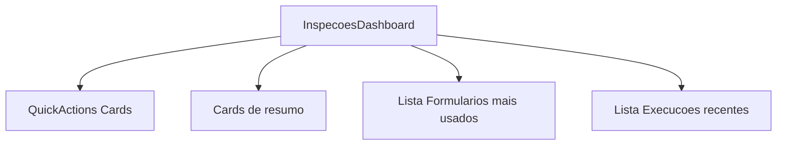
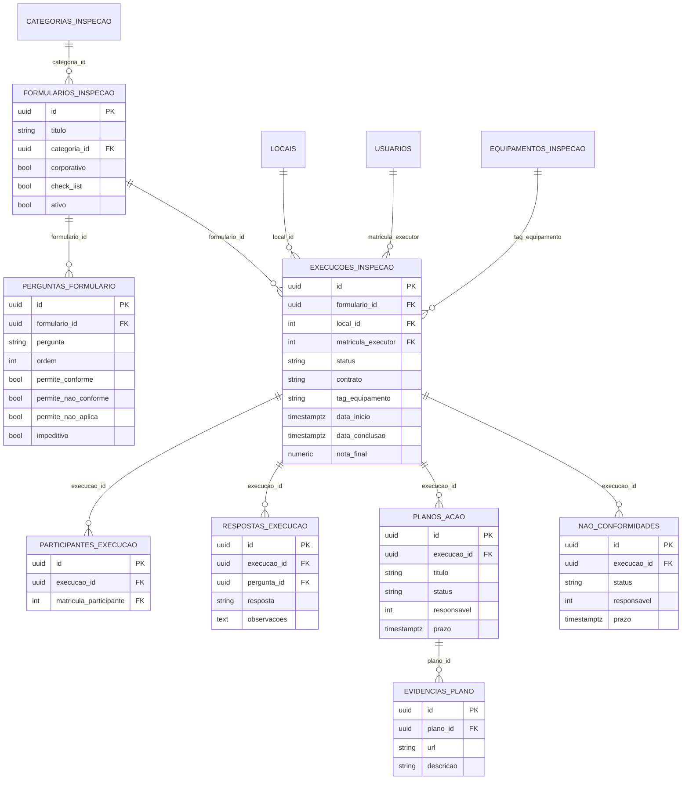

# Modulo de Inspecoes - Arquitetura Tecnica

## 1. Arquitetura Geral

```mermaid
graph TD
    A[InspecoesDashboard<br/>Next.js Client] --> B[/api/inspecoes/stats/]
    A --> C[/api/inspecoes/execucoes<br/>CRUD + respostas/]
    A --> D[/api/inspecoes/formularios<br/>+ categorias/]
    A --> E[/api/inspecoes/execucoes/[id]/planos-acao<br/>+ evidencias/]
    A --> F[/api/inspecoes/nao-conformidades | planos-acao/minhas/]
    A --> G[/api/inspecoes/equipamentos | equipamentos/realtime/]
    A --> H[/api/inspecoes/locais | usuarios/]

    B --> I[(Supabase Postgres)]
    C --> I
    D --> I
    E --> I
    F --> I
    G --> I
    G --> J[(Supabase Storage<br/>e realtime)]
    H --> I

    subgraph "Frontend Layer"
        A
        K[Quick actions / cards]
        L[Cards de resumo]
        M[Formularios mais usados]
        N[Execucoes recentes]
    end

    subgraph "Backend Layer"
        B
        C
        D
        E
        F
        G
        H
    end

    subgraph "Data Layer"
        I
        J
    end
```

## 2. Stack Tecnologico

* **Frontend**: Next.js (app router) + React 18 + TypeScript + Tailwind CSS + lucide-react + sonner + shadcn/ui components
* **Backend**: Next.js API Routes com validacao JWT
* **Banco**: Supabase (PostgreSQL) – formularios, perguntas, execucoes, respostas, participantes, equipamentos, locais, NC e planos de acao
* **Storage/Realtime**: Supabase Storage (evidencias) e @supabase/realtime-js (equipamentos/realtime)

## 3. Definicoes de Rotas

| Rota                                       | Proposito                                                                  |
| ------------------------------------------ | -------------------------------------------------------------------------- |
| /inspecoes                                 | Dashboard com cards, estatisticas, atalhos                                 |
| /inspecoes/formularios                     | CRUD de formularios                                                        |
| /inspecoes/execucoes                       | Listagem/gerencia execucoes                                                |
| /inspecoes/executar                        | Iniciar execucao                                                           |
| /inspecoes/nao-conformidades               | Tratamento de NC                                                           |
| /inspecoes/minhas-acoes                    | Planos de acao do usuario                                                  |
| /inspecoes/equipamentos                    | Gestao de equipamentos                                                     |
| /inspecoes/categorias                      | Gestao de categorias                                                       |
| /api/inspecoes/stats                       | GET estatisticas para dashboard                                            |
| /api/inspecoes/formularios                 | GET lista paginada; POST cria (Admin/Editor)                               |
| /api/inspecoes/formularios/[id]            | GET detalhe; PUT atualiza; DELETE arquiva                                 |
| /api/inspecoes/categorias                  | GET/POST categorias; [id] para GET/PUT/DELETE                              |
| /api/inspecoes/execucoes                   | GET lista com filtros; POST cria; PUT salva/conclui                        |
| /api/inspecoes/execucoes/[id]              | GET detalhe; PUT/DELETE atualiza/encerra (executor ou Admin)               |
| /api/inspecoes/execucoes/[id]/planos-acao  | GET/POST planos; PUT atualiza status; DELETE remove                        |
| /api/inspecoes/execucoes/[id]/planos-acao/[planoId]/evidencias | GET/POST/DELETE evidencias de plano                          |
| /api/inspecoes/equipamentos                | GET/POST equipamentos; [id] para GET/PUT/DELETE                            |
| /api/inspecoes/equipamentos/realtime       | SSE de atualizacoes de equipamentos                                        |
| /api/inspecoes/locais                      | GET/POST/PUT/DELETE locais                                                 |
| /api/inspecoes/nao-conformidades           | GET/POST NC; avaliacoes/correcao                                           |
| /api/inspecoes/planos-acao/minhas          | GET planos vinculados ao usuario                                           |
| /api/inspecoes/usuarios                    | GET usuarios para seletores                                                |

## 4. APIs Necessarias

### 4.1 Dashboard de Inspecoes

**Endpoint**: `GET /api/inspecoes/stats`  
Resumo 30 dias: total/ativos de formularios, execucoes totais/em andamento/concluidas, media de conformidade, execucoes recentes (com formulario/categoria/local/executor) e top formularios (execucoes e media por formulario). Valida JWT.

### 4.2 Formularios e Categorias

* `GET /api/inspecoes/formularios` – filtros `categoria_id`, `corporativo`, `ativo`, `search`, paginacao.  
* `POST /api/inspecoes/formularios` – Admin/Editor; cria com categoria, flags `corporativo`, `check_list`, perguntas opcionais (ordem, permissao de respostas, impeditivo).  
* `GET|PUT|DELETE /api/inspecoes/formularios/[id]` – detalhe, edicao (inclui perguntas), arquivamento.  
* `GET|POST /api/inspecoes/categorias` e `GET|PUT|DELETE /api/inspecoes/categorias/[id]` – CRUD de categorias.

### 4.3 Execucoes de Inspecao

**Endpoint**: `GET | POST | PUT /api/inspecoes/execucoes`  
Filtros: `formulario_id`, `status`, `executor`, `local_id`, `data_inicio`, `data_fim`, paginacao.  
* POST cria execucao com formulario/locais obrigatorios, opcional participantes e respostas. Se `check_list` concluido exige `tag_equipamento`. Calcula nota via RPC `calcular_nota_execucao` e pode marcar equipamento impedido se perguntas impeditivas nao conformes.  
* PUT atualiza local/data_inicio/participantes/respostas; permite concluir (`concluir=true` ou `status=concluida`) se executor ou Admin; recalcula nota e aplica impedimento.

**Endpoint**: `GET | PUT | DELETE /api/inspecoes/execucoes/[id]`  
Detalhe completo (formularios, respostas, participantes, locais, planos, NC). PUT para atualizar status ou dados; DELETE para cancelar/remover (permissao executor/Admin).

### 4.4 Planos de Acao dentro da Execucao

* `GET | POST /api/inspecoes/execucoes/[id]/planos-acao` – listar/criar planos associados a uma execucao.  
* `PUT | DELETE /api/inspecoes/execucoes/[id]/planos-acao/[planoId]` – atualizar status/responsavel/prazo ou remover.  
* `GET | POST | DELETE /api/inspecoes/execucoes/[id]/planos-acao/[planoId]/evidencias/[evidenciaId]` – gerencia evidencias de plano (urls/arquivos).

### 4.5 Nao Conformidades e Planos

* `GET | POST /api/inspecoes/nao-conformidades` – lista/cria NC vinculadas a execucao/resposta; inclui status, responsavel e prazos.  
* `GET /api/inspecoes/planos-acao/minhas` – planos atribuídos ao usuario autenticado com filtro de status/prazo.

### 4.6 Equipamentos e Realtime

* `GET | POST /api/inspecoes/equipamentos` – cadastro e listagem (com filtros como tag, status, impedido).  
* `GET | PUT | DELETE /api/inspecoes/equipamentos/[id]` – detalhe, atualiza impedimento, anexa local/contrato.  
* `GET /api/inspecoes/equipamentos/realtime` – SSE usando @supabase/realtime-js com Service Role Key; valida JWT query `token`.

### 4.7 Locais e Usuarios

* `GET | POST | PUT | DELETE /api/inspecoes/locais` – CRUD de locais para execucoes.  
* `GET /api/inspecoes/usuarios` – lista usuarios (matricula, nome, email) para seletores de executor/participante/responsavel.

## 5. Estrutura de Componentes



### 5.1 Componentes Principais

* **InspecoesDashboard** – pagina principal; carrega `/api/inspecoes/stats`, controla loading/erro.  
* **QuickActions Cards** – links para formularios, executar, execucoes, NC, minhas acoes, equipamentos.  
* **Cards de resumo** – indicadores de formularios, execucoes, andamento, concluidas 30d, media de conformidade, atalho para categorias.  
* **Formularios mais usados** – top 5 por execucoes e media de conformidade.  
* **Execucoes recentes** – status/nota/local/executor com badge de status.  
* **Botao Iniciar Inspecao** – navega para `/inspecoes/executar`.

## 6. Hooks Customizados

### 6.1 useAuth

Fornece `user` e `role`; usado para mostrar saudacao e restringir acoes (ex.: criacao/edicao de formularios exige Admin/Editor; algumas edicoes exigem executor/Admin).

## 7. Modelo de Dados



### 7.1 Consultas e Operacoes Principais

* **Stats**: contagens head e selecoes para execucoes recentes e formularios mais usados (media de conformidade).  
* **Formularios**: lista com joins de categoria e contagem de perguntas; criacao com batch de perguntas.  
* **Execucoes**: listagem com joins (formulario, local, executor, participantes), filtros e paginacao; criacao/edicao grava participantes e respostas, recalcula nota, pode marcar equipamento impedido por perguntas impeditivas.  
* **Planos de acao**: CRUD aninhado por execucao, com evidencias vinculadas.  
* **NC**: cria/lista NC ligadas a execucao/resposta com responsavel/prazo.  
* **Equipamentos**: CRUD, opcional impedimento automatico via execucao check_list; realtime canal dedicado.

## 8. Consideracoes de Performance

* Listagens paginadas (`page`, `limit`) em formularios e execucoes.  
* Stats agrega consultas paralelas; considerar cache se volume crescer.  
* Upserts de respostas/participantes podem gerar varias operacoes sequenciais; evitar payloads muito grandes.  
* Realtime (equipamentos) deve ser encerrado ao sair da pagina para liberar conexoes.  
* RPC `calcular_nota_execucao` evita logica de nota no cliente.

## 9. Seguranca e Permissoes

* Todas as rotas validam JWT (`Authorization: Bearer`).  
* Criar/editar formularios restrito a Admin/Editor.  
* Execucoes: criacao/autosave requer autenticacao; edicao/conclusao apenas executor ou Admin, e status nao permite alterar quando finalizada.  
* Planos/NC seguem permissao do usuario autenticado (executor/responsavel/Admin); acoes de DELETE/PUT respeitam checks internos.  
* Upload/evidencias usam Service Role Key apenas no backend; limites de tipos/tamanho definidos nos endpoints de evidencias.  
* Equipamentos realtime exige token validado antes de abrir canal; impedimento de equipamento depende de regras de pergunta impeditiva.  
* RLS do Supabase esperado para filtrar por contrato_raiz quando aplicavel.
