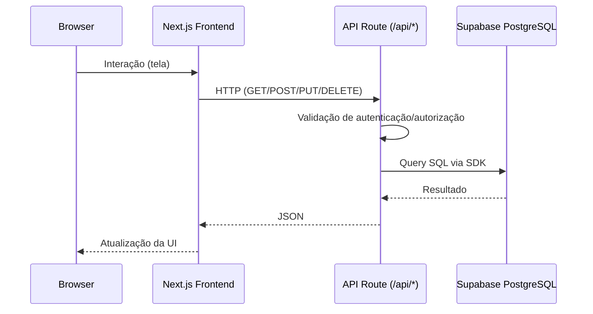

# Systemmax — Arquitetura Completa da Plataforma

> Documento técnico executivo para apresentação à diretoria.
>
> Objetivo: consolidar, de forma clara e detalhada, a arquitetura de software, a stack tecnológica, o modelo de comunicação entre serviços, o fluxo de autenticação e a estratégia de dados do Systemmax.

---

## 1) Visão Executiva

O **Systemmax** é uma plataforma corporativa web construída sobre **Next.js + React + TypeScript**, com arquitetura orientada a módulos de negócio e backend via **API Routes** no próprio Next.js.

A plataforma opera com:

- **Camada de apresentação** (Frontend web);
- **Camada de aplicação** (API Routes e regras de negócio);
- **Camada de dados** em **Supabase** (PostgreSQL + Storage + Realtime);
- **Autenticação customizada** baseada em JWT (cookie HTTP-only para sessão de usuário).

Em termos de arquitetura lógica, trata-se de um **monólito modular** (frontend + backend no mesmo projeto), consumindo serviços gerenciados externos (Supabase e integrações pontuais).

---

## 2) Arquitetura em Camadas

```mermaid
flowchart TB
  U[Usuário via navegador]

  subgraph WEB[Camada Web - Next.js]
    FE[Frontend React + App Router]
    API[API Routes /api/*\n(Regras de negócio)]
    MW[Middleware global\n(controle de acesso por cookie)]
  end

  subgraph DATA[Camada de Dados - Supabase]
    PG[(PostgreSQL)]
    ST[(Supabase Storage)]
    RT[(Supabase Realtime)]
  end

  subgraph EXT[Integrações externas]
    WA[API WhatsApp Umbler Talk\n(reset de senha)]
  end

  U --> FE
  FE --> MW
  FE --> API
  API --> PG
  API --> ST
  API --> RT
  API --> WA
```

### Leitura da arquitetura

1. O usuário interage com as páginas da aplicação (App Router).
2. O middleware valida presença de cookie de autenticação para rotas privadas.
3. O frontend consome endpoints `/api/*` para operações de negócio.
4. As APIs acessam o Supabase com chave adequada (anon/client ou service role/server).
5. Para eventos em tempo real, APIs específicas abrem stream SSE conectado ao Realtime do Supabase.

---

## 3) Stack Tecnológica Oficial

## 3.1 Base da aplicação

- **Framework:** Next.js 15
- **UI Runtime:** React 18
- **Linguagem:** TypeScript
- **Estilização:** Tailwind CSS

## 3.2 Bibliotecas de aplicação

- **Banco e serviços de dados:** `@supabase/supabase-js`
- **Tempo real:** `@supabase/realtime-js`
- **Autenticação/JWT:** `jsonwebtoken`
- **Hash de senha:** `bcrypt` e `bcryptjs`
- **Validação:** `zod`
- **Estado local:** `zustand`
- **Formulários:** `react-hook-form` + `@hookform/resolvers`
- **Exportações/Documentos:** `exceljs`, `jspdf`

## 3.3 Organização de execução

- **Frontend + Backend** no mesmo artefato Next.js (App Router + API Routes).
- Scripts existentes:
  - `npm run dev`
  - `npm run build`
  - `npm run start`
  - `npm run lint`

---

## 4) Estrutura de Módulos de Negócio

A plataforma é segmentada por domínios funcionais. Entre os módulos centrais:

- **Users** (usuários, contratos, equipes, permissões e funcionalidades);
- **Desvios** (registro, avaliação, resolução, imagens, monitoramento);
- **Inspeções** (formulários, execuções, não conformidades, planos de ação, equipamentos);
- **Emociograma** (registros comportamentais, alertas e tratativas);
- **Boas Práticas**, **Almoxarifado**, **Interações**, **Prontidão**, **3PS**, **Apadrinhamento**, entre outros.

Cada módulo possui:

- páginas de interface em `src/app/(app)/<modulo>`;
- APIs em `src/app/api/<modulo>`;
- integrações com tabelas e storage no Supabase.

---

## 5) Comunicação Entre Serviços (Fluxos Técnicos)

## 5.1 Fluxo padrão (consulta/gravação)



## 5.2 Fluxo de upload de evidências/imagens

1. Frontend envia `multipart/form-data` para endpoint de upload.
2. API valida autenticação, tipo MIME e tamanho do arquivo.
3. API grava no **Supabase Storage** (bucket do domínio, ex.: `desvios-images`).
4. API persiste metadados/URL em tabela relacional no PostgreSQL.

## 5.3 Fluxo de tempo real

1. Frontend conecta em endpoint de stream SSE (ex.: monitoramentos).
2. Endpoint cria canal via `@supabase/realtime-js`.
3. Alterações em tabelas monitoradas (`postgres_changes`) são transmitidas ao cliente.

---

## 6) Arquitetura de Autenticação e Autorização

## 6.1 Modelo de autenticação

O Systemmax usa autenticação própria baseada em JWT:

1. Usuário envia credenciais em `/api/auth/login`.
2. API valida usuário ativo na tabela `usuarios`.
3. Senha é comparada com hash `bcrypt`.
4. Em sucesso, API emite JWT com claims (matrícula, nome, email, role, contrato etc.).
5. Token é armazenado em cookie `auth_token` HTTP-only.

## 6.2 Expiração e sessão

- Token JWT com expiração (24h na emissão).
- Cookie de autenticação com `maxAge` de sessão operacional (8h no login).
- Rotas privadas de UI dependem da presença do cookie.

## 6.3 Controle de acesso

Há duas camadas:

- **Gate de navegação (middleware global):** impede acesso de não autenticados a rotas privadas.
- **Gate de API (autorização por endpoint):** valida token e aplica regras por perfil/papel.

Perfis base:

- `Admin`
- `Editor`
- `Usuario`

Além de role, partes do sistema usam permissões por funcionalidade e escopo por contrato/equipe.

## 6.4 Princípios de segurança adotados

- Cookie `httpOnly` para token (evita acesso direto por JS client).
- Uso de `SUPABASE_SERVICE_ROLE_KEY` somente no backend/API.
- Segregação de responsabilidades por perfil em operações sensíveis (ex.: exclusão, avaliação, conclusão).
- Validações de entrada em operações críticas (upload, filtros, mudanças de status).

---

## 7) Dados, Banco e Armazenamento

## 7.1 Onde os dados estão armazenados

A persistência principal está no **Supabase PostgreSQL**:

- dados mestres (usuários, contratos, equipes);
- dados transacionais dos módulos (desvios, inspeções, emociograma, etc.);
- dados de sessão e rastreabilidade operacional.

## 7.2 Objetos/arquivos

Arquivos são armazenados no **Supabase Storage** em buckets por contexto funcional, por exemplo:

- `avatars`
- `desvios-images`
- buckets de evidências de planos/inspeções (dependendo da implementação por módulo)

## 7.3 Realtime

Eventos de atualização em tabelas específicas são observados por canais Realtime e retransmitidos para o frontend em SSE quando aplicável.

## 7.4 Organização lógica dos dados

Padrões recorrentes:

- tabelas por domínio funcional;
- relacionamentos por chaves de referência (usuário, contrato, equipe, entidade de negócio);
- campos de auditoria temporal (`created_at`, `updated_at`);
- estratégias de escopo por contrato/usuário em listagens e mutações.

---

## 8) Onde o Supabase roda (infraestrutura)

Conforme premissa informada para esta apresentação:

- O ambiente de dados utiliza **Supabase nativo/gerenciado**;
- Em **infraestrutura dedicada de porte Large**;
- Executando na **AWS**.

Implicações arquiteturais:

- alta disponibilidade e operação gerenciada da camada de dados;
- banco, storage e realtime no mesmo ecossistema de plataforma;
- redução de overhead operacional interno para gestão de banco e serviços auxiliares.

---

## 9) Mapa de Serviços e Responsabilidades

| Serviço/Camada | Responsabilidade principal | Tecnologia |
|---|---|---|
| Frontend Web | Interface do usuário, navegação, formulários, dashboards | Next.js + React + Tailwind |
| Middleware Web | Proteção de rotas privadas por sessão/cookie | Next.js Middleware |
| API de Aplicação | Regras de negócio, validações, autorização, integrações | Next.js API Routes |
| Autenticação | Login, emissão/validação JWT, sessão em cookie | jsonwebtoken + bcrypt |
| Banco de Dados | Persistência relacional transacional e analítica operacional | Supabase PostgreSQL |
| Armazenamento de Arquivos | Upload e entrega de imagens/evidências | Supabase Storage |
| Realtime | Eventos de atualização para monitoramentos | Supabase Realtime |
| Integrações externas | Comunicação com serviços de notificação/mensageria | API externa (ex.: Umbler Talk) |

---

## 10) Governança de APIs Internas

Padrão operacional observado:

- prefixo único: `/api/<dominio>`;
- métodos HTTP semânticos (`GET`, `POST`, `PUT`, `DELETE`);
- retorno majoritariamente em JSON com indicadores de sucesso/erro;
- autenticação obrigatória na maior parte dos endpoints de negócio;
- paginação/filtros server-side em endpoints de listagem volumosa.

Benefícios para diretoria:

- padronização acelera evolução de módulos;
- facilita auditoria técnica e manutenção;
- reduz risco de inconsistência entre equipes de desenvolvimento.

---

## 11) Escalabilidade e Evolução Arquitetural

## 11.1 Pontos fortes atuais

- Arquitetura modular por domínio facilita expansão funcional.
- Backend co-localizado (API Routes) simplifica entrega e governança.
- Supabase unifica banco, storage e realtime com menor custo de integração.

## 11.2 Estratégias de evolução recomendadas

1. **Camada de observabilidade** completa (logs estruturados, tracing, métricas por endpoint).
2. **Cache seletivo** para endpoints de dashboard/estatísticas com alto volume.
3. **Padronização de segurança** para tokens/cookies entre todos os endpoints.
4. **Catálogo formal de dados** por domínio (dicionário de tabelas e políticas de acesso).
5. **Esteira de qualidade** com testes automatizados por módulo crítico.

---

## 12) Resumo para apresentação executiva

O Systemmax adota uma arquitetura robusta e moderna, com:

- **Aplicação web corporativa unificada** (Next.js);
- **Segurança por autenticação JWT e autorização por perfil/escopo**;
- **Dados centralizados em Supabase PostgreSQL**;
- **Armazenamento de evidências no Supabase Storage**;
- **Atualizações em tempo real via Supabase Realtime**;
- **Infraestrutura gerenciada dedicada na AWS (Supabase nativo, porte Large)**.

Isso entrega uma base técnica consistente para operação, crescimento por módulos e governança de segurança e dados em nível corporativo.
