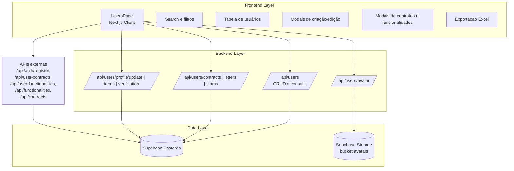
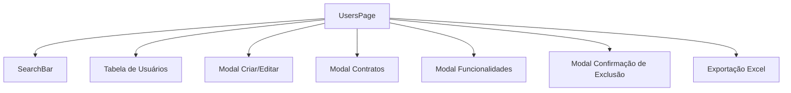
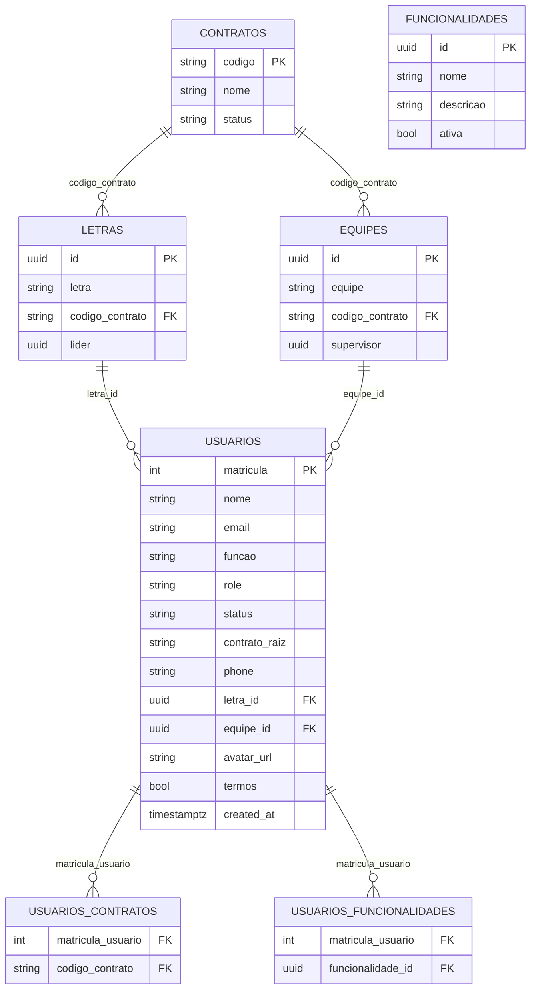

# Módulo de Usuários - Arquitetura Técnica

## 1. Arquitetura Geral



## 2. Stack Tecnológico

* **Frontend**: Next.js (app router) + React 18 + TypeScript + Tailwind CSS + lucide-react + sonner + ExcelJS
* **Backend**: Next.js API Routes com validação JWT
* **Banco**: Supabase (PostgreSQL) com relações entre usuários, contratos, letras e equipes
* **Storage**: Supabase Storage (bucket `avatars`)

## 3. Definições de Rotas

| Rota                                   | Propósito                                                                 |
| -------------------------------------- | ------------------------------------------------------------------------- |
| /users                                 | Página de gestão de usuários (listagem, filtros, modais)                  |
| /api/users                             | GET lista usuários; PUT atualiza; DELETE inativa (Admin)                  |
| /api/users/[matricula]                 | GET consulta individual; PUT atualização parcial (email/phone/avatar_url) |
| /api/users/avatar                      | POST upload de avatar para o bucket `avatars`                             |
| /api/users/contracts                   | GET contratos ativos para dropdown                                        |
| /api/users/letters                     | GET letras por contrato (dropdown)                                        |
| /api/users/teams                       | GET equipes por contrato (dropdown)                                       |
| /api/users/profile/update              | PUT atualiza telefone/letra/equipe do usuário logado                      |
| /api/users/terms                       | PUT registra aceite/recusa de termos                                      |
| /api/users/verification                | GET verifica aceite de termos e dados obrigatórios                        |

## 4. APIs Necessárias

### 4.1 Gestão de Usuários

**Endpoint**: `GET | PUT | DELETE /api/users`  
**Headers**: `Authorization: Bearer <jwt>`

* GET retorna usuários (Admin/Editor). Se role ≠ Admin filtra por `contrato_raiz` do token.
* PUT atualiza dados (nome/email/funcao/contrato_raiz/phone/letra_id/equipe_id/password_hash) e, se Admin, também `role` e `status`. Aceita flags de consentimento `terms_reconhecimento_facial|termsReconhecimentoFacial|termsBiometria`.
* DELETE (Admin) marca `status = inativo` via query `?matricula=<id>`.

**Response (GET)**:

```json
{
  "success": true,
  "users": [
    {
      "matricula": 123,
      "nome": "Usuário",
      "email": "u@empresa.com",
      "funcao": "Coordenador",
      "contrato_raiz": "CTR-01",
      "status": "ativo",
      "role": "Editor",
      "phone": "119999999",
      "letra": { "id": "uuid", "letra": "A" },
      "equipe": { "id": "uuid", "equipe": "Equipe X" }
    }
  ]
}
```

### 4.2 Usuário por Matrícula

**Endpoint**: `GET | PUT /api/users/[matricula]`  
**Headers**: `Authorization: Bearer <jwt>`

* Autorização: o próprio usuário ou perfis Admin/Editor.  
* GET traz dados básicos (`matricula, nome, email, phone, role, status, funcao`).  
* PUT permite atualizar apenas campos whitelisted (`email`, `telefone|phone`, `avatar_url`).

### 4.3 Cadastro de Usuário (dependência)

**Endpoint**: `POST /api/auth/register`  
Usado na página `/users` para criar novos usuários com senha inicial, role e vínculo de contrato/letra/equipe.

### 4.4 Dropdowns de Contrato, Letra e Equipe

* `GET /api/users/contracts` – retorna contratos ativos (`codigo, nome, status`).  
* `GET /api/users/letters?contrato=<codigo>` – retorna letras do contrato com liderança.  
* `GET /api/users/teams?contrato=<codigo>` – retorna equipes do contrato com supervisor.

Todas exigem `Authorization: Bearer <jwt>` e validam token via `jwt.verify`.

### 4.5 Avatar de Usuário

**Endpoint**: `POST /api/users/avatar`  
**Body**: `FormData` (`avatar` File, `matricula` string)  
**Regras**: imagem até 5 MB; content-type `image/*`; somente o próprio usuário ou Admin pode enviar. O arquivo vai para `avatars/<matricula>-<timestamp>.<ext>` e `usuarios.avatar_url` é atualizado com a URL pública.

### 4.6 Atualização de Perfil do Logado

**Endpoint**: `PUT /api/users/profile/update`  
**Headers**: `Authorization: Bearer <jwt>`  
**Body**: `{ phone?: string, letra_id?: number, equipe_id?: number }`  
Atualiza telefone e vínculos de letra/equipe do usuário autenticado; retorna dados normalizados para o app.

### 4.7 Termos de Uso

**Endpoint**: `PUT /api/users/terms`  
**Body**: `{ accepted: boolean }`  
Registra aceite ou recusa dos termos (`usuarios.termos`) e `updated_at`.

### 4.8 Verificação de Perfil

**Endpoint**: `GET /api/users/verification`  
Verifica, para o usuário autenticado, se termos foram aceitos e se há `phone`, `letra_id` e `equipe_id`. Retorna `missingFields` para forçar fluxo de completude.

## 5. Estrutura de Componentes



### 5.1 Componentes Principais

* **UsersPage** (página) – controla estado global, busca inicial (`/api/users`), e integra todos os modais.
* **SearchBar** – filtra por nome/email/matrícula em memória.
* **Tabela de Usuários** – renderiza colunas de identificação, contrato, role/status e ações.
* **Modal Criar/Editar** – formulário com senha (apenas criação), contrato/letra/equipe dinâmicos, role/status (somente Admin).
* **Modal Contratos** – lista contratos (via `/api/contracts`) e permite toggles com `/api/user-contracts` POST/DELETE.
* **Modal Funcionalidades** – lista funcionalidades (via `/api/functionalities`) e gerencia vínculos em `/api/user-functionalities`.
* **Modal de Exclusão** – confirma deleção lógica e chama `DELETE /api/users?matricula=...`.
* **Exportação Excel** – gera workbook com ExcelJS em client-side a partir de `filteredUsers`.

## 6. Hooks Customizados

### 6.1 useAuth

Fornece `user` autenticado (`matricula`, `role`, `contrato_raiz`), usado para restringir acesso à página, aplicar filtros de contrato e validar permissões (ex.: ocultar ação de exclusão se o usuário não tem a funcionalidade `f98bff3d-38e2-4af1-b9c3-8ed1487ad39a`).

## 7. Modelo de Dados



### 7.1 Consultas e Operações Principais

* **Listagem**: select de `usuarios` com joins opcionais de `letras` e `equipes`, ordenando por `created_at desc`, filtrando por `contrato_raiz` se não for Admin.
* **Dropdowns**: `letras` e `equipes` filtradas por `codigo_contrato`; apenas registros ativos de `contratos`.
* **Consents**: `termos` e flags de reconhecimento/biometria atualizados junto ao usuário.
* **Storage**: upload para bucket `avatars` e persistência da URL pública em `usuarios.avatar_url`.

## 8. Considerações de Performance

* Carga inicial faz fetch de usuários e contratos; para grandes volumes considerar paginação e busca server-side.
* Exportação Excel ocorre no client; evitar chamada com listas enormes sem paginação.
* Dropdowns de letra/equipe são carregados sob demanda ao selecionar contrato (reduz chamadas desnecessárias).
* Uso de loading flags (`loading`, `contractsLoading`, `functionalitiesLoading`) evita múltiplas requisições concorrentes nos modais.

## 9. Segurança e Permissões

* Todas as APIs validam JWT (`Authorization: Bearer`) e roles; Admin/Editor acessam `/users`, enquanto usuários comuns são bloqueados.
* `/api/users` restringe alterações de role/status a Admin e bloqueia deleção física (usa desativação).
* `/api/users/[matricula]` e `/api/users/profile/update` só aceitam self-service ou perfis privilegiados.
* Upload de avatar limita tipo e tamanho de arquivo e limpa storage se falha ao gravar no banco.
* Dados sensíveis trafegam via Supabase Service Role Key somente no backend (API Routes).
